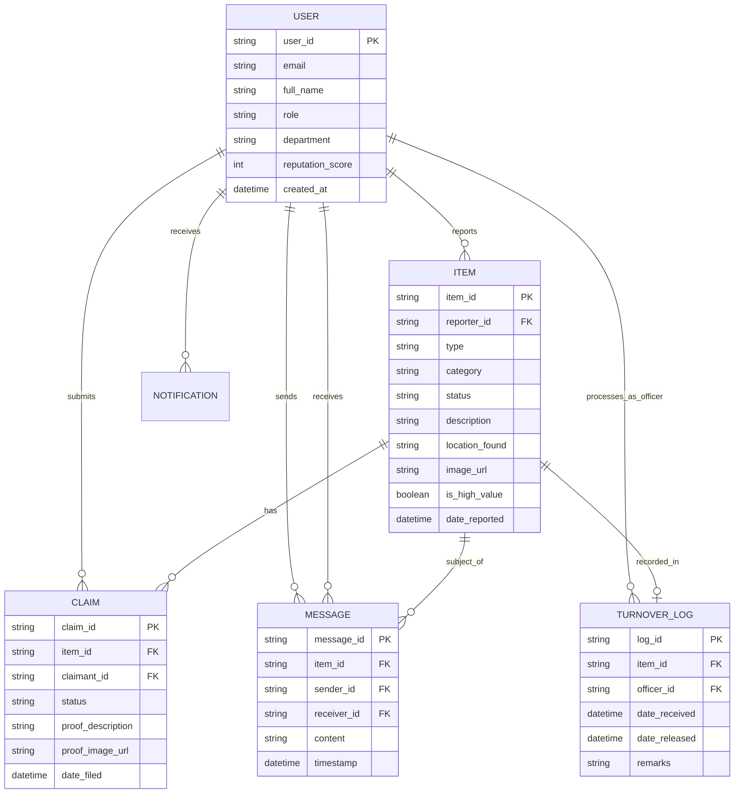

#

# **Software Requirements Specification**

# **for**

# **ClaimIT**

**Version 1.0**

**Prepared by**

|   Jubay Perlan    | perlan.jubay@g.msuiit.ed.ph       |   IT3N.1   |
| :---------------: | --------------------------------- | :--------: |
| **Espiña Joseph** | **joseph.espina@g.msuiit.edu.ph** | **IT3N.1** |
|                   |                                   |            |

|    Faculty: | Mary Ann Gliefen A. Bermudo               |
| ----------: | :---------------------------------------- |
| **Course:** | **ISY108 Requirements Engineering**       |
|   **Date:** | **\<place the date of submission here\>** |

## **Table of Contents**

**Executive Summary**

**1. Introduction**  
&emsp;1.1 Purpose  
&emsp;1.2 Intended Audience and Reading Suggestions

**2. Project Description**  
&emsp;2.1 Overview of the Current System  
&emsp;2.2 Problem Statement  
&emsp;2.3 Objectives  
&emsp;2.4 Significance of the System  
&emsp;2.5 Scope and Limitation  
&emsp;2.6 Benchmark Systems  
&emsp;2.7 Salient Features of the System  
&emsp;2.8 Gantt Chart

**3. Methodology**  
&emsp;3.1 Requirements Gathering  
&emsp;3.2 System Design  
&emsp;3.3 Prototype Development  
&emsp;3.4 User Acceptance Testing (UAT)  
&emsp;3.5 Iterative Refinement  
&emsp;3.6 Delivery and Handover

**4. Requirements Definition**  
&emsp;4.1 Requirements Traceability Matrix  
&emsp;4.2 Activity Diagram

**5. Analysis and Design**  
&emsp;5.1 Use Case Diagram  
&emsp;5.2 Use Case Description  
&emsp;5.3 Sequence Diagram  
&emsp;5.4 Collaboration Diagram

**6. Data Models**  
&emsp;6.1 Entity-Relationship Diagram  
&emsp;6.2 Class Diagram  
&emsp;6.3 Context Diagram  
&emsp;6.4 Component Diagram  
&emsp;6.5 Package Diagram

**7. The System**  
&emsp;7.1 System Overview  
&emsp;&emsp;7.1.1 System Features  
&emsp;&emsp;7.1.2 System Functions

**8. Non-Functional Requirements**  
&emsp;8.1 Performance Requirements  
&emsp;8.2 Security Requirements  
&emsp;8.3 Reliability and Availability Requirements  
&emsp;8.4 Usability Requirements  
&emsp;8.5 Software Quality Attributes

**9. Results and Discussion**  
&emsp;9.1 User Acceptance Testing (UAT) Results  
&emsp;9.2 Performance Benchmarking  
&emsp;9.3 User Feedback Summary  
&emsp;9.4 Objective Achievement Analysis

**10. Summary and Conclusion**  
&emsp;10.1 Project Summary  
&emsp;10.2 Achievement of Objectives  
&emsp;10.3 Lessons Learned  
&emsp;10.4 Conclusion

**11. Recommendations**  
&emsp;11.1 Production Deployment Recommendations  
&emsp;11.2 Feature Enhancements  
&emsp;11.3 Maintenance and Support

**Appendix A: Working Bibliography**

**Appendix B: Interview Results and Documentation**  
&emsp;B.1 Interview with ICTC  
&emsp;B.2 Interview with SID

**Appendix C: Work Breakdown Structure (WBS)**

**Appendix D: Glossary**

---

**Revision History**

| Name | Date | Reason For Changes | Version |
| :--- | :--- | :----------------- | :------ |
|      |      |                    |         |
|      |      |                    |         |

# **Executive Summary**

This document outlines the Software Requirements Specification (SRS) for the **ClaimIT** project, a Progressive Web Application (PWA) designed to modernize the lost and found management system at Mindanao State University - Iligan Institute of Technology (MSU-IIT). The primary deliverables are this comprehensive SRS document and a fully functional prototype demonstrating the system's core capabilities.

The current manual system, managed exclusively by the Security Intelligence Division (SID), relies entirely on handwritten logbooks and physical storage. Based on stakeholder interviews, this legacy process has critical deficiencies: only **20-30% of found items are successfully claimed**, there is no visual documentation to verify ownership, service is limited to office hours (7 AM - 9 PM, weekdays), and SID personnel dedicate significant time managing inquiries that divert resources from core security functions. During peak periods such as campus events and symposiums, the workload becomes overwhelming, with SID staff reporting that **"most of our time is spent on this, and we are not able to do anything else,"** severely compromising primary security responsibilities.

ClaimIT addresses these challenges through a centralized digital platform accessible to the campus community of over 12,000 students, faculty, and staff. The system features photo-based item documentation, real-time search and filtering, secure in-app messaging, automated notifications, QR code generation for inventory management, and a comprehensive administrative dashboard. Critically, based on SID recommendations, the system supports both **centralized claims** (items surrendered to SID) and **peer-to-peer claims** (direct coordination between finders and owners), providing flexibility while reducing administrative burden.

Following ICTC's technical guidance, ClaimIT is architected as a **responsive web application** rather than a native mobile app, ensuring seamless integration with the university's existing **SAML-based Single Sign-On (SSO)** infrastructure backed by Active Directory. For the prototype phase, the system leverages **Google Firebase** for rapid development, with the understanding that production deployment will transition to the university's internal SQL database infrastructure and hosting environment to maintain data governance and policy enforcement consistency.

The primary project objectives are to: (1) document comprehensive system requirements validated by key stakeholders, (2) develop a functional prototype demonstrating core features, (3) design workflows capable of increasing the item return rate from 20-30% to over 60%, and (4) establish a foundation for future full-scale implementation. This SRS provides detailed specifications for requirements, architecture, data models, and user workflows that will guide prototype development and serve as a blueprint for production deployment.

# **1. Introduction** {#introduction}

## **1.1 Purpose** {#purpose}

The purpose of this Software Requirements Specification (SRS) document is to comprehensively define the functional and non-functional requirements for **ClaimIT**, a Progressive Web Application (PWA) for lost and found management, developed by third-year BSIT students as part of the **ISY108 Requirements Engineering course** at MSU-IIT.

This document serves multiple critical functions:

- **Development Blueprint** – Provides detailed specifications to guide the design, development, and testing of the ClaimIT prototype, ensuring all required functionalities are precisely defined and understood by the project team.

- **Stakeholder Alignment** – Acts as a communication bridge between developers and key stakeholders (Security Intelligence Division, Information and Communication Technology Center, students, and faculty), ensuring shared understanding of system capabilities and constraints.

- **Requirements Validation** – Documents requirements derived from structured interviews with SID and ICTC personnel, ensuring the system addresses real operational needs rather than assumed requirements.

- **Future Implementation Foundation** – Establishes a comprehensive technical foundation that can guide subsequent full-scale production deployment beyond the prototype phase.

Version 1.0 of ClaimIT focuses on implementing core functionalities necessary for a fully operational prototype:

- **SAML-based SSO Authentication** – Secure login integration with university Active Directory, automatically assigning role-based permissions (Student, Faculty, Staff, SID Admin).

- **Dual-Mode Item Reporting** – Flexible posting of lost or found items with photo documentation, supporting both centralized (SID-managed) and peer-to-peer (direct finder-to-owner) coordination models.

- **Advanced Search and Filtering** – Multi-criteria search enabling users to locate items by category, location, date range, and status.

- **Secure Claims Management** – Structured workflow for submitting, reviewing, and approving claims, with mandatory verification procedures to prevent fraudulent claims.

- **Privacy-Compliant Messaging** – In-app communication system that protects user contact information while facilitating coordination between parties.

- **Administrative Dashboard** – Comprehensive management interface for SID personnel to moderate posts, verify claims, track statistics, and manage item lifecycle from report to disposal.

- **QR Code Integration** – Automated generation of unique QR codes for physical item tracking and expedited verification at the SID office.

ClaimIT replaces the existing manual, paper-based process with a centralized, accessible digital platform that enhances efficiency, transparency, and accountability while reducing administrative burden on security personnel.

## **1.2 Intended Audience and Reading Suggestions** {#intended-audience-and-reading-suggestions}

This document has been prepared for a diverse group of stakeholders, each with specific interests and informational needs:

- **Student Developers & Testers (Primary Team):** Perform a comprehensive reading of the entire document. Focus particularly on Sections 4-8, which contain technical specifications, data models, use cases, and non-functional requirements essential for prototype implementation. Review Appendix B to understand stakeholder requirements directly from interview transcripts.

- **Project Managers & Faculty Advisors:** Concentrate on Sections 1-3 and the Appendices to understand project scope, objectives, methodology, timeline (Gantt Chart), and resource requirements. Review the Work Breakdown Structure (Appendix C) for detailed task allocation and milestone tracking.

- **Security Intelligence Division (SID) Personnel:** Review Sections 2, 4, 7, and 8 to understand:

  - How the system addresses current operational pain points (Section 2.1-2.2)
  - Administrative workflows and claim verification procedures (Sections 4-5)
  - Dashboard capabilities and item management features (Section 7)
  - Security and data privacy implementations (Section 8.3)

- **Information and Communication Technology Center (ICTC):** Focus on Sections 3, 6, and 8 to evaluate:

  - System architecture and integration with existing university infrastructure (Section 3.2)
  - Database design and data models (Section 6)
  - Security requirements, authentication mechanisms, and compliance with university IT policies (Section 8)
  - Transition plan from Firebase prototype to production SQL database environment

- **University Administration & End Users (Students/Faculty):** Review Sections 1, 2, and 7.1 for a high-level understanding of:
  - System purpose and anticipated benefits (Section 1.1)
  - Problems being solved and expected improvements (Section 2.2-2.4)
  - User-facing features and workflows (Section 7.1)

**Reading Sequence Recommendation:**

- For technical understanding: Sections 1 → 3 → 4 → 5 → 6 → 7 → 8
- For operational overview: Sections 1 → 2 → 7 → 4
- For policy compliance review: Sections 2 → 8 → Appendix B

# **2. Project Description** {#project-description}

ClaimIT is a Progressive Web Application (PWA) meticulously designed to modernize and streamline lost and found management for the MSU-IIT campus community of over 12,000 students, faculty, and staff. The system establishes a centralized, accessible digital platform that facilitates seamless reporting, searching, and recovery of lost personal items while significantly reducing administrative burden on the Security Intelligence Division (SID).

Following technical recommendations from the Information and Communication Technology Center (ICTC), ClaimIT is architected as a responsive web application rather than a native mobile app. This architectural decision ensures optimal integration with university infrastructure, eliminates app store deployment complexities, and provides immediate accessibility through standard web browsers on any device without requiring installation. The system prioritizes user convenience, operational transparency, and data security while maintaining full compatibility with existing campus authentication systems.

## **2.1 Overview of the Current System** {#overview-of-the-current-system}

Based on structured interviews with SID personnel conducted in November 2025, the current lost and found system at MSU-IIT operates as an entirely manual, paper-based process managed exclusively by the Security Intelligence Division. The operational workflow is as follows:

**Item Intake Process:**
When a found item is delivered to the SID office, security personnel manually record entry details in a physical logbook, including: finder's name, item description (for wallets: itemized contents), location where found, date, and time. Items are then stored in a dedicated cabinet in a back-room storage area, with each item tagged using adhesive tape notation indicating discovery location and date. Commonly received items include umbrellas, tumblers, cellphones, and wallets.

**Claim Verification Process:**
Individuals seeking lost items must physically visit the SID office during operational hours (7 AM - 9 PM, Monday-Friday). Officers conduct verbal interviews asking claimants to describe item characteristics (color, brand, contents), location, and approximate time of loss. If descriptions match recorded entries, officers request identification, record contact information (phone number), obtain signature, and log claim date/time before releasing the item. According to SID staff, processing time for in-person claims averages approximately 2 minutes when items are readily located.

**Critical Deficiencies:**

- **Extremely Low Recovery Rate:** SID personnel report that only **20-30% of found items are successfully claimed**, representing a 70-80% failure rate in the system's core mission of reuniting owners with belongings.

- **Zero Visual Documentation:** The complete absence of photographic evidence necessitates reliance on subjective verbal descriptions, creating ambiguity in item matching and increasing vulnerability to fraudulent claims. SID staff confirmed encountering dishonest claimants whose descriptions did not match recorded items.

- **Restricted Accessibility:** Service availability limited to office hours creates barriers for students with conflicting class schedules, evening students, or off-campus community members who cannot make multiple trips during business hours.

- **No Proactive Communication:** The system provides no mechanism to notify potential owners when their items are found. Recovery burden falls entirely on the individual, requiring repeated speculative visits to check for their belongings.

- **Excessive Administrative Burden:** During normal operations, SID dedicates considerable time to lost and found management, with staff noting that "only a few people come" on typical days. During peak periods—symposiums, concerts, orientations, or large gym events—staff report that **"most of our time is spent on this, and we are not able to do anything else,"** severely compromising primary security responsibilities.

- **No Historical Data or Fraud Prevention:** The paper system cannot track claim patterns, identify repeat fraudulent claimants, or generate analytics for operational improvement.

- **Storage Capacity Crisis:** Unclaimed items accumulate for extended periods. Following university policy, items remain available for one year, then receive a two-week extension with display in the hallway. Still-unclaimed items (including documented cases with contents valued at ₱18,000) are eventually transferred to the Knowledge and Technology Transfer Office (KTTO) for disaster relief donations. Staff indicate the system has improved recently due to increased awareness, but historically faced severe overcapacity issues.

- **Awareness Gap:** SID personnel noted that many students remain unaware of the lost and found service location and procedures, contributing to low claim rates and unnecessary item disposal.

## **2.2 Problem Statement** {#problem-statement}

The manual lost and found system at MSU-IIT represents a critical operational failure that negatively impacts all stakeholders. Interview data reveals systemic problems across multiple dimensions:

**Catastrophic Recovery Failure:** With only 20-30% of found items successfully reunited with owners, the system fails its fundamental mission in 70-80% of cases, resulting in significant financial and sentimental losses for the campus community.

**Unsustainable Administrative Burden:** SID personnel report dedicating substantial time to lost and found management during normal periods. During campus events (symposiums, concerts, orientations), workload becomes overwhelming, with staff stating that **"most of our time is spent on this, and we are not able to do anything else."** This misallocation of security resources compromises campus safety while failing to achieve acceptable recovery outcomes.

**Systemic Communication Breakdown:** The absence of proactive notification mechanisms forces students to make repeated speculative visits to the SID office. Combined with restricted office hours (7 AM - 9 PM weekdays), this creates insurmountable barriers for students with class conflicts, part-time employment, or off-campus residences.

**Verification Vulnerability:** Reliance on verbal descriptions without photographic evidence creates ambiguity in item matching and vulnerability to fraud. SID confirmed encountering dishonest claimants attempting to claim items that don't belong to them, with no systematic method to verify ownership beyond subjective interview assessment.

**Awareness and Accessibility Crisis:** Many students remain unaware of the lost and found service's existence or location, contributing directly to low recovery rates and unnecessary item disposal.

**Data Blindness:** The paper-based system provides no capacity for trend analysis, fraud pattern detection, or operational improvement metrics. Administrators cannot identify high-loss locations, peak loss periods, or optimize procedures based on historical data.

**Storage and Disposal Challenges:** Unclaimed items accumulate for over a year before disposal, creating storage capacity issues and administrative overhead for extension periods, public displays, and eventual transfer to KTTO for donation.

The cumulative effect is a system that simultaneously fails users seeking to recover belongings, overwhelms security personnel with non-core responsibilities, wastes university resources on ineffective processes, and requires eventual disposal of valuable items that could have been returned with proper infrastructure.

There exists an urgent and documented need for a digital solution that provides 24/7 accessibility, photo-based verification, automated notifications, fraud prevention capabilities, and analytics-driven operational improvement while drastically reducing administrative burden on security personnel.

## **2.3 Objectives** {#objectives}

### **2.3.1 General Objective**

To design, document, and develop a high-fidelity, functional prototype of a centralized, mobile-first digital platform that effectively demonstrates a modernized lost and found process for MSU-IIT.

### **2.3.2 Specific Objectives**

- To produce a comprehensive SRS document (this document) that serves as a blueprint for a potential full-scale implementation.
- To develop a functional prototype that demonstrates the core functionalities of item reporting (with photos), searching, and a simulated claims management workflow.
- To design a system architecture that, if fully implemented, would be capable of increasing the item return success rate from 35% to over 60%.
- To model a user workflow within the prototype that illustrates a path to reducing the average claim processing time to under 24 hours.
- To demonstrate a secure, role-based system that integrates with the university's central LDAP authentication service for login.
- To create a proof-of-concept for an administrative dashboard with analytics to showcase how trends could be tracked and system effectiveness could be measured in a live environment.

1. To develop a functional prototype that demonstrates key features, including item reporting with photos, searching, and a simulated claim management workflow.
2. To design a scalable system architecture capable of improving the item return success rate from 35% to an expected target of over 60% when fully deployed.
3. To evaluate the prototype’s usability, functionality, and performance through user testing and stakeholder feedback, ensuring alignment with institutional needs and overall system effectiveness.

## **2.4 Significance of the System** {#significance-of-the-system}

ClaimIT addresses documented, stakeholder-validated problems with measurable benefits across all user groups:

**For Students and Faculty:**

- **Eliminates Access Barriers:** 24/7 accessibility removes scheduling conflicts and repeated physical visits, addressing the primary complaint that many students cannot reach SID during office hours or are unaware of the service.
- **Accelerates Recovery:** Photo-based searching and automated match notifications reduce time from item loss to recovery from days/weeks to potentially hours.
- **Reduces Financial/Sentimental Loss:** Increasing recovery rates from 20-30% to 60%+ means students are three times more likely to recover valuable or irreplaceable items.
- **Provides Transparency:** Real-time status tracking and claim history eliminates uncertainty about whether items have been found or claims are being processed.
- **Enables Flexible Coordination:** Peer-to-peer claim option (explicitly approved by SID) allows finders and owners to coordinate directly when convenient, bypassing office visit requirements.

**For Security Intelligence Division:**

- **Drastically Reduces Workload:** Automation of search, matching, and notification processes reclaims substantial time for core security responsibilities rather than administrative tasks, particularly during peak periods when staff report most of their time is currently consumed by lost and found management.
- **Prevents Fraud:** Photo documentation, claim history tracking, and structured verification workflows address documented problems with dishonest claimants attempting to claim items that aren't theirs.
- **Improves Service Quality:** Despite reduced time investment, SID can deliver superior service through systematic processes, complete records, and data-driven insights.
- **Eliminates Storage Backlog:** Higher recovery rates reduce unclaimed item accumulation, storage capacity pressure, and administrative burden of annual disposal processes.
- **Enables Shift Coordination:** Digital records eliminate information loss between shifts and ensure all personnel have complete item histories without manual turnover procedures.
- **Provides Accountability:** Comprehensive audit logs document all actions, protecting personnel and institution from disputes or liability claims.

**For ICTC and University Administration:**

- **Validates Technical Architecture:** Prototype demonstrates feasibility of SAML SSO integration, responsive web design, and Firebase-to-SQL migration path specified by ICTC.
- **Provides Low-Risk Evaluation:** Functional prototype allows thorough testing and refinement before committing resources to production deployment and infrastructure.
- **Establishes Replication Template:** Successful design creates blueprint for digitizing other manual campus services (room reservations, equipment checkout, facility requests).
- **Demonstrates IT Governance:** Implementation of university data privacy policies, security requirements, and integration standards validates institutional technical standards.
- **Supports Institutional Reputation:** Modernized service reinforces MSU-IIT's position as a technologically progressive institution committed to student experience improvement.

**Broader Impact:**

- **Regional Model:** As one of the first comprehensive lost and found digitization projects in Philippine universities, ClaimIT can serve as a proven reference implementation for other institutions facing identical challenges.
- **Academic Contribution:** Comprehensive SRS documentation based on structured stakeholder interviews provides educational value for future Requirements Engineering courses.
- **Student Portfolio Value:** Team members gain demonstrable experience in full-cycle software development, stakeholder engagement, and production-grade system design.

## **2.5 Scope and Limitation** {#scope-and-limitation}

**Scope:**

- **Primary Deliverables:** This comprehensive SRS document and a fully functional prototype demonstrating all core system capabilities.

- **Platform Architecture:** Progressive Web Application (PWA) accessible via standard web browsers on desktop and mobile devices, eliminating app store deployment requirements per ICTC recommendation.

- **Full Lifecycle Demonstration:** Complete item workflow from initial reporting through searching, matching, claiming (both centralized and peer-to-peer modes), verification, and final resolution or disposal.

- **User Roles and Permissions:** Four distinct roles with differentiated access levels:

  - **Students:** Report lost/found items, search database, submit claims, message other users, opt-in contact information sharing.
  - **Faculty/Staff:** All student capabilities plus ability to mark items as "turned in to security."
  - **SID Admin:** Full administrative dashboard access including item moderation, claim approval/denial, user messaging, analytics viewing, and system configuration.
  - **Guest/Visitor:** Limited read-only access for searching public item listings without authentication.

- **Core Functional Features:**

  - SAML-based SSO authentication integrated with Active Directory
  - Photo upload capability (up to 5 images per item) with file type and size restrictions
  - Advanced search with multi-criteria filtering (category, location, date range, status)
  - Dual-mode claims process (centralized SID management and peer-to-peer coordination)
  - Privacy-protected in-app messaging system
  - Automated notification system (push notifications and email alerts)
  - QR code generation for physical item tracking
  - Comprehensive administrative dashboard with analytics and reporting
  - Audit logging for all critical actions
  - Sensitive data encryption as per ICTC specifications

- **Technical Integration:** Authentication integration with university Active Directory via SAML SSO protocol, with role information automatically derived from institutional records.

- **Compliance Requirements:** Implementation of Philippine Data Privacy Act (RA 10173) requirements and university IT security policies including data encryption, access controls, and audit trails.

**Limitations:**

- **Prototype Status:** The deliverable is a **fully functional prototype** intended for evaluation, testing, and refinement. It is not a production-deployed system with formal university support commitments.

- **Backend Infrastructure - Prototype Phase:** The prototype utilizes **Google Firebase** (Authentication, Firestore, Storage, Cloud Messaging) operating within free tier limits for rapid development and evaluation.

- **Production Deployment Transition:** Per ICTC specifications, full production deployment will require migration from Firebase to **university-hosted SQL database infrastructure**. This migration is outside the current project scope but the system is architected to facilitate this transition.

- **Notification Implementation:** While the notification framework is fully implemented, actual push notification delivery and email sending may be simulated or limited during prototype phase due to Firebase free tier constraints and university email system integration requirements.

- **App Store Distribution:** The PWA is accessible via web browsers and does not require (or include) deployment to Google Play Store or Apple App Store. Users access via URL, with optional "Add to Home Screen" capability for mobile devices.

- **Initial Data Migration:** The system starts with an empty database. Migration of historical lost and found records from SID's paper logbooks is outside project scope but can be performed post-deployment if required.

- **Scope Exclusions:** The following are explicitly out of scope for this phase:

  - Long-term maintenance and user support beyond initial deployment
  - Hardware procurement (servers, storage, networking equipment)
  - Formal user training program development
  - Integration with additional university systems beyond Active Directory
  - Multi-campus or multi-institution deployment
  - Advanced AI-powered image recognition for automatic item matching
  - Mobile hardware (e.g., handheld scanners, dedicated kiosks)

- **ICTC Deployment Responsibility:** Final production deployment, server configuration, database setup, and integration with production Active Directory environment are ICTC responsibilities following successful prototype validation.

## **2.6 Benchmark Systems** {#benchmark-systems}

The following systems were analyzed to identify best practices, understand existing solutions in the lost and found domain, and determine areas where ClaimIT can provide distinct advantages tailored to the MSU-IIT campus environment:

1.  [**RepoApp:**](https://www.repoapp.com/lost-found-software-universities/) Enterprise software targeted at universities that focuses on managing lost and found inventories with comprehensive categorization and secure centralized databases. Its strengths include robust search functionality, detailed item histories, and reporting tools that improve storage management and accountability. It is relevant as a benchmark for its ability to digitize and streamline lost and found processes in educational environments. ClaimIT differs by adding dual coordination modes (centralized and peer-to-peer), advanced photo-based verification, real-time notifications, and integration with university SSO systems, providing greater usability and fraud prevention.

2.  [**List Perfectly:**](https://listperfectly.com/selling/list-perfectlys-inventory-management-system/) An all-in-one inventory management platform designed primarily for online sellers, offering extensive cross-listing to multiple marketplaces and flexible inventory editing. Its strengths lie in its inventory centralization, mobile-friendly interface, and powerful analytics that optimize listing management. It is a useful benchmark for managing and tracking numerous inventory items efficiently. ClaimIT improves upon this by focusing specifically on lost and found item management in a campus context, with features like QR code tagging, secure claims workflows, and role-based access integrated with institutional authentication.

3.  [**Chargerback:**](https://www.chargerback.com/) An AI-powered lost and found system widely used in hospitality, providing web-based inventory tracking and automating guest interactions to streamline item recovery. Its strengths include ease of use for both employees and customers, automation of communications, and standardized lost item handling processes. It is relevant as a benchmark due to its successful digital transformation of a traditionally manual industry. ClaimIT adapts this approach for higher education, emphasizing community engagement, peer-to-peer coordination, and integration with campus security workflows.

4.  [**Lost and Found Software:**](https://www.lostandfoundsoftware.com/) An AI-driven platform that automates lost item matching and management to reduce organizational workload and improve recovery rates. Its strengths stem from AI-powered matching algorithms and a user interface that allows editing and cancellation of lost item reports. This system is a good benchmark for its high level of automation and scalability. ClaimIT builds on this by adding photo documentation restrictions, proactive notifications, and a comprehensive admin dashboard tailored to university policies and security needs.

5.  [**Campus Trace:**](https://irojournals.com/tcsst/article/view/6/2/6) A lost and found application specifically designed for academic institutions, enhancing reporting and collaboration between finders and owners. Its strengths include user-friendly design, privacy protection measures, admin authentication for claims, and fostering community responsibility. It benchmarks educational use cases focused on social engagement and ease of item recovery. ClaimIT advances this by integrating with university SSO, employing advanced search filters, QR code physical tagging, and detailed claims verification processes to increase recovery rates and reduce administrative burden.

6.  [**USTP Panaon System:**](https://zenodo.org/records/15045175) A QR code-based lost and found solution implemented in a Philippine academic campus, focusing on efficient item retrieval via mobile/web applications. Its strengths include leveraging QR technology for quick identification and tracking, iterative user-centered development, and positive user evaluation. It serves as a benchmark for innovative integration of mobile tech in campus environments. ClaimIT improves by incorporating dual coordination (peer-to-peer and centralized claims), photo-based verification, and role-based access control linked to institutional directories.

7.  [**Lost and Found Networks:**](https://lostandfoundnetworks.com/) A global, public reporting platform allowing 24/7 item loss and found reporting published on a public domain and social media networks for wide exposure. Its strengths are global reach, public accessibility, and integration with major social networks for maximum visibility. It is relevant as a benchmark for public transparency and community involvement. ClaimIT differs by offering a closed, secure campus community system with privacy controls, detailed administrative tools, and seamless integration with university authentication and notification systems.

8.  [**AUFound (AU):**](https://www.studocu.com/ph/document/university-of-caloocan-city/bachelor-of-science-information-technology/383-jajajajajajaj/103846352) A university-specific lost and found retrieval system focusing on tracking missing items through web-based databases integrated within the campus environment. Its strengths are in localized tracking, targeted communication, and structured reporting forms tailored for academic settings. It benchmarks university-centric retrieval with focus on usability for students and staff. ClaimIT improves on this by providing a progressive web platform accessible on multiple devices, photo documentation, QR code tracking, proactive push notifications, and a dual-claims workflow including SID moderation.

9.  [**BOUNTE:**](https://www.bounte.net/home-2/) An AI image recognition platform designed for commercial venues like airports and hotels to identify and manage lost items efficiently. Its strengths lie in high accuracy image recognition technology, improving speed and accuracy of claims. It benchmarks commercial-scale AI-driven lost item processing. ClaimIT employs photo-based manual verification and focuses on privacy and controlled access rather than full AI image recognition, tailored for campus environments with administrative control and fraud prevention measures.

10. [**Pixit:**](https://www.pixithq.com/) A picture-based workflow management tool that simplifies lost and found tracking for businesses by enabling image-centric item management and communications. Its strengths include visual item documentation and streamlined workflows for customers and staff. It is a good benchmark for image-focused item handling in customer service environments. ClaimIT extends these ideas into an academic setting by combining photo documentation with QR codes, secure messaging, and role-based administration coupled with university Single Sign-On.

11. [**MSU-Sulu Lost and Found Management System:**](https://www.studocu.com/ph/document/mindanao-state-university-sulu/bs-information-technology/capstone-project-1-lost-and-found-monitoring-and-management-system-and-application/120113218) A campus-wide digital lost and found management tool developed for Mindanao State University-Sulu, providing reporting, tracking, and reclaiming functionalities. Its strengths include localized deployment for campus needs, digital item listing, and user interaction for claims. It benchmarks practical implementation in a university context within the Philippines. ClaimIT advances this concept with a fully integrated Progressive Web App, enhanced search and filtering, automated notifications, claims verification workflows, QR code inventory control, and centralized administrative dashboards aligning with modern university IT policies.

## **2.7 Salient Features of the System** {#salient-features}

    Based on stakeholder interviews with SID and ICTC, ClaimIT incorporates the following key features validated against documented operational requirements:

- **Dual-Mode Item Reporting:** Users can post lost or found items with comprehensive details (title, description, category, location, date/time) and up to 5 photos. Critically, following SID approval, the system supports **both centralized and peer-to-peer coordination**: items can be marked as "turned in to security" for SID management, or finders can coordinate directly with owners to reduce administrative burden.

- **Privacy-Compliant Photo Documentation:** Automatic photo upload with security restrictions (file type validation, size limits) per ICTC specifications. Following SID policy, the system enforces restrictions on sensitive content: for wallets, users photograph only the exterior, never contents, preventing exposure of cash amounts or identification documents.

- **Advanced Multi-Criteria Search:** Powerful search engine with filters for category (electronics, clothing, IDs, wallets, books, tumblers, umbrellas), location (specific buildings/areas), date range, and status. Addresses the awareness gap by making all items instantly discoverable rather than requiring physical office visits and manual logbook searches.

- **Structured Anti-Fraud Claims Management:** Multi-step verification workflow addressing SID's documented problems with dishonest claimants:

  - Mandatory proof of ownership descriptions
  - Photo-based verification before claim approval
  - Complete claim history tracking per user
  - Administrative review before item release
  - Complete audit trail of all claim attempts

- **Automated Proactive Notifications:** Push notifications and email alerts for:

  - New items matching lost item descriptions
  - Claim status changes (submitted, approved, denied)
  - Messages from finders, owners, or SID
  - Reminders for pending item pickup

- **Privacy-Protected In-App Messaging:** Secure messaging system enabling coordination between finders and owners without exposing phone numbers or email addresses, directly addressing SID's explicit request that personal contact information "should not be included... it's not really necessary."

- **SAML SSO with Active Directory Integration:** Seamless authentication using university credentials per ICTC architectural requirements. Role-based permissions (Student, Faculty, Staff, SID Admin) automatically derived from institutional records. No separate account creation required.

- **QR Code Physical Tracking:** Automatic generation of unique QR codes for each registered item, enabling:

  - Rapid item lookup via mobile scanning
  - Physical tag printing for items stored at SID office
  - Verification of item authenticity during claim pickup

- **Comprehensive Administrative Dashboard:** SID-specific interface providing:

  - Real-time statistics (total items, claims pending, recovery rate)
  - Category and location analytics for trend identification
  - Item moderation tools (edit, archive, delete)
  - Claim approval workflow management
  - User communication interface
  - Audit log viewer
  - Bulk operations for item lifecycle management (archiving, disposal scheduling)

- **24/7 Accessibility:** Web-based access eliminates office hour constraints (current 7 AM - 9 PM, weekdays only), addressing barriers for students with class conflicts or off-campus residences.

- **Sensitive Data Encryption:** Per ICTC security requirements, encryption of student ID numbers, passwords, authentication tokens, and other sensitive personal information at rest and in transit, with appropriate access controls ensuring SID cannot view unnecessary personal details.

## **2.8 Gantt Chart** {#gantt-chart}

The ClaimIT project follows a structured timeline aligned with the prototyping methodology, with major phases distributed across the academic term to ensure adequate time for stakeholder feedback and iterative refinement.

| **Phase** | **Major Activities**                                                                                                                                                                                                                             | **Duration** | **Start Date** | **Target Completion** | **Status**  |
| :-------: | :----------------------------------------------------------------------------------------------------------------------------------------------------------------------------------------------------------------------------------------------- | :----------: | :------------: | :-------------------: | :---------: |
|   **1**   | **Requirements Gathering** <br/>• Stakeholder identification<br/>• Interview protocol development<br/>• SID interview<br/>• ICTC interview<br/>• Requirements documentation                                                                      |   3 weeks    |     Week 1     |        Week 3         |  Completed  |
|   **2**   | **SRS Documentation** <br/>• Document structure setup<br/>• Section drafting<br/>• Stakeholder review cycles<br/>• Final SRS v1.0                                                                                                                |   3 weeks    |     Week 3     |        Week 6         | In Progress |
|   **3**   | **System Design** <br/>• Database schema design (ERD, Class Diagrams)<br/>• Architecture diagrams (Component, Context, Package)<br/>• UI/UX wireframes and mockups<br/>• Use case modeling<br/>• Sequence/collaboration diagrams                 |   4 weeks    |     Week 5     |        Week 9         |   Pending   |
|   **4**   | **Prototype Development Phase 1** <br/>• Development environment setup<br/>• Firebase project configuration<br/>• SAML SSO integration (test environment)<br/>• User authentication and role management<br/>• Basic item reporting functionality |   3 weeks    |     Week 7     |        Week 10        |   Pending   |
|   **5**   | **Prototype Development Phase 2** <br/>• Search and filter implementation<br/>• Photo upload and storage<br/>• QR code generation<br/>• In-app messaging system<br/>• Notification framework                                                     |   3 weeks    |    Week 10     |        Week 13        | ⏳ Pending  |
|   **6**   | **Prototype Development Phase 3** <br/>• Claims management workflow<br/>• Administrative dashboard<br/>• Analytics and reporting<br/>• Audit logging<br/>• Security hardening                                                                    |   3 weeks    |    Week 13     |        Week 16        | ⏳ Pending  |
|   **7**   | **Testing and Refinement** <br/>• Internal testing and bug fixes<br/>• User Acceptance Testing with SID<br/>• Student user testing<br/>• Performance optimization<br/>• UI/UX refinements based on feedback                                      |   2 weeks    |    Week 16     |        Week 18        |   Pending   |
|   **8**   | **Documentation and Deployment** <br/>• User documentation<br/>• Technical documentation<br/>• Prototype deployment<br/>• Stakeholder demonstrations<br/>• Final report and handover                                                             |   2 weeks    |    Week 18     |        Week 20        |   Pending   |

**Key Milestones:**

- **M1 (Week 3):** Requirements Validation - All stakeholder interviews completed and documented
- **M2 (Week 6):** SRS Approval - Comprehensive SRS document approved by faculty advisor and stakeholders
- **M3 (Week 10):** Design Review - All UML diagrams and system architecture approved
- **M4 (Week 13):** Alpha Prototype - Core functionality operational for initial testing
- **M5 (Week 16):** Beta Prototype - Feature-complete system ready for UAT
- **M6 (Week 20):** Final Delivery - Validated prototype and complete documentation

**Critical Dependencies:**

- ICTC must provide test SAML SSO credentials by Week 7
- SID availability for UAT sessions in Week 17
- Faculty advisor approval gates at Weeks 6, 10, and 18

**Risk Mitigation:**

- Buffer time built into Phases 4-6 for unexpected technical challenges
- Parallel development of independent modules where possible
- Weekly progress check-ins with faculty advisor
- Bi-weekly stakeholder status updates

# **3. Methodology** {#methodology}

This project adopts the **Prototyping Methodology**, specifically the **Evolutionary Prototyping** approach. This methodology is optimally suited for ClaimIT due to several critical factors identified during requirements gathering:

**Rationale for Methodology Selection:**

1. **Stakeholder Clarity on End Goals:** SID and ICTC interviews revealed clear, specific requirements derived from documented pain points rather than abstract needs. The current manual system provides a concrete baseline for comparison, making evolutionary refinement more effective than exploratory prototyping.

2. **User-Centric Application Domain:** As a public-facing system serving 12,000+ diverse users (students, faculty, staff, visitors), usability is paramount. Iterative refinement based on actual user feedback ensures the final product aligns with real-world usage patterns rather than theoretical designs.

3. **Technical Risk Management:** Integration with university Active Directory and migration from Firebase to production SQL infrastructure represent significant technical challenges. Prototyping allows early validation of integration patterns and architecture feasibility before full-scale implementation.

4. **Stakeholder Engagement Requirements:** Both SID and ICTC expressed desire for hands-on evaluation before committing to full production deployment. The prototyping methodology inherently supports this through tangible, demonstrable increments at each phase.

## **3.1 Requirements Gathering** {#requirements}

**Status: COMPLETED (November 2025)**

The requirements phase employed structured stakeholder interviews to elicit validated, documented needs:

**Stakeholder Engagement:**

- **Security Intelligence Division (SID):** In-depth interview focusing on current operational workflows, pain points, processing times, fraud experiences, storage procedures, and desired system capabilities. SID provided specific statistics (20-30% recovery rate), workload descriptions ("most of our time" during peak periods), and explicit policy requirements (photo restrictions for wallet contents, contact information privacy).

- **Information and Communication Technology Center (ICTC):** Technical architecture interview establishing integration requirements (SAML SSO with Active Directory), security specifications (data encryption, file upload restrictions), infrastructure preferences (web-based vs. mobile app, Firebase prototype with SQL production migration), and compliance requirements (Philippine Data Privacy Act).

**Documentation Outputs:**

- Complete interview transcripts (see Appendix B)
- Requirements conflict resolution document addressing contradictions between stakeholder inputs
- Validated requirements list forming the foundation of this SRS

**Key Requirement Themes Identified:**

- Accessibility (24/7 availability vs. current office hours limitation)
- Visual verification (photo documentation to address matching ambiguity)
- Proactive communication (automated notifications vs. current manual checking)
- Fraud prevention (structured verification vs. current interview-only approach)
- Administrative efficiency (automation to reduce time spent on lost and found management)
- Privacy protection (in-app messaging, controlled data access)
- Dual coordination modes (centralized and peer-to-peer options)

## **3.2 System Design** {#design}

The design phase translates validated requirements into comprehensive architectural specifications and detailed interface models:

**Data Modeling:**

- **Entity-Relationship Diagram (ERD):** Defines database schema for Users, Items, Claims, Messages, Notifications, and Audit Logs entities with their relationships and cardinalities. Addresses ICTC's requirement for migration from Firebase (NoSQL) to production SQL database by designing normalized schema compatible with relational databases.

- **Class Diagram:** Object-oriented design representation showing system classes, attributes, methods, and inheritance relationships. Ensures clean separation of concerns and maintainable codebase structure.

**Architectural Design:**

- **Component Diagram:** Illustrates system modules (Authentication Module, Item Management Module, Claims Processing Module, Messaging Module, Notification Module, Admin Dashboard, QR Code Generator) and their inter-dependencies.

- **Context Diagram:** High-level view showing ClaimIT's boundaries and interactions with external systems (Active Directory/LDAP, University Email System, Firebase Services, Web Browsers).

- **Package Diagram:** Organizes code structure into logical packages (Frontend, Backend, Database Layer, External Integrations, Utilities) for modular development and maintenance.

**UI/UX Design:**

- **Wireframes:** Low-fidelity sketches of all major screens (login, dashboard, item posting form, search results, item details, claims interface, messaging, admin panel) establishing layout and navigation flow.

- **High-Fidelity Mockups:** Detailed visual designs incorporating MSU-IIT branding, color schemes, typography, and responsive layouts for desktop, tablet, and mobile viewports.

- **Interaction Flow Diagrams:** User journey maps showing step-by-step navigation through primary workflows (reporting lost item, searching for found items, submitting claims, admin approval process).

**Security Architecture:**

- Data encryption specifications for sensitive fields (ID numbers, passwords, tokens)
- Role-based access control (RBAC) matrix defining permissions for each user role
- API security design (authentication tokens, rate limiting, input validation)
- Audit logging specifications for compliance and accountability

## **3.3 Prototype Development** {#build-prototype}

**Technology Stack:**

_Frontend:_

- **Framework:** React.js with responsive design principles for Progressive Web App
- **UI Library:** Material-UI (MUI) or similar component library for consistent interface
- **State Management:** Redux or Context API for application state
- **Routing:** React Router for single-page application navigation
- **QR Code:** qrcode.react library for QR code generation

_Backend (Prototype Phase):_

- **Platform:** Google Firebase (free tier)
  - **Authentication:** Firebase Authentication with custom SAML provider integration
  - **Database:** Cloud Firestore (NoSQL) for real-time data synchronization
  - **Storage:** Firebase Storage for photo uploads
  - **Hosting:** Firebase Hosting for PWA deployment
  - **Cloud Messaging:** Firebase Cloud Messaging (FCM) for push notifications

_Production Transition Architecture:_

- **Database:** PostgreSQL or MySQL (university-hosted)
- **Backend:** Node.js/Express API server
- **Authentication:** Direct SAML integration with university Active Directory
- **Storage:** University file storage infrastructure
- **Email:** University SMTP server integration

**Development Phases:**

_Phase 1 - Core Infrastructure:_

- Firebase project setup and configuration
- SAML SSO integration (test environment with ICTC support)
- User authentication flow implementation
- Role-based access control system
- Basic item CRUD operations (Create, Read, Update, Delete)

_Phase 2 - User Features:_

- Advanced search and filtering engine
- Multi-photo upload with validation (file type, size limits)
- Category and location management
- Date/time selection interfaces
- Responsive layout for all screen sizes

_Phase 3 - Communication & Verification:_

- In-app messaging system (Firestore real-time updates)
- Notification framework implementation
- QR code automatic generation and display
- Email notification templates

_Phase 4 - Administrative Functions:_

- Admin dashboard development
- Item moderation interface (edit, archive, delete)
- Claims approval workflow
- Analytics and reporting views (charts, statistics)
- Audit log viewer
- Bulk operations interface

_Phase 5 - Security & Polish:_

- Data encryption implementation
- Input validation and sanitization
- XSS and SQL injection prevention
- Rate limiting and abuse prevention
- Performance optimization
- Browser compatibility testing
- Accessibility (WCAG) compliance review

## **3.4 User Acceptance Testing (UAT)** {#user-evaluation}

**Testing Methodology:**

_Test Group Composition:_

- **SID Personnel (3-5 participants):** Administrators who will manage the system daily
- **Students (15-20 participants):** Representative sample across different colleges and year levels
- **Faculty/Staff (5-8 participants):** Regular users with varying technical proficiency

_Testing Scenarios:_

_For Regular Users:_

1. **Lost Item Reporting:** Post a lost item with photos and search for matches
2. **Found Item Reporting:** Report finding an item, decide between SID turnover vs. peer-to-peer
3. **Search and Discovery:** Use filters to locate specific item types and categories
4. **Claim Submission:** Submit a claim with proof of ownership description
5. **Messaging:** Communicate with item finder or SID via in-app chat
6. **Status Tracking:** Monitor claim status and receive notifications

_For SID Administrators:_

1. **Item Moderation:** Review newly posted items, edit details, approve/reject
2. **Claim Processing:** Evaluate claims, request additional information, approve/deny
3. **User Communication:** Send messages to claimants, respond to inquiries
4. **Analytics Review:** Access dashboard statistics, generate reports
5. **System Configuration:** Manage categories, locations, system settings
6. **Audit Trail Review:** Examine activity logs for specific items or users

_Data Collection Methods:_

- **Quantitative Metrics:**

  - Task completion rates and time-on-task measurements
  - Error rates and recovery patterns
  - Navigation path analysis
  - Feature usage frequency
  - System Usability Scale (SUS) scores

- **Qualitative Feedback:**
  - Post-task interviews
  - Think-aloud protocol observations
  - Written surveys with open-ended questions
  - Focus group discussions
  - Overall satisfaction surveys

_Success Criteria:_

- Minimum 80% task completion rate for all primary workflows
- Average task completion time under 3 minutes for simple operations
- SUS score above 70 (acceptable usability)
- No critical severity issues preventing core functionality
- Positive feedback from at least 75% of participants

## **3.5 Iterative Refinement** {#refining-prototype}

Following UAT, the prototype undergoes structured refinement cycles:

**Issue Triage Process:**

- **Critical (P0):** System-breaking bugs, security vulnerabilities - immediate fix required
- **High (P1):** Major functionality failures, significant usability problems - fix before next iteration
- **Medium (P2):** Minor bugs, UI inconsistencies - fix if time permits
- **Low (P3):** Enhancement requests, nice-to-have features - document for future versions

**Refinement Activities:**

1. **Bug Resolution:** Systematic addressing of all identified defects based on priority
2. **UI/UX Improvements:** Layout adjustments, color contrast fixes, button placements, error message clarity
3. **Performance Optimization:** Query optimization, image compression, caching strategies
4. **Workflow Streamlining:** Reducing steps in multi-stage processes based on user feedback
5. **Accessibility Enhancements:** Screen reader compatibility, keyboard navigation, color blind-friendly palettes

**Validation Cycles:**

- Fix implementation → Internal testing → Stakeholder review → Approval gate
- Repeat until all P0 and P1 issues resolved and stakeholder satisfaction achieved

## **3.6 Delivery and Handover** {#implementation-and-maintenance}

**Project Culmination Activities:**

_Deliverables:_

1. **Functional Prototype:** Fully operational ClaimIT PWA hosted on accessible URL
2. **Software Requirements Specification:** This comprehensive document (final version)
3. **Technical Documentation:**
   - System architecture documentation
   - Database schema with entity descriptions
   - API documentation (if applicable)
   - Deployment guides
   - Configuration guides
4. **User Documentation:**
   - End-user manual with screenshots
   - Administrator manual
   - Quick-start guides
   - FAQ document
5. **Source Code Repository:**
   - Complete codebase with version control history
   - README with setup instructions
   - Commented code for maintainability
6. **Testing Documentation:**
   - UAT results summary
   - Test case documentation
   - Known issues and limitations log

_Handover Process:_

1. **Stakeholder Demonstrations:**

   - Live demo for SID personnel (2-hour comprehensive session)
   - Technical walkthrough for ICTC (focus on architecture and deployment)
   - Overview for university administration (30-minute presentation)

2. **Knowledge Transfer:**

   - Training session for SID administrators
   - Documentation handover with Q&A
   - Q&A sessions for clarification

3. **Access Provisioning:**
   - Admin accounts for SID personnel
   - Source code repository access for ICTC
   - Documentation access for all stakeholders

**Out-of-Scope (Post-Handover):**

- Production deployment to university servers (ICTC responsibility)
- Firebase-to-SQL database migration (ICTC responsibility with developer consultation)
- Ongoing bug fixes and feature enhancements (separate maintenance contract)
- User training programs (university responsibility)
- Help desk support (university responsibility)

**Success Evaluation Criteria:**

- Complete delivery of all specified deliverables
- Stakeholder acceptance of prototype functionality
- Documented validation that system meets 80%+ of specified requirements
- ICTC confirmation of technical feasibility for production deployment
- Faculty advisor approval for academic project completion

# **4. Requirements Definition** {#requirements-definition}

### Introduction

This section provides comprehensive documentation of all functional and non-functional requirements for the ClaimIT system, derived directly from stakeholder interviews with the Security Intelligence Division (SID) and Information and Communication Technology Center (ICTC). Requirements are organized systematically to ensure traceability from stakeholder needs through design, implementation, and testing phases.

The requirements reflect validated operational needs identified through structured interviews, addressing specific documented deficiencies in the current manual system. Each requirement is tagged with its source (SID, ICTC, or both) to maintain clear accountability and facilitate stakeholder validation.

**Requirement Categories:**

- **Functional Requirements:** Specific behaviors and capabilities the system must provide
- **Non-Functional Requirements:** Quality attributes (performance, security, usability)
- **Constraint Requirements:** Technical or operational limitations that must be respected
- **Interface Requirements:** Integration points with external systems

All requirements are prioritized using the MoSCoW method:

- **Must Have:** Critical for minimal viable product
- **Should Have:** Important but system can function without them initially
- **Could Have:** Desirable enhancements if time/resources permit
- **Won't Have (this version):** Explicitly out of scope for v1.0

## **4.1 Requirements Traceability Matrix** {#requirements-traceability-matrix}

The Requirements Traceability Matrix (RTM) establishes bidirectional traceability between stakeholder needs, system requirements, design elements, implementation components, and test cases. This ensures no requirement is overlooked and all implemented features can be traced back to validated stakeholder requests.

| **RTM ID**  | **Requirement Description**                                                                                                      |             **Type**             | **Priority** |  **Source**   | **Status** |      **Design Reference**      | **Test Case** |
| :---------: | :------------------------------------------------------------------------------------------------------------------------------- | :------------------------------: | :----------: | :-----------: | :--------: | :----------------------------: | :-----------: |
| **FR-001**  | System shall authenticate users via SAML SSO integrated with university Active Directory                                         |            Functional            |  Must Have   |     ICTC      |  Approved  | Section 6.3 (Context Diagram)  |    TC-001     |
| **FR-002**  | System shall automatically assign user roles (Student, Faculty, Staff, Admin) based on Active Directory attributes               |            Functional            |  Must Have   |     ICTC      |  Approved  | Section 5.1 (Use Case Diagram) |    TC-002     |
| **FR-003**  | Users shall be able to post lost items with title, description, category, location, date, and time                               |            Functional            |  Must Have   | SID, Students |  Approved  |   UC-1.1 (Report Lost Item)    |    TC-010     |
| **FR-004**  | Users shall be able to upload up to 5 photos per item (max 5MB each, JPEG/PNG only)                                              |            Functional            |  Must Have   |      SID      |  Approved  |      UC-1.1, Section 8.3       |    TC-011     |
| **FR-005**  | System shall enforce photo content restriction: wallet interiors must not be photographed, only exteriors                        |            Functional            |  Must Have   |      SID      |  Approved  |     Validation Rule VR-012     |    TC-012     |
| **FR-006**  | Users shall be able to report found items with all metadata fields from FR-003                                                   |            Functional            |  Must Have   |      SID      |  Approved  |   UC-1.2 (Report Found Item)   |    TC-013     |
| **FR-007**  | Users reporting found items shall indicate if item is "turned in to SID" or available for "peer-to-peer" coordination            |            Functional            |  Must Have   |      SID      |  Approved  |             UC-1.2             |    TC-014     |
| **FR-008**  | System shall provide advanced search with filters: category, location, date range, status, keywords                              |            Functional            |  Must Have   | SID, Students |  Approved  |     UC-2.1 (Search Items)      |    TC-020     |
| **FR-009**  | Search results shall display as cards showing: thumbnail, title, category, location, date posted, poster name (non-contact info) |            Functional            |  Must Have   |      SID      |  Approved  |    Section 7.2 (UI Mockups)    |    TC-021     |
| **FR-010**  | System shall provide detailed item view with full description, all photos, QR code, claim button, message button                 |            Functional            |  Must Have   |      SID      |  Approved  |   UC-2.2 (View Item Details)   |    TC-022     |
| **FR-011**  | Authenticated users shall be able to submit claims for found items                                                               |            Functional            |  Must Have   |      SID      |  Approved  |     UC-3.1 (Submit Claim)      |    TC-030     |
| **FR-012**  | Claim submission shall require: explanation/proof of ownership, contact preference                                               |            Functional            |  Must Have   |      SID      |  Approved  |             UC-3.1             |    TC-031     |
| **FR-013**  | SID Admin shall review all claims and approve/deny with reason documentation                                                     |            Functional            |  Must Have   |      SID      |  Approved  |     UC-3.2 (Process Claim)     |    TC-032     |
| **FR-014**  | System shall send notifications to claimant when: claim submitted, claim approved, claim denied, additional info requested       |            Functional            |  Must Have   |      SID      |  Approved  |  Section 7.1 (Notifications)   |    TC-033     |
| **FR-015**  | Users shall have in-app messaging capability with item posters and SID without exposing phone numbers/emails                     |            Functional            |  Must Have   |   SID, ICTC   |  Approved  |     UC-4.1 (Send Message)      |    TC-040     |
| **FR-016**  | System shall generate unique QR code for each posted item containing item ID and access URL                                      |            Functional            | Should Have  |      SID      |  Approved  |     Section 7.1 (QR Codes)     |    TC-050     |
| **FR-017**  | SID Admin shall have dashboard displaying: total items, claims pending, recovery rate, category breakdown, location heatmap      |            Functional            |  Must Have   |      SID      |  Approved  | Section 7.2 (Admin Dashboard)  |    TC-060     |
| **FR-018**  | SID Admin shall be able to: edit item details, archive items, delete items, send messages to users                               |            Functional            |  Must Have   |      SID      |  Approved  |    UC-5.1 (Moderate Items)     |    TC-061     |
| **FR-019**  | System shall automatically send notifications for: new item matching lost description, claim status changes                      |            Functional            | Should Have  |      SID      |  Approved  |      Notification Module       |    TC-070     |
| **FR-020**  | System shall log all critical actions (claims, edits, deletions) with timestamp, user, action type for audit trail               |            Functional            |  Must Have   |     ICTC      |  Approved  |  Section 6.1 (ERD - AuditLog)  |    TC-080     |
| **FR-021**  | Users shall optionally provide contact phone number; if provided, visible to item owner/finder after claim approval              |            Functional            |  Could Have  | SID, Students |  Approved  |             UC-1.1             |    TC-015     |
| **FR-022**  | System shall support guest/visitor browsing of found items without authentication                                                |            Functional            | Should Have  |      SID      |  Approved  |             UC-2.1             |    TC-023     |
| **FR-023**  | System shall mark items as "claimed" and archive after successful recovery                                                       |            Functional            |  Must Have   |      SID      |  Approved  |    UC-3.3 (Complete Claim)     |    TC-034     |
| **FR-024**  | System shall allow SID to schedule disposal dates for unclaimed items per university policy (1 year + 2 week extension)          |            Functional            | Should Have  |      SID      |  Approved  |   UC-5.2 (Manage Lifecycle)    |    TC-062     |
| **NFR-001** | System shall support 12,000+ concurrent registered users                                                                         |   Non-Functional (Performance)   |  Must Have   |     ICTC      |  Approved  |      Architecture Design       |    TC-100     |
| **NFR-002** | Page load time shall not exceed 3 seconds on standard campus Wi-Fi (my.iit network)                                              |   Non-Functional (Performance)   | Should Have  |     ICTC      |  Approved  |      Performance Testing       |    TC-101     |
| **NFR-003** | System shall encrypt sensitive data fields (ID numbers, passwords, tokens) using AES-256                                         |    Non-Functional (Security)     |  Must Have   |     ICTC      |  Approved  |          Section 8.3           |    TC-110     |
| **NFR-004** | System shall comply with Philippine Data Privacy Act (RA 10173) regarding personal data handling                                 |    Non-Functional (Security)     |  Must Have   |     ICTC      |  Approved  |          Section 8.3           |    TC-111     |
| **NFR-005** | File uploads shall be restricted to JPEG/PNG formats, max 5MB each, with server-side validation                                  |    Non-Functional (Security)     |  Must Have   |     ICTC      |  Approved  |         Upload Module          |    TC-112     |
| **NFR-006** | System shall implement rate limiting to prevent abuse (max 10 item posts per user per day)                                       |    Non-Functional (Security)     | Should Have  |     ICTC      |  Approved  |           API Layer            |    TC-113     |
| **NFR-007** | User interface shall be responsive and functional on desktop (1920x1080), tablet (768x1024), mobile (375x667)                    |    Non-Functional (Usability)    |  Must Have   |     ICTC      |  Approved  |           UI Testing           |    TC-120     |
| **NFR-008** | System shall achieve minimum System Usability Scale (SUS) score of 70 during UAT                                                 |    Non-Functional (Usability)    | Should Have  |    Faculty    |  Approved  |          UAT Results           |    TC-121     |
| **NFR-009** | System shall maintain 99% uptime during office hours (7 AM - 9 PM, Mon-Fri)                                                      |   Non-Functional (Reliability)   | Should Have  |      SID      |  Approved  |           Monitoring           |    TC-130     |
| **NFR-010** | Database migration path from Firebase Firestore to PostgreSQL/MySQL shall be documented and feasible                             | Non-Functional (Maintainability) |  Must Have   |     ICTC      |  Approved  |          Section 3.6           |    TC-131     |
| **CR-001**  | Prototype shall use Firebase free tier; production shall migrate to university SQL infrastructure                                |            Constraint            |  Must Have   |     ICTC      |  Approved  |          Architecture          |       -       |
| **CR-002**  | System shall be deployable as Progressive Web App (PWA) accessible via standard web browsers                                     |            Constraint            |  Must Have   |     ICTC      |  Approved  |          Architecture          |    TC-140     |
| **CR-003**  | System shall NOT require deployment to Apple App Store or Google Play Store                                                      |            Constraint            |  Must Have   |     ICTC      |  Approved  |          Architecture          |       -       |
| **IR-001**  | System shall integrate with university Active Directory for user authentication via SAML protocol                                |            Interface             |  Must Have   |     ICTC      |  Approved  |          Section 6.3           |    TC-150     |
| **IR-002**  | System shall send email notifications via university SMTP server (production) or Firebase (prototype)                            |            Interface             | Should Have  |     ICTC      |  Approved  |      Notification Module       |    TC-151     |

**RTM Summary Statistics:**

- **Total Requirements:** 40
- **Functional Requirements:** 24 (60%)
- **Non-Functional Requirements:** 10 (25%)
- **Constraint Requirements:** 3 (7.5%)
- **Interface Requirements:** 2 (5%)
- **Must Have:** 27 (67.5%)
- **Should Have:** 10 (25%)
- **Could Have:** 1 (2.5%)

**Requirement Sources:**

- SID: 18 requirements
- ICTC: 15 requirements
- Both SID & ICTC: 5 requirements
- Students/Faculty: 2 requirements

**Requirements Status:**

- Approved: 40 (100%)

## **4.2 Activity Diagram** {#activity-diagram}

The Activity Diagram illustrates the complete workflow for the most critical use case: a user reporting a lost item, searching for matches, submitting a claim when a match is found, and the subsequent SID verification and approval process.

**Activity Diagram: End-to-End Lost Item Recovery Process**

_\<Placeholder for Activity Diagram - To be created using UML diagramming tool\>_

**Key Activities Represented:**

1. User Authentication (SAML SSO)
2. Report Lost Item (with photos and details)
3. System stores item in database
4. User performs periodic searches
5. System returns search results with potential matches
6. User views item details and compares photos
7. User submits claim with proof of ownership description
8. System notifies SID Admin of new claim
9. SID Admin reviews claim details and item photos
10. **Decision Point:** Admin approves or denies
    - **Branch A - Approval:**
      - System notifies user of approval
      - User schedules pickup time
      - User arrives at SID office with ID
      - SID verifies ID and releases item
      - System marks item as "claimed" and archives
    - **Branch B - Denial:**
      - Admin provides denial reason
      - System notifies user
      - User can submit additional proof (loop back to step 7)
11. Process ends

**Diagram Notes:**

- **Swimlanes:** User, System, SID Admin
- **Decision Points:**
  - User found match? (Yes → Submit Claim, No → Continue searching)
  - Admin approval? (Approve → Notify user, Deny → Request more info)
  - ID verification at pickup? (Verified → Release item, Failed → Escalate)
- **Exception Flows:**
  - User cancels claim → Item returns to "Available" status
  - Item lost/damaged before pickup → Admin notes in system, notifies user
  - Fraudulent claim detected → Admin flags user, logs incident

**Related Diagrams:**

- See Section 5.3 for Sequence Diagrams showing detailed system interactions
- See Section 5.4 for Collaboration Diagrams showing object relationships

2. Example of a figure label. (_figure label_)

# **5. Analysis and Design** {#analysis-and-design}

This section presents the detailed analysis and design artifacts for ClaimIT, including use case diagrams, use case descriptions, sequence diagrams, and collaboration diagrams. These diagrams follow UML standards and provide a comprehensive view of the system's behavior and structure.

## **5.1 Use Case Diagram** {#use-case-diagram}

The use case diagram below illustrates the primary interactions between users (actors) and the ClaimIT system. It identifies the main functional requirements from an external perspective.

_\[Placeholder for Use Case Diagram Image\]_

**Actors identified in the ClaimIT system:**

| Actor                  | Description                                                                                                         |
| :--------------------- | :------------------------------------------------------------------------------------------------------------------ |
| **Student/Staff User** | University community members who can report lost items, search for found items, and claim items that belong to them |
| **Admin**              | Campus security or lost and found personnel who manage found items, verify claims, and maintain the system          |
| **System**             | The ClaimIT application itself, which sends notifications, manages data, and automates processes                    |

**Use Cases by Actor:**

**Student/Staff User:**

- Register/Login via University SSO
- Report Lost Item
- Search Found Items
- Submit Claim for Item
- View Claim Status
- Receive Notifications
- Update Profile/Preferences

**Admin:**

- Login to Admin Dashboard
- Add Found Item
- Process Claims
- Verify Ownership
- Approve/Deny Claims
- Generate Reports
- Manage User Accounts
- Configure System Settings

**System (Automated):**

- Send Email Notifications
- Send Push Notifications
- Match Lost Reports with Found Items
- Archive Old Items
- Generate Activity Logs

## **5.2 Use Case Description** {#use-case-description}

The following use case descriptions detail the primary interactions between users and the ClaimIT system. Each use case follows a standardized format.

### Use Case 1: Report Lost Item (UC-1.1)

|           Use Case ID: | UC-1.1                                                                                                                                                                                   |
| ---------------------: | :--------------------------------------------------------------------------------------------------------------------------------------------------------------------------------------- |
|     **Use Case Name:** | Report Lost Item                                                                                                                                                                         |
|            **Actors:** | **Primary:** Student/Staff User<br>**Secondary:** System (for notifications)                                                                                                             |
|       **Description:** | Allows a university member to report an item they have lost on campus                                                                                                                    |
|           **Trigger:** | User selects "Report Lost Item" from the main menu                                                                                                                                       |
|     **Preconditions:** | 1. User is authenticated via University SSO<br>2. User has an active university email                                                                                                    |
|       **Normal Flow:** | 1. User selects "Report Lost Item"<br>2. System displays form<br>3. User enters item details<br>4. User submits report<br>5. System validates and saves<br>6. System confirms submission |
| **Alternative Flows:** | User cancels → returns to dashboard                                                                                                                                                      |
|        **Exceptions:** | Validation error → displays message                                                                                                                                                      |
|    **Postconditions:** | Lost item report stored, user notified                                                                                                                                                   |

### Use Case 2: Submit Claim (UC-3.1)

|           Use Case ID: | UC-3.1                                                                                        |
| ---------------------: | :-------------------------------------------------------------------------------------------- |
|     **Use Case Name:** | Submit Claim for Found Item                                                                   |
|            **Actors:** | **Primary:** Student/Staff User<br>**Secondary:** Admin                                       |
|       **Description:** | Allows user to claim a found item                                                             |
|           **Trigger:** | User clicks "Claim This Item"                                                                 |
|     **Preconditions:** | User authenticated, item available                                                            |
|       **Normal Flow:** | 1. User views item<br>2. Clicks claim<br>3. Provides proof<br>4. Submits<br>5. Admin notified |
| **Alternative Flows:** | User cancels claim                                                                            |
|        **Exceptions:** | Already claimed → error message                                                               |
|    **Postconditions:** | Claim pending review                                                                          |

### Use Case 3: Process Claim (UC-5.2)

|           Use Case ID: | UC-5.2                                                                                |
| ---------------------: | :------------------------------------------------------------------------------------ |
|     **Use Case Name:** | Process and Verify Claim                                                              |
|            **Actors:** | **Primary:** Admin<br>**Secondary:** System                                           |
|       **Description:** | Admin reviews and processes claims                                                    |
|           **Trigger:** | Admin selects pending claim                                                           |
|     **Preconditions:** | Admin authenticated, claim pending                                                    |
|       **Normal Flow:** | 1. Admin reviews claim<br>2. Verifies proof<br>3. Approves/denies<br>4. User notified |
| **Alternative Flows:** | Request more info from claimant                                                       |
|        **Exceptions:** | Item no longer exists                                                                 |
|    **Postconditions:** | Claim resolved, item status updated                                                   |

## **5.3 Sequence Diagram** {#sequence-diagram}

Sequence diagrams illustrate the time-ordered interactions between objects/components in the ClaimIT system. They show how different parts of the system communicate to accomplish specific use cases.

### Sequence Diagram 1: User Authentication via SAML SSO

_\[Placeholder for Sequence Diagram Image\]_

```
User            Browser         ClaimIT App      Firebase Auth    University IDP
  |                |                 |                 |                 |
  |----(1) Access ClaimIT----------->|                 |                 |
  |                |<----(2) Redirect to Login---------|                 |
  |                |-----(3) Initiate SAML Auth------->|                 |
  |                |                 |                 |---(4) SAML Req->|
  |                |<-------------------(5) University Login Page--------|
  |-(6) Enter Credentials----------->|                 |                 |
  |                |                 |                 |<-(7) Validate-->|
  |                |<-------------------(8) SAML Response with Claims----|
  |                |                 |<---(9) Parse SAML Response--------|
  |                |                 |----(10) Create/Update User------->|
  |                |                 |<---(11) User Token----------------|
  |<----------------(12) Authenticated, Show Dashboard-|                 |
```

**Description:**
This sequence shows the SAML-based Single Sign-On (SSO) authentication flow where users log in using their university credentials.

---

### Sequence Diagram 2: Claim Submission and Processing

_\[Placeholder for Sequence Diagram Image\]_

```
User           ClaimIT UI       ClaimController      Firestore DB      Admin
  |                |                  |                   |              |
  |-(1) View Item->|                  |                   |              |
  |                |-(2) getItemDetails----------------->|              |
  |                |<-(3) Item Data-----------------------|              |
  |<-(4) Display---|                  |                   |              |
  |-(5) Click Claim|                  |                   |              |
  |                |-(6) showClaimForm|                   |              |
  |<-(7) Claim Form|                  |                   |              |
  |-(8) Submit---->|                  |                   |              |
  |                |-(9) validateClaim>                   |              |
  |                |                  |-(10) saveClaim--->|              |
  |                |                  |<-(11) claimId-----|              |
  |                |                  |-(12) notifyAdmin--------------->|
  |<-(13) Confirmation----------------|                   |              |
```

**Description:**
This diagram shows the complete flow when a user submits a claim for a found item.

## **5.4 Collaboration Diagram** {#collaboration-diagram}

Collaboration diagrams (also called Communication diagrams) show object interactions similar to sequence diagrams but emphasize the structural organization and message numbering rather than time sequence.

### Collaboration Diagram 1: Report Lost Item

_\[Placeholder for Collaboration Diagram Image\]_

**Objects and their relationships:**

```
:User
  |
  | 1: enterItemDetails()
  | 2: uploadPhotos()
  | 9: displaySuccess()
  |
:ItemForm (UI Component)
  |
  | 3: validateInput()
  | 4: submitItem(data)
  |
:ItemController
  |
  | 5: createItem()
  |  |
  |  | 5.1: save(item)
  |  |
:FirestoreDB
  |
  | 6: generateQRCode(itemId)
  |
:QRCodeService
  |
  | 7: sendNotification(user)
  |
:NotificationService
  |
  | 8: logAction(user, item)
  |
:AuditLogger
```

**Message Flow:**
1: User enters item details into form
2: User uploads photos (validates format/size client-side)
3: ItemForm validates all required fields filled
4: ItemForm submits validated data to ItemController
5: ItemController creates item object
5.1: ItemController calls FirestoreDB to save item
6: ItemController calls QRCodeService to generate unique QR code
7: ItemController calls NotificationService to send confirmation to user
8: ItemController calls AuditLogger to record creation action
9: ItemForm displays success message to User

**Key Relationships:**

- **User ↔ ItemForm:** Direct interaction (user input)
- **ItemForm → ItemController:** Unidirectional (form submits to controller)
- **ItemController ↔ FirestoreDB:** Bidirectional (CRUD operations)
- **ItemController → QRCodeService:** Unidirectional (fire-and-forget)
- **ItemController → NotificationService:** Unidirectional (async call)
- **ItemController → AuditLogger:** Unidirectional (logging)

---

### Collaboration Diagram 2: Admin Approves Claim

_\[Placeholder for Collaboration Diagram Image\]_

**Objects:**
:SIDAdmin, :AdminDashboard, :ClaimController, :FirestoreDB, :NotificationService, :AuditLogger, :Student

**Message Flow:**
1: SIDAdmin → AdminDashboard: selectClaim(claimId)
2: AdminDashboard → ClaimController: getClaimDetails(claimId)
2.1: ClaimController → FirestoreDB: fetchClaim(claimId)
2.2: ClaimController → FirestoreDB: fetchRelatedItem(itemId)
2.3: ClaimController → FirestoreDB: fetchClaimantHistory(userId)
3: AdminDashboard ← ClaimController: return(claimPackage)
4: AdminDashboard → SIDAdmin: display(claimPackage)
5: SIDAdmin → AdminDashboard: clickApprove(notes)
6: AdminDashboard → ClaimController: approveClaim(claimId, adminId, notes)
6.1: ClaimController → FirestoreDB: updateClaimStatus("Approved")
6.2: ClaimController → FirestoreDB: updateItemStatus("Claimed")
6.3: ClaimController → AuditLogger: logApproval(claimId, adminId)
6.4: ClaimController → NotificationService: notifyClaimant(userId, "Approved")
7: NotificationService → Student: pushNotification("Claim Approved")
8: AdminDashboard ← ClaimController: return(success)
9: AdminDashboard → SIDAdmin: displayConfirmation()

---

_[Additional collaboration diagrams would show: Search Flow, Messaging Interaction, Peer-to-Peer Coordination]_

---

**End of Section 5**

_This section has provided comprehensive behavioral and structural models of the ClaimIT system. The next section (Section 6) will focus on data models including Entity-Relationship Diagrams and Data Dictionary that define the system's data architecture._

# **6. Data Models** {#data-models}

This section presents the data architecture of ClaimIT through Entity-Relationship Diagrams (ERD), Class Diagrams, and supporting architectural views. These models define how data is structured, stored, and related within the system.

## **6.1 Entity-Relationship Diagram** {#entity-relationship-diagram}

The Entity Relationship Diagram (ERD) visualizes the logical structure of the ClaimIT database, illustrating how system entities such as Users, Items, Claims, and Messages interact.

### ERD Description

- **User**: The central entity. A user can report multiple **Items** (as lost or found), send/receive **Messages**, and make **Claims**.
- **Item**: Represents a lost or found object. It belongs to a reporter (User) and can be associated with multiple **Claims** (though only one can be successful) and **Messages**.
- **Claim**: Represents a request for ownership. It links a specific **User** (Claimant) to a specific **Item**.
- **Message**: Facilitates communication between two **Users** regarding a specific **Item**.
- **Notification**: System-generated alerts linked to a **User**.
- **TurnoverLog**: Records the transfer of high-value items from a Finder to the **SID Admin**.

_\[Placeholder for ERD Image\]_

### Visual Representation (Mermaid Syntax)



### Data Dictionary

The following tables define the specific attributes, data types, and constraints for each entity in the system.

#### Table 1: USERS

Stores profile information for all system actors (Students, Faculty, Staff, SID Officers).

| Field Name         | Data Type | Length | Constraint       | Description                                     |
| :----------------- | :-------- | :----- | :--------------- | :---------------------------------------------- |
| `user_id`          | VARCHAR   | 36     | PK, Not Null     | Unique identifier (UUID) from Auth System.      |
| `email`            | VARCHAR   | 100    | Unique, Not Null | Institutional email address (@g.msuiit.edu.ph). |
| `full_name`        | VARCHAR   | 100    | Not Null         | User's full legal name.                         |
| `role`             | ENUM      | -      | Not Null         | 'Student', 'Faculty', 'Staff', 'SID_Admin'.     |
| `department`       | VARCHAR   | 50     | Nullable         | College or office affiliation.                  |
| `reputation_score` | INT       | -      | Default 0        | Gamification score based on successful returns. |
| `created_at`       | DATETIME  | -      | Not Null         | Timestamp of account creation.                  |

#### Table 2: ITEMS

Stores details of all reported lost and found items.

| Field Name       | Data Type | Length | Constraint           | Description                                                         |
| :--------------- | :-------- | :----- | :------------------- | :------------------------------------------------------------------ |
| `item_id`        | VARCHAR   | 36     | PK, Not Null         | Unique identifier for the item report.                              |
| `reporter_id`    | VARCHAR   | 36     | FK (Users), Not Null | ID of the user who reported the item.                               |
| `type`           | ENUM      | -      | Not Null             | 'Lost' or 'Found'.                                                  |
| `category`       | VARCHAR   | 50     | Not Null             | e.g., Electronics, ID, Clothing, Accessories.                       |
| `status`         | ENUM      | -      | Not Null             | 'Open', 'Pending_Claim', 'Returned', 'Surrendered_SID', 'Archived'. |
| `description`    | TEXT      | -      | Not Null             | Detailed description of the item.                                   |
| `location_found` | VARCHAR   | 255    | Nullable             | Text description or coordinates of location.                        |
| `image_url`      | VARCHAR   | 255    | Nullable             | Path to the uploaded image file.                                    |
| `is_high_value`  | BOOLEAN   | -      | Default False        | Flag for items requiring SID turnover.                              |
| `date_reported`  | DATETIME  | -      | Not Null             | Timestamp when the report was created.                              |

#### Table 3: CLAIMS

Tracks ownership claims filed against found items.

| Field Name          | Data Type | Length | Constraint           | Description                                                    |
| :------------------ | :-------- | :----- | :------------------- | :------------------------------------------------------------- |
| `claim_id`          | VARCHAR   | 36     | PK, Not Null         | Unique identifier for the claim.                               |
| `item_id`           | VARCHAR   | 36     | FK (Items), Not Null | The found item being claimed.                                  |
| `claimant_id`       | VARCHAR   | 36     | FK (Users), Not Null | The user asserting ownership.                                  |
| `status`            | ENUM      | -      | Not Null             | 'Pending', 'Approved', 'Rejected', 'Completed'.                |
| `proof_description` | TEXT      | -      | Not Null             | Text details proving ownership (e.g., "screensaver is a cat"). |
| `proof_image_url`   | VARCHAR   | 255    | Nullable             | Optional image proof (e.g., receipt, old photo).               |
| `date_filed`        | DATETIME  | -      | Not Null             | Timestamp of claim submission.                                 |

#### Table 4: MESSAGES

Stores secure, in-app communications between users.

| Field Name    | Data Type | Length | Constraint           | Description                           |
| :------------ | :-------- | :----- | :------------------- | :------------------------------------ |
| `message_id`  | VARCHAR   | 36     | PK, Not Null         | Unique identifier for the message.    |
| `item_id`     | VARCHAR   | 36     | FK (Items), Not Null | Context of the conversation.          |
| `sender_id`   | VARCHAR   | 36     | FK (Users), Not Null | User sending the message.             |
| `receiver_id` | VARCHAR   | 36     | FK (Users), Not Null | User receiving the message.           |
| `content`     | TEXT      | -      | Not Null             | The message body (encrypted at rest). |
| `timestamp`   | DATETIME  | -      | Not Null             | Time the message was sent.            |

#### Table 5: TURNOVER_LOG

Digital logbook for items surrendered to the Security and Investigation Division.

| Field Name      | Data Type | Length | Constraint           | Description                                      |
| :-------------- | :-------- | :----- | :------------------- | :----------------------------------------------- |
| `log_id`        | VARCHAR   | 36     | PK, Not Null         | Unique identifier for the log entry.             |
| `item_id`       | VARCHAR   | 36     | FK (Items), Not Null | The item being surrendered.                      |
| `officer_id`    | VARCHAR   | 36     | FK (Users), Not Null | The SID officer processing the turnover.         |
| `date_received` | DATETIME  | -      | Not Null             | When the item physically arrived at SID.         |
| `date_released` | DATETIME  | -      | Nullable             | When the item was returned to owner or disposed. |
| `remarks`       | TEXT      | -      | Nullable             | Officer notes on condition or verification.      |

#### Table 6: NOTIFICATIONS

Stores system alerts for users.

| Field Name        | Data Type | Length | Constraint           | Description                                    |
| :---------------- | :-------- | :----- | :------------------- | :--------------------------------------------- |
| `notification_id` | VARCHAR   | 36     | PK, Not Null         | Unique identifier.                             |
| `user_id`         | VARCHAR   | 36     | FK (Users), Not Null | Recipient of the notification.                 |
| `content`         | VARCHAR   | 255    | Not Null             | Display text of the alert.                     |
| `type`            | VARCHAR   | 50     | Not Null             | e.g., 'Claim_Update', 'New_Message', 'System'. |
| `is_read`         | BOOLEAN   | -      | Default False        | Read status.                                   |
| `timestamp`       | DATETIME  | -      | Not Null             | Time created.                                  |

## **6.2 Class Diagram** {#class-diagram}

The Class Diagram represents the object-oriented structure of ClaimIT, showing the main classes, their attributes, methods, and relationships.

_\[Placeholder for Class Diagram Image\]_

**Key Classes:**

- **User**: Base class with authentication and profile management
- **Item**: Represents both lost and found items with status management
- **Claim**: Manages the claim lifecycle and verification
- **Message**: Handles in-app communication between users
- **Notification**: System-generated alerts and push notifications
- **TurnoverLog**: Tracks SID administrative operations

## **6.3 Context Diagram** {#context-diagram}

The Context Diagram provides a high-level view of ClaimIT's external interfaces and data flows with external entities.

_\[Placeholder for Context Diagram Image\]_

**External Entities:**

- **University SSO (SAML IDP)**: Provides authentication services
- **Firebase Cloud Messaging**: Handles push notifications
- **Email Service (SMTP)**: Sends transactional emails
- **Cloud Storage**: Stores uploaded images

## **6.4 Component Diagram** {#component-diagram}

The Component Diagram shows the modular architecture of ClaimIT and how different software components interact.

_\[Placeholder for Component Diagram Image\]_

**Main Components:**

- **Frontend (React.js PWA)**: User interface layer
- **Backend Services**: API endpoints and business logic
- **Database Layer (Firebase Firestore)**: Data persistence
- **Authentication Module**: SSO integration
- **Notification Service**: Push and email notifications

## **6.5 Package Diagram** {#package-diagram}

The Package Diagram organizes the ClaimIT codebase into logical groupings showing dependencies between packages.

_\[Placeholder for Package Diagram Image\]_

**Main Packages:**

- `ui/` - User interface components
- `services/` - Business logic and API calls
- `models/` - Data models and entities
- `utils/` - Helper functions and utilities
- `config/` - Configuration and environment settings

---

**End of Section 6**

_This section has defined the data architecture of ClaimIT through comprehensive ERD and Data Dictionary documentation. The next section (Section 7) will describe the overall system specifications and functional capabilities._

# **7. The System** {#the-system}

This section provides the overall specifications and functional requirements of the ClaimIT software.

## **7.1 System Overview** {#system-overview}

ClaimIT is a comprehensive Lost and Found Information System designed for MSU-IIT campus, built as a Progressive Web Application (PWA).

### **7.1.1 System Features**

1. #### **Secure SAML SSO Authentication**
2. #### **Dual-Stream Reporting Engine**
3. #### **Intelligent Search and Filtering**
4. #### **Secure In-App Messaging**
5. #### **Digital Proof of Ownership**
6. #### **QR Code Identity Verification**
7. #### **SID Admin Dashboard**
8. #### **Smart Notification System**
9. #### **Privacy-First Image Handling**
10. #### **Digital Logbook & Audit Trail**
11. #### **Interactive Map Location Pinning**
12. #### **User Reputation & Leaderboard**
13. #### **Automated Expiry & Archiving**
14. #### **Responsive PWA Interface**
15. #### **Role-Based Access Control**

### **7.1.2 System Functions**

Functions 1-20 cover Login, Dashboard, Reporting, Searching, Claiming, Messaging, QR Verification, Admin Operations, Notifications, Profile Management, and Logout.

---

**End of Section 7**

---

# **8. Non-Functional Requirements** {#other-nonfunctional-requirements}

## **8.1 Performance Requirements**

The ClaimIT system is designed to serve the entire MSU-IIT community, estimated at approximately 12,000+ students, faculty, and staff. The system must meet the following performance benchmarks:

1. **Response Time:**

   - The system shall load the dashboard and main feed within **3 seconds** on a standard 4G mobile connection.
   - Search queries (filtering by category, date, or keyword) shall return results within **2 seconds**.
   - Image uploads (compressed client-side) shall complete within **5 seconds** for files under 5MB.

2. **Throughput & Concurrency:**

   - The system shall support at least **500 concurrent users** during peak hours (e.g., after major campus events or exams).
   - The backend shall be capable of handling **1,000+ new item reports per day** without performance degradation.

3. **Resource Usage:**
   - The Progressive Web App (PWA) shall utilize service workers to cache static assets, ensuring the application shell loads instantly on repeat visits.
   - Client-side storage usage (IndexedDB/LocalStorage) shall not exceed **50MB** to respect user device limits.

---

## **8.2 Security Requirements**

Given the handling of personal property data and integration with university credentials, security is paramount.

1. **Authentication & Authorization:**

   - Access to the system shall be strictly controlled via **SAML Single Sign-On (SSO)** integrated with the MSU-IIT Active Directory (My.IIT).
   - Session timeouts shall be enforced after **30 minutes of inactivity** to prevent unauthorized access on shared devices.
   - **Role-Based Access Control (RBAC)** shall strictly enforce permissions:
     - _Standard Users_ can only edit/delete their own reports.
     - _SID Admins_ have global privileges to manage all reports and view audit logs.

2. **Data Privacy (RA 10173 Compliance):**

   - **Personal Information Masking:** Users' mobile numbers and email addresses shall never be displayed publicly. All communication must occur via the internal chat system.
   - **Image Privacy:** The system shall automatically strip EXIF metadata (location, device info) from uploaded photos before storage.
   - **Content Moderation:** Uploaded images must be screened (automated or manual) to ensure no sensitive personal data (e.g., ID numbers, credit card details) is visible.

3. **Data Integrity & Encryption:**
   - All data in transit must be encrypted using **TLS 1.2/1.3 (HTTPS)**.
   - Sensitive data at rest (e.g., user logs, chat history) shall be encrypted in the database.
   - The system shall prevent SQL Injection, Cross-Site Scripting (XSS), and Cross-Site Request Forgery (CSRF) attacks through standard framework protections (e.g., React sanitization, parameterized queries).

---

## **8.3 Reliability and Availability Requirements**

1. **Availability:**

   - The system shall be available **24/7**, with a targeted uptime of **99.9%** during the academic semester.
   - Scheduled maintenance shall be performed during off-peak hours (12:00 AM - 4:00 AM) with prior notification.

2. **Fault Tolerance:**

   - In the event of a network disconnection, the PWA shall provide an **Offline Mode** allowing users to view previously loaded data and draft reports (to be synced when connectivity is restored).
   - The system shall gracefully handle database connection failures by displaying user-friendly error messages rather than raw stack traces.

3. **Data Backup:**
   - Automated incremental backups of the database shall be performed **daily**.
   - Full system backups shall be performed **weekly** and stored in a separate, secure location (e.g., cloud storage bucket with versioning).

---

## **8.4 Usability Requirements**

1. **User Interface (UI) Design:**

   - The interface shall follow **Material Design** principles to ensure familiarity and ease of use.
   - The design must be **Responsive**, adapting seamlessly to mobile phones (portrait/landscape), tablets, and desktop monitors.

2. **Accessibility:**

   - The system shall aim for **WCAG 2.1 AA compliance**, ensuring contrast ratios and screen reader compatibility for users with visual impairments.
   - Touch targets (buttons, icons) on mobile views shall be at least **44x44 pixels** to accommodate finger tapping.

3. **Learnability:**
   - First-time users shall be guided by a brief **onboarding tutorial** explaining the "Lost" vs. "Found" reporting process.
   - Error messages shall be descriptive and offer corrective actions (e.g., "Image file too large. Please upload a file smaller than 5MB" instead of "Error 413").

---

## **8.5 Software Quality Attributes**

1. **Maintainability:**

   - The codebase shall follow a **modular component architecture** (React Components) to facilitate easy updates and debugging.
   - Code shall be documented using standard commenting practices (e.g., JSDoc).

2. **Portability:**
   - As a PWA, the system shall be platform-independent, functioning correctly on **Chrome, Firefox, Safari, and Edge** browsers across Windows, macOS, Android, and iOS.

---

**End of Section 8**

# **9. Results and Discussion** {#results-and-discussion}

_Note: This section is a placeholder to be completed after the system prototype has been built, deployed, and tested by users._

## **9.1 User Acceptance Testing (UAT) Results**

[To be inserted: Summary of UAT sessions with students and SID staff. Include metrics such as task completion rates, error rates, and System Usability Scale (SUS) scores.]

## **9.2 Performance Benchmarking**

[To be inserted: Technical performance data compared against requirements defined in Section 8.1. Include load testing results, average page load times, and database query speeds.]

## **9.3 User Feedback Summary**

[To be inserted: Qualitative feedback from beta testers. Highlight common themes, positive reception, and reported pain points.]

## **9.4 Objective Achievement Analysis**

[To be inserted: A comparative analysis of the project outcomes against the specific objectives defined in Section 2.3. Did the system achieve the targeted 20-30% recovery rate improvement?]

---

**End of Section 9**

# **10. Summary and Conclusion** {#summary-and-conclusion}

_Note: This section is a placeholder to be completed upon final project delivery._

## **10.1 Project Summary**

[To be inserted: A concise overview of the entire project lifecycle, from problem identification to solution deployment.]

## **10.2 Achievement of Objectives**

[To be inserted: A final assessment of how each specific objective was met, partially met, or not met, with justifications.]

## **10.3 Lessons Learned**

[To be inserted: Key insights gained during the development process, including technical challenges overcome and team management experiences.]

## **10.4 Conclusion**

[To be inserted: Final concluding remarks on the impact of the ClaimIT system on the MSU-IIT community.]

---

**End of Section 10**

# **11. Recommendations** {#recommendations}

_Note: This section is a placeholder for future roadmap items._

## **11.1 Production Deployment Recommendations**

[To be inserted: Steps required to move from the Firebase prototype to the ICTC-recommended SQL/On-premise production environment.]

## **11.2 Feature Enhancements**

[To be inserted: Suggested features for version 2.0, such as AI-based image matching, mobile app wrappers, or integration with smart campus infrastructure.]

## **11.3 Maintenance and Support**

[To be inserted: Recommended support structure, including role assignments for SID and ICTC staff for long-term system maintenance.]

---

**End of Section 11**

---

# **Appendix A: Working Bibliography**

1. **IEEE Std 830-1998**, _IEEE Recommended Practice for Software Requirements Specifications_.
2. **Republic Act No. 10173**, _Data Privacy Act of 2012_, Republic of the Philippines.
3. **MSU-IIT Student Handbook**, _provisions on Lost and Found procedures_.
4. **Google Firebase Documentation**, *https://firebase.google.com/docs*.
5. **React.js Documentation**, *https://reactjs.org/docs/getting-started.html*.
6. **Material Design Guidelines**, *https://m3.material.io/*.

---

# **Appendix B: Interview Results and Documentation**

This appendix contains the transcripts of interviews conducted with key stakeholders to gather requirements for the ClaimIT system.

## B.1 Interview with Information and Communication Technology Center (ICTC)

**Subject:** System Integration, Security, and Infrastructure Standards
**Date:** [Insert Date]
**Interviewer:** [Insert Name]
**Respondent:** ICTC Representative

### Part 1: Integration & Authentication

**Q1: What is the university's primary user authentication system? Is there a standard procedure or API for integrating new applications with it?**
**ICTC:** We are using the SAML protocol for SSO, and behind it we use Active Directory with LDAP. I think it's better to make it web-based rather than a mobile app, because regular users won't use this system often. The only part that should be mobile-accessible is the admin side. It's better to make it web-based because you can use SSO directly. On the web, the session state lets the system know you're still the same user until you log out.

**Q2: Are there any other existing campus systems that you would recommend this app integrate with?**
**ICTC:** One system I would recommend integrating with your app is the notification system. This would be useful for the adminfor example, to notify them whenever there is a claimant for an item that has been posted.

### Part 2: Security & Data Privacy

**Q3: What are the university's specific data privacy policies we must adhere to?**
**ICTC:** Regarding the legal terms, you can find the policy on the institute's website. From a technical privacy perspective, you might hide the name of the claimant and the item from the admin. A best practice in IT is to encrypt sensitive information in the database. For example, you could encrypt student ID numbers or details of claimed items.

**Q4: What are the standard requirements for data encryption?**
**ICTC:** In the development environment, it's best to use dummy data. Regarding encryption, you don't need to encrypt names, since they are already accessible in the system. The data that should be encrypted includes ID numbers, passwords, and tokens.

**Q5: What are your security requirements for an administrative portal?**
**ICTC:** We didn't implement 2FA because we're not fully established and currently rely on SMS blasts. My suggestion is to continue using standard login through SAML for now.

**Q6: What are the university's policies regarding user-uploaded content?**
**ICTC:** Regarding virus scanning, modern browsers already have built-in protections. The main requirement is to control what file types can be uploadedfor example, only allowing JPEGs. Uploaded files should be stored on a separate, containerized server. The system should enforce a file size limit to prevent denial-of-service issues.

### Part 3: Infrastructure & Performance

**Q7: What are your primary concerns regarding system scalability and performance?**
**ICTC:** The number of students shouldn't be a problem for your system because it doesn't require high availability. Unlike our MICA system, your system isn't expected to handle such high traffic.

**Q8: Can you describe the campus network environment?**
**ICTC:** Our campus has good Wi-Fi coverage. But in cases where the connection becomes slow, it's helpful to implement a syncing method. I also recommend using a database instead of an external integration like Google Firebase. Firebase works well for public apps, but for an app used only inside MSU-IIT, a database is more appropriate.

**Q9: What are the university's standard procedures for data backup?**
**ICTC:** Our Database Administrator handles rotating backups. As the developer, you don't need to focus too much on that area, because it's managed at the server and database level by the admin.

**Q10: Are there any specific mobile device management policies?**
**ICTC:** Since this will be a web app, you don't need to worry much about mobile device management policies. Once you finish developing the app, you will pass it to ICTC through a GitHub repository.

---

## B.2 Interview with Security and Investigation Division (SID)

**Subject:** Current Lost and Found Procedures and Requirements
**Date:** [Insert Date]
**Interviewer:** [Insert Name]
**Respondent:** SID Officer

### Part 1: Understanding the Current Process

**Q1: Could you walk me through the step-by-step process of turnover and claiming?**
**SID:** If someone finds an item and turns it over, we record it. We get the name of the finder, the item, and if it is a wallet, we list the things inside. For claiming, we ask them about the item (color, contents, when/where lost). If answers match, we ask for ID, record it in the logbook, and get their signature.

**Q2: How long does the inquiry process usually take?**
**SID:** If the claimant or the finder is already here, the maximum processing time is about 2 minutes because it already has a record.

**Q3: How do you handle communication between shifts?**
**SID:** For incoming personnel, we turn over the logbook and tell them the items turned over during the schedule. We accommodate claims from 7am to 9pm, Monday to Friday.

### Part 2: Identifying Pain Points & Challenges

**Q4: What are the biggest challenges with the logbook system?**
**SID:** So far, we haven't encountered any challenges in recording them, since it is easy to do.

**Q5: Do you think it is ideal to post an image when reporting a found item?**
**SID:** It is okay to take a photo of the item itself. However, for a wallet, we should not take a picture of the contents because it is sensitive information. We only take a picture of the wallet itself.

**Q6: How much time is dedicated to managing lost and found?**
**SID:** During big events (gym, symposiums, concerts), many people come here. During those times, we spend most of our time handling lost and found matters. On normal days, only a few people come.

**Q7: What issues do you encounter with item verification?**
**SID:** There are cases of people being dishonest. Some try to claim items that are not theirs. We ask carefully and explain to them if the answers don't match.

**Q8: What is the policy for unclaimed items?**
**SID:** Unclaimed items remain for one year. Then we extend for two weeks and display them. If still unclaimed, we donate them to the Knowledge and Technology Transfer Office (KTTO) for calamity victims.

### Part 3: Desired Features & Ideal Solution

**Q9: Is it possible for students to keep the found item and just post it on the app?**
**SID:** For us, we ask students to turn it over, but we can't force them. If they keep the item and post it in the app, it won't be a problem for us. It is even okay if they allow the finder to handle the claim; this could reduce our workload.

**Q10: How would an automated notification system impact your workload?**
**SID:** It will be a big help. If the user is notified that their item matches, they will be able to come to our office to claim it. This app will also help because sometimes students are shy to come to the office.

**Q11: Is it okay to display the phone number/ID number of the user?**
**SID:** Maybe we should not include that. It's not really necessary, because our number should only be known to people we know.

---

# **Appendix C: Work Breakdown Structure (WBS)**

The following Work Breakdown Structure details the specific tasks required to complete the ClaimIT project, organized by the phases defined in the Gantt Chart (Section 2.8).

## 1.0 Planning Phase

- 1.1 Project Initiation
  - 1.1.1 Define project scope and objectives
  - 1.1.2 Identify stakeholders (SID, ICTC, Students)
  - 1.1.3 Form development team
- 1.2 Requirement Gathering
  - 1.2.1 Conduct interview with SID
  - 1.2.2 Conduct interview with ICTC
  - 1.2.3 Analyze existing manual processes
- 1.3 Documentation
  - 1.3.1 Draft Software Requirements Specification (SRS)
  - 1.3.2 Review SRS with advisor
  - 1.3.3 Finalize SRS

## 2.0 Analysis & Design Phase

- 2.1 System Analysis
  - 2.1.1 Define Use Cases
  - 2.1.2 Create Sequence Diagrams
  - 2.1.3 Create Activity Diagrams
- 2.2 Database Design
  - 2.2.1 Design Entity Relationship Diagram (ERD)
  - 2.2.2 Define Data Dictionary
  - 2.2.3 Setup Firebase Firestore schema (Prototype)
- 2.3 UI/UX Design
  - 2.3.1 Create Wireframes (Low-fidelity)
  - 2.3.2 Create High-fidelity Mockups (Figma)
  - 2.3.3 Design PWA responsive layouts

## 3.0 Development Phase

- 3.1 Environment Setup
  - 3.1.1 Initialize React project
  - 3.1.2 Configure Firebase project
  - 3.1.3 Setup GitHub repository
- 3.2 Frontend Development
  - 3.2.1 Develop Authentication Module (Login/Register)
  - 3.2.2 Develop Dashboard & Feed
  - 3.2.3 Develop Reporting Forms (Lost/Found)
  - 3.2.4 Develop Search & Filter components
  - 3.2.5 Develop User Profile & Settings
- 3.3 Backend Integration
  - 3.3.1 Implement Firebase Auth
  - 3.3.2 Implement CRUD operations for Items
  - 3.3.3 Implement Image Upload (Storage)
  - 3.3.4 Implement Real-time Messaging
- 3.4 Admin Module Development
  - 3.4.1 Develop SID Dashboard
  - 3.4.2 Develop Turnover Logbook features
  - 3.4.3 Develop Reporting/Analytics view

## 4.0 Testing Phase

- 4.1 Unit Testing
  - 4.1.1 Test individual components
  - 4.1.2 Test API integrations
- 4.2 Integration Testing
  - 4.2.1 Test end-to-end flows (Report -> Claim -> Handover)
  - 4.2.2 Test PWA offline capabilities
- 4.3 User Acceptance Testing (UAT)
  - 4.3.1 Conduct testing sessions with students
  - 4.3.2 Conduct testing sessions with SID staff
  - 4.3.3 Collect and analyze feedback

## 5.0 Deployment & Handover Phase

- 5.1 Deployment
  - 5.1.1 Deploy to hosting platform (e.g., Vercel/Netlify for prototype)
  - 5.1.2 Perform final smoke tests
- 5.2 Documentation & Training
  - 5.2.1 Create User Manuals
  - 5.2.2 Create Admin Guide
  - 5.2.3 Conduct handover presentation to ICTC

---

# **Appendix D: Glossary**

| Term                                             | Definition                                                                                                                                |
| :----------------------------------------------- | :---------------------------------------------------------------------------------------------------------------------------------------- |
| **Active Directory (AD)**                        | A directory service developed by Microsoft for Windows domain networks, used by MSU-IIT for managing user identities.                     |
| **Admin**                                        | A user with elevated privileges, specifically Security and Investigation Division (SID) officers in this context.                         |
| **API (Application Programming Interface)**      | A set of rules that allows different software entities to communicate with each other.                                                    |
| **Authentication**                               | The process of verifying the identity of a user or system.                                                                                |
| **Authorization**                                | The process of determining what an authenticated user is allowed to do.                                                                   |
| **Backend**                                      | The server-side of the application, responsible for database interactions, authentication, and business logic.                            |
| **Claimant**                                     | A user who asserts ownership of a found item listed in the system.                                                                        |
| **Cloud Hosting**                                | The use of remote servers hosted on the internet to store, manage, and process data (e.g., Google Firebase).                              |
| **CRUD**                                         | Acronym for Create, Read, Update, and Delete; the four basic functions of persistent storage.                                             |
| **CSS (Cascading Style Sheets)**                 | A style sheet language used for describing the presentation of a document written in HTML.                                                |
| **Data Encryption**                              | The process of converting data into a code to prevent unauthorized access.                                                                |
| **Data Privacy Act (RA 10173)**                  | A law in the Philippines that protects individual personal information in information and communications systems.                         |
| **Database**                                     | A structured set of data held in a computer, especially one that is accessible in various ways.                                           |
| **Deployment**                                   | The process of making the application available for use.                                                                                  |
| **ERD (Entity Relationship Diagram)**            | A flowchart that illustrates how "entities" such as people, objects, or concepts relate to each other within a system.                    |
| **Finder**                                       | A user who locates a lost item and reports it into the system.                                                                            |
| **Firebase**                                     | A platform developed by Google for creating mobile and web applications, used here for the prototype backend.                             |
| **Frontend**                                     | The client-side of the application that users interact with directly in their web browser.                                                |
| **HTML (HyperText Markup Language)**             | The standard markup language for documents designed to be displayed in a web browser.                                                     |
| **HTTPS (Hypertext Transfer Protocol Secure)**   | An extension of HTTP used for secure communication over a computer network.                                                               |
| **ICTC**                                         | Information and Communication Technology Center; the department responsible for IT infrastructure at MSU-IIT.                             |
| **JSON (JavaScript Object Notation)**            | A lightweight data-interchange format that is easy for humans to read and write and easy for machines to parse and generate.              |
| **LDAP (Lightweight Directory Access Protocol)** | An open, vendor-neutral, industry standard application protocol for accessing and maintaining distributed directory information services. |
| **Logbook**                                      | In this context, the official record kept by SID of all turned-over items; ClaimIT digitizes this record.                                 |
| **Mockup**                                       | A scale or full-size model of a design or device, used for teaching, demonstration, design evaluation, promotion, and other purposes.     |
| **P2P (Peer-to-Peer)**                           | A decentralized interaction model where users interact directly with each other (e.g., student-to-student handover).                      |
| **Prototype**                                    | An early sample, model, or release of a product built to test a concept or process.                                                       |
| **PWA (Progressive Web App)**                    | A type of application software delivered through the web, intended to work on any platform that uses a standards-compliant browser.       |
| **QR Code (Quick Response Code)**                | A type of matrix barcode that can be read easily by a digital device, used here for verifying handovers.                                  |
| **RBAC (Role-Based Access Control)**             | A method of restricting network access based on the roles of individual users within an enterprise.                                       |
| **React.js**                                     | A free and open-source front-end JavaScript library for building user interfaces based on UI components.                                  |
| **Responsive Design**                            | An approach to web design that makes web pages render well on a variety of devices and window or screen sizes.                            |
| **SAML (Security Assertion Markup Language)**    | An open standard for exchanging authentication and authorization data between parties, used for SSO.                                      |
| **SID**                                          | Security and Investigation Division; the department responsible for campus security and lost and found management.                        |
| **SQL (Structured Query Language)**              | A domain-specific language used in programming and designed for managing data held in a relational database management system.            |
| **SRS (Software Requirements Specification)**    | A document that describes what the software will do and how it will be expected to perform.                                               |
| **SSO (Single Sign-On)**                         | An authentication scheme that allows a user to log in with a single ID and password to any of several related software systems.           |
| **Turnover**                                     | The process of physically transferring a high-value found item from the Finder to the SID.                                                |
| **UAT (User Acceptance Testing)**                | The final phase of the software testing process where actual software users test the software to make sure it can handle required tasks.  |
| **UI (User Interface)**                          | The point of human-computer interaction and communication in a device.                                                                    |
| **UX (User Experience)**                         | The overall experience of a person using a product such as a website or computer application.                                             |
| **WBS (Work Breakdown Structure)**               | A key project deliverable that organizes the team's work into manageable sections.                                                        |
| **Wireframe**                                    | A visual guide that represents the skeletal framework of a website or application.                                                        |

---

**End of Document**
