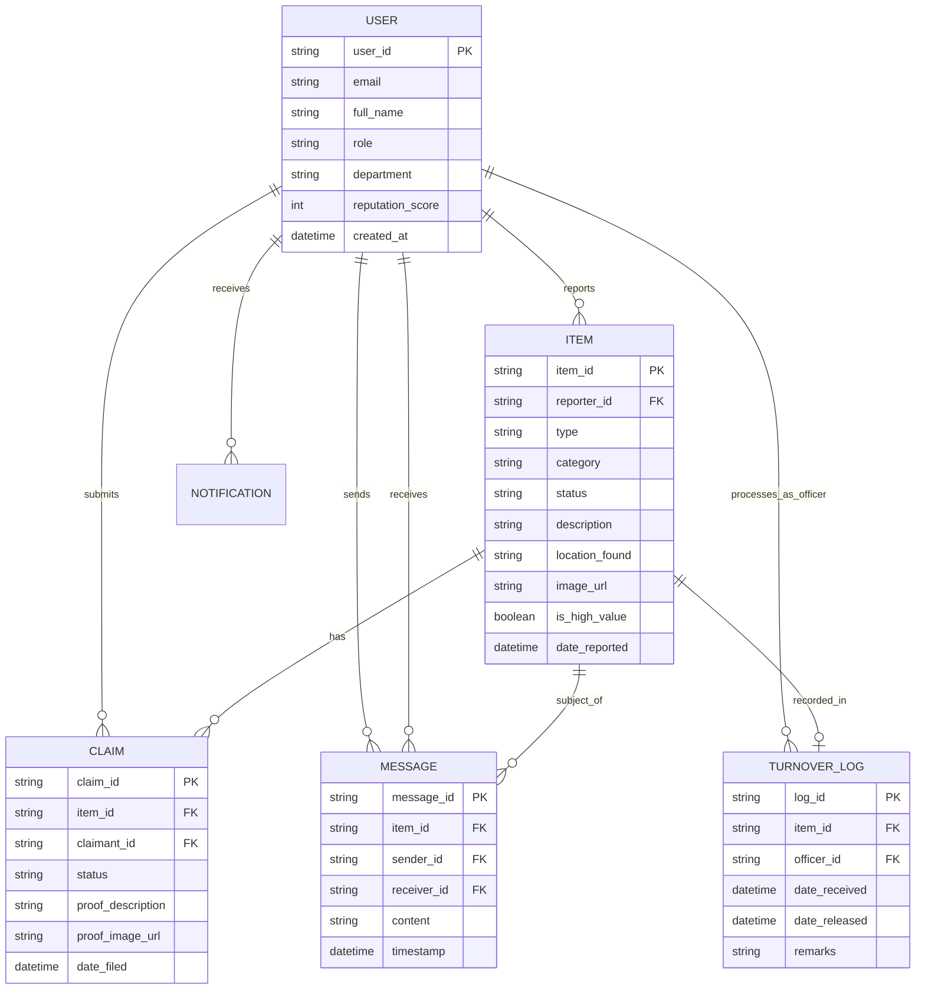

# Section 6: Data Models

## 6.1 Entity Relationship Diagram (ERD)

The Entity Relationship Diagram (ERD) visualizes the logical structure of the ClaimIT database, illustrating how system entities such as Users, Items, Claims, and Messages interact.

### ERD Description

- **User**: The central entity. A user can report multiple **Items** (as lost or found), send/receive **Messages**, and make **Claims**.
- **Item**: Represents a lost or found object. It belongs to a reporter (User) and can be associated with multiple **Claims** (though only one can be successful) and **Messages**.
- **Claim**: Represents a request for ownership. It links a specific **User** (Claimant) to a specific **Item**.
- **Message**: Facilitates communication between two **Users** regarding a specific **Item**.
- **Notification**: System-generated alerts linked to a **User**.
- **TurnoverLog**: Records the transfer of high-value items from a Finder to the **SID Admin**.

### Visual Representation (Mermaid Syntax)

_Copy and paste the code below into a Mermaid-compatible editor (like draw.io or Mermaid Live Editor) to generate the diagram._

## 6.2 Data Dictionary

The following tables define the specific attributes, data types, and constraints for each entity in the system.

### Table 1: USERS

Stores profile information for all system actors (Students, Faculty, Staff, SID Officers).

| Field Name         | Data Type | Length | Constraint       | Description                                     |
| :----------------- | :-------- | :----- | :--------------- | :---------------------------------------------- |
| `user_id`          | VARCHAR   | 36     | PK, Not Null     | Unique identifier (UUID) from Auth System.      |
| `email`            | VARCHAR   | 100    | Unique, Not Null | Institutional email address (@g.msuiit.edu.ph). |
| `full_name`        | VARCHAR   | 100    | Not Null         | User's full legal name.                         |
| `role`             | ENUM      | -      | Not Null         | 'Student', 'Faculty', 'Staff', 'SID_Admin'.     |
| `department`       | VARCHAR   | 50     | Nullable         | College or office affiliation.                  |
| `reputation_score` | INT       | -      | Default 0        | Gamification score based on successful returns. |
| `created_at`       | DATETIME  | -      | Not Null         | Timestamp of account creation.                  |

### Table 2: ITEMS

Stores details of all reported lost and found items.

| Field Name       | Data Type | Length | Constraint           | Description                                                         |
| :--------------- | :-------- | :----- | :------------------- | :------------------------------------------------------------------ |
| `item_id`        | VARCHAR   | 36     | PK, Not Null         | Unique identifier for the item report.                              |
| `reporter_id`    | VARCHAR   | 36     | FK (Users), Not Null | ID of the user who reported the item.                               |
| `type`           | ENUM      | -      | Not Null             | 'Lost' or 'Found'.                                                  |
| `category`       | VARCHAR   | 50     | Not Null             | e.g., Electronics, ID, Clothing, Accessories.                       |
| `status`         | ENUM      | -      | Not Null             | 'Open', 'Pending_Claim', 'Returned', 'Surrendered_SID', 'Archived'. |
| `description`    | TEXT      | -      | Not Null             | Detailed description of the item.                                   |
| `location_found` | VARCHAR   | 255    | Nullable             | Text description or coordinates of location.                        |
| `image_url`      | VARCHAR   | 255    | Nullable             | Path to the uploaded image file.                                    |
| `is_high_value`  | BOOLEAN   | -      | Default False        | Flag for items requiring SID turnover.                              |
| `date_reported`  | DATETIME  | -      | Not Null             | Timestamp when the report was created.                              |

### Table 3: CLAIMS

Tracks ownership claims filed against found items.

| Field Name          | Data Type | Length | Constraint           | Description                                                    |
| :------------------ | :-------- | :----- | :------------------- | :------------------------------------------------------------- |
| `claim_id`          | VARCHAR   | 36     | PK, Not Null         | Unique identifier for the claim.                               |
| `item_id`           | VARCHAR   | 36     | FK (Items), Not Null | The found item being claimed.                                  |
| `claimant_id`       | VARCHAR   | 36     | FK (Users), Not Null | The user asserting ownership.                                  |
| `status`            | ENUM      | -      | Not Null             | 'Pending', 'Approved', 'Rejected', 'Completed'.                |
| `proof_description` | TEXT      | -      | Not Null             | Text details proving ownership (e.g., "screensaver is a cat"). |
| `proof_image_url`   | VARCHAR   | 255    | Nullable             | Optional image proof (e.g., receipt, old photo).               |
| `date_filed`        | DATETIME  | -      | Not Null             | Timestamp of claim submission.                                 |

### Table 4: MESSAGES

Stores secure, in-app communications between users.

| Field Name    | Data Type | Length | Constraint           | Description                           |
| :------------ | :-------- | :----- | :------------------- | :------------------------------------ |
| `message_id`  | VARCHAR   | 36     | PK, Not Null         | Unique identifier for the message.    |
| `item_id`     | VARCHAR   | 36     | FK (Items), Not Null | Context of the conversation.          |
| `sender_id`   | VARCHAR   | 36     | FK (Users), Not Null | User sending the message.             |
| `receiver_id` | VARCHAR   | 36     | FK (Users), Not Null | User receiving the message.           |
| `content`     | TEXT      | -      | Not Null             | The message body (encrypted at rest). |
| `timestamp`   | DATETIME  | -      | Not Null             | Time the message was sent.            |

### Table 5: TURNOVER_LOG

Digital logbook for items surrendered to the Security and Investigation Division.

| Field Name      | Data Type | Length | Constraint           | Description                                      |
| :-------------- | :-------- | :----- | :------------------- | :----------------------------------------------- |
| `log_id`        | VARCHAR   | 36     | PK, Not Null         | Unique identifier for the log entry.             |
| `item_id`       | VARCHAR   | 36     | FK (Items), Not Null | The item being surrendered.                      |
| `officer_id`    | VARCHAR   | 36     | FK (Users), Not Null | The SID officer processing the turnover.         |
| `date_received` | DATETIME  | -      | Not Null             | When the item physically arrived at SID.         |
| `date_released` | DATETIME  | -      | Nullable             | When the item was returned to owner or disposed. |
| `remarks`       | TEXT      | -      | Nullable             | Officer notes on condition or verification.      |

### Table 6: NOTIFICATIONS

Stores system alerts for users.

| Field Name        | Data Type | Length | Constraint           | Description                                    |
| :---------------- | :-------- | :----- | :------------------- | :--------------------------------------------- |
| `notification_id` | VARCHAR   | 36     | PK, Not Null         | Unique identifier.                             |
| `user_id`         | VARCHAR   | 36     | FK (Users), Not Null | Recipient of the notification.                 |
| `content`         | VARCHAR   | 255    | Not Null             | Display text of the alert.                     |
| `type`            | VARCHAR   | 50     | Not Null             | e.g., 'Claim_Update', 'New_Message', 'System'. |
| `is_read`         | BOOLEAN   | -      | Default False        | Read status.                                   |
| `timestamp`       | DATETIME  | -      | Not Null             | Time created.                                  |
