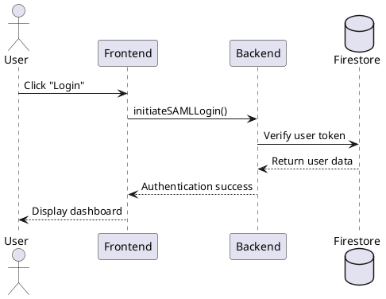
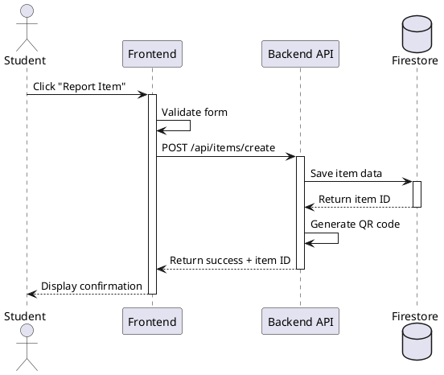

# DIAGRAM CREATION GUIDE FOR ClaimIT SRS

## Overview

This guide provides detailed recommendations for creating all UML diagrams and visual artifacts required in the ClaimIT SRS document. Each diagram type is explained with tool recommendations, creation steps, and best practices.

---

## RECOMMENDED TOOLS

### Option 1: Draw.io (diagrams.net) - **HIGHLY RECOMMENDED**

- **Cost:** Free, open-source
- **Platform:** Web-based + desktop apps (Windows, Mac, Linux)
- **URL:** https://app.diagrams.net/
- **Pros:**
  - No account required
  - Extensive UML shape libraries built-in
  - Professional-quality output
  - Export to PNG, SVG, PDF
  - Easy to learn
  - Can integrate with Google Drive, OneDrive
  - Offline capable
- **Cons:** None significant for this project
- **Best for:** All diagram types (Use Case, Sequence, Class, ERD, Component, Context, Package, Activity)

**How to Start:**

1. Go to https://app.diagrams.net/
2. Choose storage location (Device, Google Drive, etc.)
3. Create "New Diagram"
4. Select template: "Software" → Choose relevant UML type
5. Drag and drop shapes from left panel
6. Export: File → Export as → PNG (300 DPI for documents)

---

### Option 2: Lucidchart

- **Cost:** Free for education (verify with .edu email) + paid plans
- **Platform:** Web-based
- **URL:** https://www.lucidchart.com/
- **Pros:**
  - Very polished, professional templates
  - Real-time collaboration
  - Education licenses available
  - Smart formatting and alignment
- **Cons:** Requires account, free version limited
- **Best for:** Collaborative team diagram creation

---

### Option 3: PlantUML - **FOR ADVANCED USERS**

- **Cost:** Free, open-source
- **Platform:** Text-based (code generates diagrams)
- **URL:** https://plantuml.com/
- **Pros:**
  - Version control friendly (text files)
  - Consistent styling
  - Fast once you learn syntax
  - Can embed in documentation
- **Cons:** Steep learning curve, text-based (no visual editor)
- **Best for:** Sequence diagrams, Class diagrams if you prefer code

**Example PlantUML Code (Sequence Diagram):**



---

### Option 4: Microsoft Visio (if available)

- **Cost:** Paid (often available through university licenses)
- **Platform:** Windows desktop
- **Pros:** Industry standard, powerful
- **Cons:** Cost, Windows-only
- **Best for:** If you already have access via MSU-IIT

---

### Option 5: StarUML

- **Cost:** Free trial, paid for full version
- **Platform:** Desktop (Windows, Mac, Linux)
- **URL:** https://staruml.io/
- **Pros:** Professional UML tool, comprehensive
- **Cons:** Watermark in free version
- **Best for:** Complex Class diagrams

---

## DIAGRAM-BY-DIAGRAM CREATION GUIDE

### 1. USE CASE DIAGRAM

**Tool:** Draw.io (recommended)

**Steps:**

1. Open Draw.io → New Diagram → UML → Use Case Diagram
2. Add System Boundary Box:
   - Shape: Rectangle (label: "ClaimIT System")
3. Add Actors (outside boundary):
   - Shape: UML Actor (stick figure)
   - Add: Guest, Student, Faculty, Admin, System (timer icon)
4. Add Use Cases (inside boundary):
   - Shape: Oval
   - Label with verb phrases: "Report Lost Item", "Search Items", etc.
5. Add Relationships:
   - **Association:** Solid line (Actor to Use Case)
   - **Include:** Dashed arrow labeled <<include>>
   - **Extend:** Dashed arrow labeled <<extend>>
   - **Generalization:** Solid arrow with hollow triangle (inheritance between actors)
6. Arrange: Actors on left/right, use cases in center
7. Color code: Optional (green for Student, blue for Admin, etc.)

**Best Practices:**

- Keep use case names short and action-oriented
- Don't overcrowd - create separate diagrams for complex subsystems
- Use generalization to show role hierarchy (Student inherits from Guest)

**Export Settings:**

- Format: PNG
- DPI: 300 (for print quality)
- Transparent background: No
- Border: 10px padding

---

### 2. ACTIVITY DIAGRAM

**Tool:** Draw.io

**Steps:**

1. Open Draw.io → New Diagram → UML → Activity Diagram
2. Add Swimlanes:
   - Shape: Horizontal Container (Pool/Lane)
   - Create 3 lanes: User, System, SID Admin
3. Add Nodes:
   - **Start:** Filled circle
   - **Activity:** Rounded rectangle
   - **Decision:** Diamond (label: question)
   - **Merge:** Diamond (no label)
   - **Fork/Join:** Thick horizontal bar (parallel activities)
   - **End:** Filled circle with outer circle
4. Connect with Arrows:
   - Control flow: Solid arrow
   - Label decision branches: [yes], [no]
5. Flow: Top to bottom, left to right

**Example Flow for "Report Lost Item":**

```
START (User Lane)
 ↓
[User clicks "Report Item"] (Activity)
 ↓
[Enter item details] (Activity)
 ↓
<Valid?> (Decision)
 ├─[No]─→ [Show errors] → Loop back
 └─[Yes]
      ↓ (crosses to System Lane)
      [Validate data] (Activity - System Lane)
       ↓
      [Save to database] (Activity)
       ↓
      [Generate QR code] (Activity)
       ↓
      [Send notification] (Activity)
       ↓ (back to User Lane)
      [Show success message]
       ↓
      END
```

**Best Practices:**

- Use swimlanes to show responsibility
- Keep activities concise (max 5 words)
- Show both happy path and error paths
- Use fork/join for parallel processes (e.g., "Save item" AND "Send notification" happen simultaneously)

---

### 3. SEQUENCE DIAGRAM

**Tool:** Draw.io or PlantUML

**Draw.io Steps:**

1. Open Draw.io → UML → Sequence Diagram template
2. Add Lifelines (vertical dashed lines):
   - Top box: Object/Actor name
   - Examples: :User, :Frontend, :Backend, :Database
3. Add Activation Boxes:
   - Thin rectangle on lifeline (shows when object is "active")
4. Add Messages (arrows between lifelines):
   - **Synchronous call:** Solid line with filled arrow
   - **Return:** Dashed line with open arrow
   - **Asynchronous:** Solid line with open arrow
5. Number messages: 1, 2, 2.1, 2.2, 3 (hierarchical numbering)
6. Add Alt/Opt/Loop frames:
   - Shape: Rectangle with label (alt, opt, loop)
   - Shows conditional logic

**PlantUML Alternative (faster for text-oriented users):**



**Best Practices:**

- Time flows top to bottom
- Show returns for synchronous calls
- Use alt frames for if/else logic
- Don't show every single method - focus on key interactions
- Limit to 7-10 messages per diagram (split complex flows)

---

### 4. COLLABORATION/COMMUNICATION DIAGRAM

**Tool:** Draw.io

**Steps:**

1. Open Draw.io → UML → Communication/Collaboration Diagram
2. Add Objects:
   - Shape: Rectangle with object name
   - Format: `:ClassName` or `objectName:ClassName`
3. Add Links (lines showing relationships):
   - Solid line between objects that interact
4. Add Messages on Links:
   - Text label with number: `1: methodName()`
   - Arrow shows direction
   - Use hierarchical numbering: 1, 1.1, 1.2, 2, 2.1
5. Arrange spatially (unlike sequence, no strict top-down)

**Example:**

```
   :User
     |
     | 1: enterDetails()
     | 6: showSuccess()
     |
   :ItemForm
     |
     | 2: validate()
     | 3: submit(data)
     |
   :ItemController
    /  |  \
   /   |   \
2: save() | 4: genQR()  5: notify()
  |      |       |
:DB   :QRService :NotifyService
```

**Best Practices:**

- Number shows sequence, but layout shows structure
- Use for simpler scenarios (sequence diagrams better for complex timing)
- Good for showing object relationships

---

### 5. CLASS DIAGRAM

**Tool:** Draw.io or StarUML

**Steps:**

1. Open Draw.io → UML → Class Diagram
2. Add Classes:
   - Shape: Rectangle divided into 3 sections
   - **Top:** Class name (bold)
   - **Middle:** Attributes with visibility and type
     - Format: `-` private, `+` public, `#` protected
     - Example: `- userId: string`
   - **Bottom:** Methods with parameters and return type
     - Example: `+ submitClaim(itemId: string): boolean`
3. Add Relationships:
   - **Association:** Solid line (general relationship)
   - **Aggregation:** Line with hollow diamond (has-a, shared ownership)
   - **Composition:** Line with filled diamond (has-a, exclusive ownership)
   - **Inheritance:** Line with hollow triangle arrow (is-a)
   - **Dependency:** Dashed arrow (uses)
4. Add Multiplicity:
   - Numbers at relationship ends: `1`, `0..1`, `1..*`, `*`

**Example Classes for ClaimIT:**

```
┌─────────────────────┐
│       User          │
├─────────────────────┤
│ - userId: string    │
│ - email: string     │
│ - role: UserRole    │
│ - name: string      │
├─────────────────────┤
│ + login(): boolean  │
│ + logout(): void    │
└─────────────────────┘
         △ (inheritance)
         |
    ┌────┴────┐
    │         │
┌───────┐ ┌──────┐
│Student│ │Admin │
└───────┘ └──────┘

┌─────────────────────┐        ┌─────────────────────┐
│       Item          │        │       Claim         │
├─────────────────────┤        ├─────────────────────┤
│ - itemId: string    │1     * │ - claimId: string   │
│ - title: string     ├────────┤ - itemId: string    │
│ - description: text │ claims │ - userId: string    │
│ - status: ItemStatus│        │ - proof: string     │
│ - postedBy: string  │        │ - status: ClaimStatus│
├─────────────────────┤        ├─────────────────────┤
│ + save(): void      │        │ + submit(): void    │
│ + archive(): void   │        │ + approve(): void   │
└─────────────────────┘        └─────────────────────┘
         1                              *
         │ posted by                    │ submits
         │                              │
      ┌──┴──┐                     ┌────┴─────┐
      │ User│                     │  User    │
      └─────┘                     └──────────┘
```

**Best Practices:**

- Don't show every property - focus on important ones
- Group related classes together
- Use color coding: Entity classes (blue), Service classes (green), UI classes (yellow)
- Show cardinality on relationships

---

### 6. ENTITY-RELATIONSHIP DIAGRAM (ERD)

**Tool:** Draw.io or dbdiagram.io

**Draw.io Steps:**

1. Open Draw.io → Entity Relation template
2. Add Entities:
   - Shape: Rectangle
   - Label: Table name (e.g., `Users`)
3. Add Attributes inside entity:
   - **Primary Key:** Underlined or with PK icon
   - Format: `attributeName : dataType`
   - Example: `userId : VARCHAR(50) PK`
4. Add Relationships:
   - Line connecting entities
   - Cardinality notation:
     - **Crow's foot notation (recommended):**
       - One: Single line `|`
       - Many: Crow's foot `<`
       - One-to-Many: `|<`
       - Many-to-Many: `><`
     - **Chen notation:** Diamond with relationship name
5. Add Foreign Keys:
   - Attribute marked with FK
   - Shows which field links to parent table

**Example ERD Structure:**

```
┌──────────────────┐           ┌──────────────────┐
│     Users        │           │      Items       │
├──────────────────┤           ├──────────────────┤
│ PK userId        │1       *  │ PK itemId        │
│    email         ├───────────┤ FK postedBy      │
│    name          │  posts    │    title         │
│    role          │           │    description   │
│    createdAt     │           │    category      │
└──────────────────┘           │    status        │
        │1                      │    location      │
        │                       │    createdAt     │
        │submits                └──────────────────┘
        │                               │1
        │*                              │
┌──────────────────┐                   │has
│     Claims       │                   │
├──────────────────┤                   │*
│ PK claimId       │          ┌────────────────┐
│ FK itemId        ├──────────│    Photos      │
│ FK userId        │          ├────────────────┤
│    proof         │1      *  │ PK photoId     │
│    status        │          │ FK itemId      │
│    submittedAt   │          │    photoURL    │
│ FK reviewedBy    │          │    uploadedAt  │
│    reviewedAt    │          └────────────────┘
└──────────────────┘
```

**Alternative Tool: dbdiagram.io (Code-based ERD)**

- URL: https://dbdiagram.io/
- Define schema in text, generates diagram:

```dbml
Table Users {
  userId varchar [pk]
  email varchar [unique, not null]
  name varchar
  role enum('student', 'faculty', 'admin')
  createdAt timestamp
}

Table Items {
  itemId varchar [pk]
  postedBy varchar [ref: > Users.userId]
  title varchar [not null]
  description text
  category varchar
  status enum('lost', 'found', 'claimed')
  createdAt timestamp
}

Table Claims {
  claimId varchar [pk]
  itemId varchar [ref: > Items.itemId]
  userId varchar [ref: > Users.userId]
  proof text
  status enum('pending', 'approved', 'denied')
  submittedAt timestamp
}
```

**Best Practices:**

- Use consistent naming (plural for tables: Users, Items)
- Every table needs a primary key
- Show all foreign keys
- Indicate required fields (NOT NULL)
- Use appropriate data types

---

### 7. CONTEXT DIAGRAM

**Tool:** Draw.io

**Steps:**

1. Open Draw.io → New Diagram → Software → Context Diagram
2. Add Central System:
   - Shape: Circle or Rectangle
   - Label: "ClaimIT System"
3. Add External Entities (outside system):
   - Shape: Rectangle
   - Examples: Students, SID, Active Directory, Email Server, Web Browser
4. Add Data Flows:
   - Arrows showing data exchange
   - Label arrows with data description
   - Examples: "Login credentials", "User profile", "Item reports", "Notifications"

**Example Structure:**

```
┌────────────┐
│  Students  │ ←─────── Item search results ─────┐
│  Faculty   │ ─────→ Lost/Found reports ────┐   │
└────────────┘                               │   │
                                             ↓   ↑
┌────────────┐                          ┌─────────────┐
│ Active Dir │ ←─── Auth request ───────│  ClaimIT    │
│   (LDAP)   │ ──→ User credentials ────→│   System    │
└────────────┘                          └─────────────┘
                                             ↑   │
┌────────────┐                               │   │
│    SID     │ ←─── Claim notifications ─────┘   │
│   Admin    │ ──→ Claim approvals ──────────────┘
└────────────┘                                   │
                                                 ↓
┌────────────┐                          ┌─────────────┐
│   Email    │ ←─── Send notifications ─│   Firebase  │
│   Server   │                          │  (Backend)  │
└────────────┘                          └─────────────┘
```

**Best Practices:**

- Keep it high-level (no internal details)
- Show all external entities system interacts with
- Label data flows clearly
- Use single circle/box for entire system (no internal decomposition)

---

### 8. COMPONENT DIAGRAM

**Tool:** Draw.io

**Steps:**

1. Open Draw.io → UML → Component Diagram
2. Add Components:
   - Shape: Rectangle with <<component>> stereotype and component icon
   - Label: Component name (e.g., "Authentication Module")
3. Add Interfaces:
   - **Provided interface:** Circle (lollipop) connected to component
   - **Required interface:** Semi-circle (socket) connected to component
4. Add Dependencies:
   - Dashed arrow showing one component depends on another

**Example Components:**

```
┌────────────────────┐
│  Web Browser       │
│  (React Frontend)  │
└─────────┬──────────┘
          │ HTTPS
          ↓
┌─────────────────────────────────┐
│      <<component>>              │
│   Authentication Module         │
│  ┌──────────────────────────┐   │
│  │ - SAML SSO               │   │
│  │ - Token Management       │   │
│  └──────────────────────────┘   │
└──────┬──────────────────────────┘
       │ requires
       ↓
┌─────────────────────────────────┐
│      <<component>>              │
│   Item Management Module        │
│  ┌──────────────────────────┐   │
│  │ - CRUD Operations        │   │
│  │ - Photo Upload           │   │
│  │ - Search Engine          │   │
│  └──────────────────────────┘   │
└──────┬──────────────────────────┘
       │ uses
       ↓
┌─────────────────────────────────┐
│      <<component>>              │
│   Database Layer                │
│  ┌──────────────────────────┐   │
│  │ - Firestore Adapter      │   │
│  │ - Query Builder          │   │
│  └──────────────────────────┘   │
└─────────────────────────────────┘
```

**Best Practices:**

- Group related functionality into components
- Show dependencies clearly
- Use packages to group related components
- Keep it logical, not physical (save deployment view for separate diagram)

---

### 9. PACKAGE DIAGRAM

**Tool:** Draw.io

**Steps:**

1. Open Draw.io → UML → Package Diagram
2. Add Packages:
   - Shape: Folder-shaped rectangle
   - Label: Package name (e.g., "com.claimit.frontend")
3. Add Dependencies:
   - Dashed arrow with <<import>> or <<access>>
4. Nest packages if showing hierarchy

**Example Structure:**

```
┌───────────────────────────────────────┐
│          com.claimit                  │
│  ┌─────────────────────────────────┐  │
│  │      frontend                   │  │
│  │  ┌────────────┐  ┌────────────┐ │  │
│  │  │ components │  │   services │ │  │
│  │  └────────────┘  └────────────┘ │  │
│  └─────────────────────────────────┘  │
│               ↓ <<import>>            │
│  ┌─────────────────────────────────┐  │
│  │      backend                    │  │
│  │  ┌────────────┐  ┌────────────┐ │  │
│  │  │     api    │  │   models   │ │  │
│  │  └────────────┘  └────────────┘ │  │
│  └─────────────────────────────────┘  │
│               ↓ <<access>>            │
│  ┌─────────────────────────────────┐  │
│  │      database                   │  │
│  │  ┌────────────┐  ┌────────────┐ │  │
│  │  │  firestore │  │   schemas  │ │  │
│  │  └────────────┘  └────────────┘ │  │
│  └─────────────────────────────────┘  │
└───────────────────────────────────────┘
```

**Best Practices:**

- Organize by logical grouping (frontend, backend, services)
- Show clear dependency direction (frontend → backend → database)
- Avoid circular dependencies
- Use consistent naming conventions

---

## GENERAL DIAGRAM BEST PRACTICES

### Visual Consistency

- **Use same tool for all diagrams** (ensures consistent style)
- **Color scheme:**
  - User-facing: Blue
  - Admin-facing: Orange
  - System/Backend: Green
  - Database: Yellow
  - External systems: Gray
- **Font:** Arial or Helvetica, 10-12pt
- **Line thickness:** 2px for main elements, 1px for relationships

### Layout

- **Left-to-right or Top-to-bottom flow**
- **Align elements** using grid/snap-to-grid
- **White space:** Don't overcrowd
- **Crossing lines:** Minimize, use bridges/jumps if necessary

### Labeling

- **Clear, concise labels** (no abbreviations unless defined)
- **Consistent naming** (match code/database names)
- **Legends:** Add legend if using colors or special notations

### Export for Documents

- **Format:** PNG (for Microsoft Word) or SVG (for web/PDF)
- **Resolution:** 300 DPI minimum for print
- **Size:** Scale to fit document width (usually 6-7 inches)
- **Filename convention:** `ClaimIT_DiagramType_Version.png`
  - Example: `ClaimIT_UseCaseDiagram_v1.png`

---

## SECTION-SPECIFIC DIAGRAM CHECKLIST

### For SRS Document, you need:

**Section 4 (Requirements):**

- [ ] Activity Diagram (End-to-end workflow)

**Section 5 (Analysis & Design):**

- [ ] Use Case Diagram (all actors and use cases)
- [ ] 3-5 Sequence Diagrams (key scenarios)
- [ ] 2-3 Collaboration Diagrams (key interactions)

**Section 6 (Data Models):**

- [ ] Entity-Relationship Diagram (complete database schema)
- [ ] Class Diagram (object-oriented design)
- [ ] Context Diagram (system boundaries)
- [ ] Component Diagram (system modules)
- [ ] Package Diagram (code organization)

**Section 7 (The System):**

- [ ] UI Mockups/Screenshots (optional but helpful)
- [ ] System Architecture Diagram (optional, high-level tech stack)

---

## COLLABORATION TIP

If working in a team:

1. **Assign diagram types to team members:**

   - Member 1: Use Case + Activity
   - Member 2: Sequence + Collaboration
   - Member 3: ERD + Class
   - Member 4: Context + Component + Package

2. **Create shared style guide:**

   - Agree on colors, fonts, layout before starting
   - Use Draw.io custom templates for consistency

3. **Review process:**
   - Peer review each diagram before finalizing
   - Ensure all diagrams use same notation standards
   - Check that diagrams are consistent with each other (e.g., classes in Class Diagram match entities in ERD)

---

## ESTIMATED TIME TO CREATE DIAGRAMS

- Use Case Diagram: 2-3 hours (including all use cases)
- Activity Diagram: 1-2 hours per diagram
- Sequence Diagrams: 2-3 hours each (×3-5 diagrams = 6-15 hours)
- Collaboration Diagrams: 1-2 hours each (×2-3 diagrams = 2-6 hours)
- ERD: 3-4 hours (complete schema with all relationships)
- Class Diagram: 4-5 hours (all classes, attributes, methods, relationships)
- Context Diagram: 1 hour
- Component Diagram: 2-3 hours
- Package Diagram: 1-2 hours

**Total estimated time: 25-40 hours** for all diagrams

**Tips to speed up:**

- Use templates and examples from Draw.io library
- Reuse elements (copy-paste and modify)
- Focus on key diagrams first, then add details
- Work in parallel with team members

---

## ADDITIONAL RESOURCES

### Tutorials:

- **Draw.io official tutorials:** https://www.diagrams.net/blog
- **UML basics:** https://www.uml-diagrams.org/
- **PlantUML guide:** https://plantuml.com/guide

### Templates:

- Download ClaimIT-specific templates (if provided by instructor)
- Draw.io built-in templates: File → New → Templates → Software

### Example SRS with Diagrams:

- IEEE Std 830-1998 sample documents
- GitHub: Search "SRS document example" for open-source references

---

**END OF DIAGRAM CREATION GUIDE**

_Follow this guide systematically to create professional, consistent diagrams for your ClaimIT SRS document. Good luck!_
