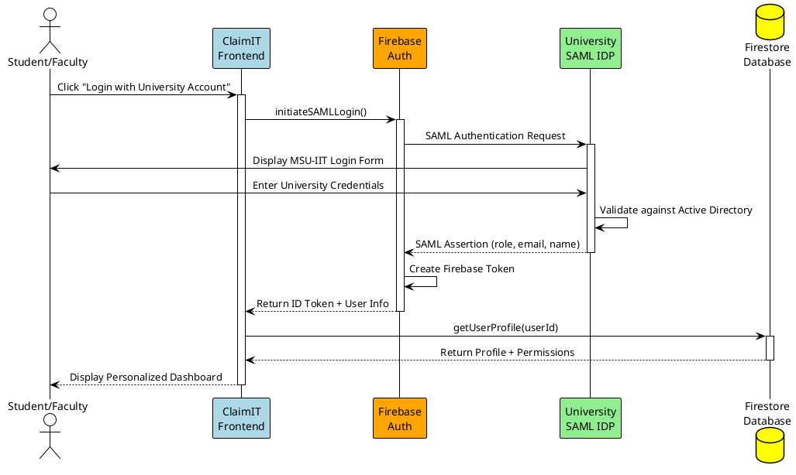
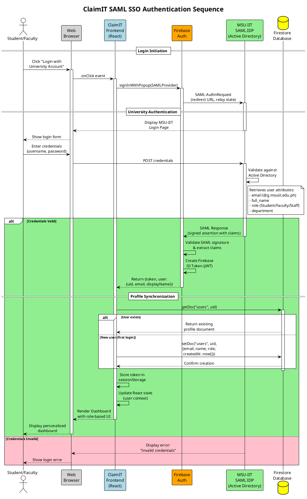
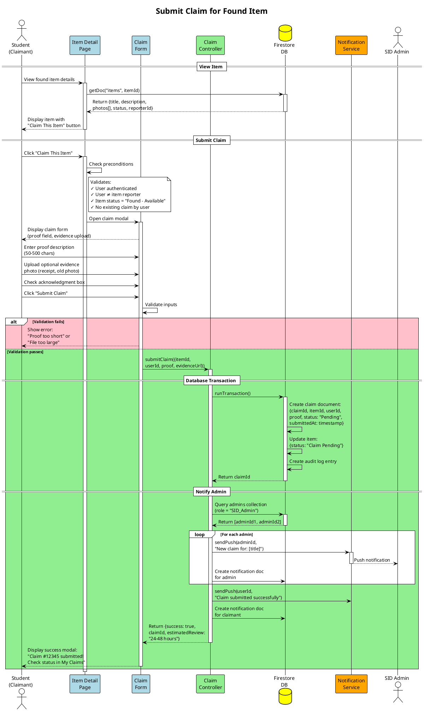
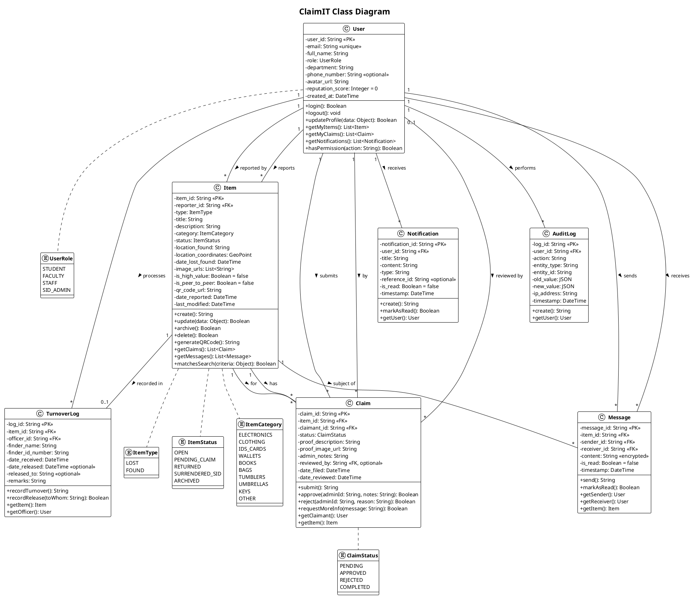
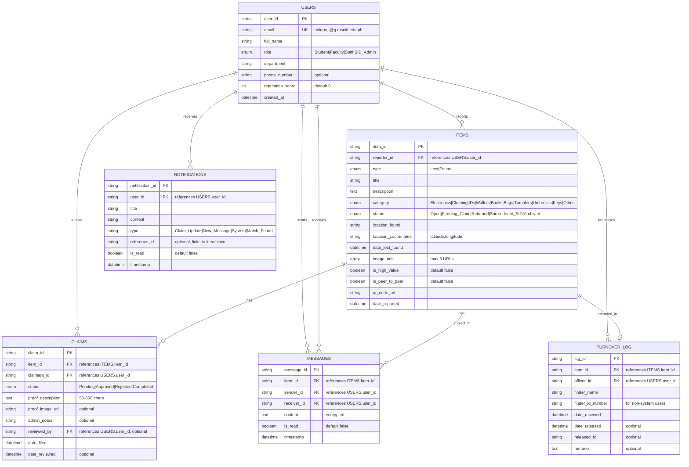

# DIAGRAM CREATION GUIDE FOR ClaimIT SRS

## Overview

This guide provides **comprehensive, step-by-step instructions** for creating all UML diagrams and visual artifacts required in the ClaimIT Software Requirements Specification (SRS) document. Each diagram type is explained with detailed ClaimIT-specific content, tool recommendations, creation steps, and best practices.

**ClaimIT System Context:**
ClaimIT is a Progressive Web Application (PWA) for MSU-IIT's campus lost and found management system. The system serves 12,000+ students, faculty, and staff, integrating with the university's SAML SSO/Active Directory for authentication. Key stakeholders include the Security Intelligence Division (SID) and Information and Communication Technology Center (ICTC).

---

## TABLE OF CONTENTS

1. [Recommended Tools](#recommended-tools)
2. [Use Case Diagram](#1-use-case-diagram)
3. [Activity Diagram](#2-activity-diagram)
4. [Sequence Diagram](#3-sequence-diagram)
5. [Collaboration Diagram](#4-collaborationcommunication-diagram)
6. [Class Diagram](#5-class-diagram)
7. [Entity-Relationship Diagram](#6-entity-relationship-diagram-erd)
8. [Context Diagram](#7-context-diagram)
9. [Component Diagram](#8-component-diagram)
10. [Package Diagram](#9-package-diagram)
11. [General Best Practices](#general-diagram-best-practices)
12. [Section-Specific Checklist](#section-specific-diagram-checklist)
13. [ClaimIT Color Scheme & Style Guide](#claimit-style-guide)

---

## RECOMMENDED TOOLS

### Option 1: Draw.io (diagrams.net) - **HIGHLY RECOMMENDED**

- **Cost:** Free, open-source
- **Platform:** Web-based + desktop apps (Windows, Mac, Linux)
- **URL:** https://app.diagrams.net/
- **Why Best for ClaimIT:**
  - No account required (important for quick student collaboration)
  - Extensive UML shape libraries built-in (all 9 diagram types supported)
  - Professional-quality output suitable for academic submission
  - Export to PNG, SVG, PDF with custom DPI settings
  - Easy to learn (2-3 hours to master all features)
  - Integrates with Google Drive, OneDrive for team collaboration
  - Offline capable via desktop app
  - **Mermaid diagram import** for quick ERD creation from code

**Step-by-Step Setup for ClaimIT Project:**

1. Go to https://app.diagrams.net/
2. Choose storage location: **Google Drive** (recommended for team access) or **Device** (for local work)
3. Click **Create New Diagram**
4. **File name convention:** `ClaimIT_[DiagramType]_v[Version].drawio`
   - Example: `ClaimIT_UseCaseDiagram_v1.drawio`
5. Select template category: **Software** → Choose relevant UML type
6. **Enable shape libraries:** Click **+ More Shapes** → Check: UML, UML 2.5, Entity Relation, Software
7. Drag and drop shapes from left panel onto canvas
8. **Export for SRS document:**
   - File → Export as → PNG
   - **Zoom:** 100% or higher
   - **Border Width:** 10px
   - **Selection Only:** Uncheck to export full diagram
   - **Transparent Background:** No (use white background for documents)

---

### Option 2: Lucidchart

- **Cost:** Free for education (verify with @g.msuiit.edu.ph email) + paid plans
- **Platform:** Web-based
- **URL:** https://www.lucidchart.com/
- **Pros:**
  - Very polished, professional templates
  - Real-time collaboration with comment threads
  - Education licenses available for MSU-IIT students
  - Smart formatting, auto-alignment, and spacing
  - Presentation mode for stakeholder reviews
- **Cons:** Requires account, free version limited to 3 editable documents
- **Best for:** Collaborative team diagram creation with live editing

**MSU-IIT Education Access:**

1. Visit https://www.lucidchart.com/pages/usecase/education
2. Sign up with your @g.msuiit.edu.ph email
3. Verify student status for free premium features

---

### Option 3: PlantUML - **FOR ADVANCED USERS & VERSION CONTROL**

- **Cost:** Free, open-source
- **Platform:** Text-based (code generates diagrams automatically)
- **URL:** https://plantuml.com/
- **VS Code Extension:** Search "PlantUML" in Extensions Marketplace
- **Pros:**
  - **Version control friendly** (text files work with Git)
  - Consistent styling across all diagrams
  - Fast iteration once syntax is learned
  - Can embed in Markdown documentation
  - Online renderer: https://www.plantuml.com/plantuml/uml/
- **Cons:** Steep learning curve, no visual drag-and-drop
- **Best for:** Sequence diagrams, Class diagrams, ERDs (especially for developers)

**VS Code PlantUML Setup:**

1. Install "PlantUML" extension by jebbs
2. Install Java Runtime (required for rendering)
3. Create `.puml` file in your project
4. Press `Alt+D` to preview diagram
5. Right-click → Export Current Diagram

**ClaimIT Example - Authentication Sequence Diagram:**



---

### Option 4: Microsoft Visio (if available via MSU-IIT)

- **Cost:** Paid (check MSU-IIT Microsoft 365 Education license)
- **Platform:** Windows desktop + web version
- **Pros:** Industry standard, powerful stencils, professional output
- **Cons:** Cost, primarily Windows, steeper learning curve
- **Best for:** Students with existing Visio experience

**Check MSU-IIT Access:**

1. Log in to https://portal.office.com with @g.msuiit.edu.ph
2. Check available apps for Visio Online or download rights

---

### Option 5: Mermaid (for ERD and Flowcharts in Markdown)

- **Cost:** Free, built into many platforms
- **Platform:** Text-based, renders in GitHub, VS Code, Notion
- **URL:** https://mermaid.live/
- **Pros:**
  - **Already used in ClaimIT SRS** (see Section 6.1 ERD code)
  - Embedded directly in Markdown files
  - Renders automatically in GitHub README
  - Quick for simple diagrams
- **Cons:** Limited styling options, not suitable for complex UML
- **Best for:** ERDs, simple flowcharts, quick documentation

**Mermaid Live Editor:** https://mermaid.live/edit

- Paste code from SRS Section 6.1 to instantly generate ERD

---

## DIAGRAM-BY-DIAGRAM CREATION GUIDE

---

## 1. USE CASE DIAGRAM

**Purpose:** Shows all actors (users) and the primary use cases (functions) they can perform in the ClaimIT system. This is the foundation for understanding system functionality from an external perspective.

**SRS Location:** Section 5.1

**Scenario:**
A student, "John," logs into the ClaimIT system using his university credentials via the SAML SSO interface. Once authenticated, he navigates to the "Report Lost Item" dashboard. He fills out a detailed form for his lost "MacBook Air," selecting the "Electronics" category, specifying the "College of Computer Studies" as the last known location, and setting the date/time. He uploads a photo of the laptop and adds a description of a unique sticker on the lid. The system validates that all required fields are present and that the photo format is correct. Upon successful validation, the system saves the report to the database, generates a unique Item ID, and makes the post visible on the public "Lost Items" feed for other students to see.

**Tool:** Draw.io (recommended) or Lucidchart

### ClaimIT-Specific Actors

| Actor             | Symbol           | Description                                                   | Color Code       |
| ----------------- | ---------------- | ------------------------------------------------------------- | ---------------- |
| **Guest/Visitor** | Stick figure     | Unauthenticated users who can only browse found items         | Gray (#808080)   |
| **Student**       | Stick figure     | Authenticated students who can report, search, claim, message | Blue (#4285F4)   |
| **Faculty/Staff** | Stick figure     | Same as students + can mark items as "Turned in to SID"       | Green (#34A853)  |
| **SID Admin**     | Stick figure     | Security personnel with full admin access                     | Orange (#FBBC04) |
| **System**        | Timer/Clock icon | Automated processes (notifications, archiving, QR generation) | Purple (#9C27B0) |

### ClaimIT Use Cases (Complete List)

**Guest/Visitor Use Cases:**

- UC-0.1: Register/Login via SSO
- UC-2.1: Browse Found Items (read-only)
- UC-2.2: Search Items (limited filters)

**Student Use Cases (inherits Guest capabilities):**

- UC-1.1: Report Lost Item
- UC-1.2: Report Found Item
- UC-2.3: View Item Details (full access)
- UC-3.1: Submit Claim
- UC-3.2: Track Claim Status
- UC-4.1: Send Message
- UC-4.2: Receive Notifications
- UC-6.1: Manage My Items (edit/delete own posts)
- UC-6.2: View My Dashboard

**Faculty/Staff Use Cases (inherits Student capabilities):**

- UC-1.3: Mark Item as "Turned in to SID"
- UC-5.3: Access Faculty Dashboard

**SID Admin Use Cases:**

- UC-5.1: Moderate Items (edit/archive/delete any item)
- UC-5.2: Process Claims (approve/deny with reasons)
- UC-5.3: Manage Item Lifecycle (disposal scheduling)
- UC-5.4: View Admin Dashboard (comprehensive analytics)
- UC-5.5: Send Admin Messages (broadcast or individual)
- UC-5.6: View Audit Logs
- UC-5.7: Configure System Settings
- UC-5.8: Generate Reports

**System (Automated) Use Cases:**

- UC-7.1: Send Automatic Notifications
- UC-7.2: Generate QR Codes
- UC-7.3: Archive Expired Items
- UC-7.4: Clean Up Temporary Data

### Step-by-Step Creation in Draw.io

1. **Open Draw.io** → New Diagram → UML → Use Case Diagram template

2. **Add System Boundary Box:**

   - Shape: Large Rectangle
   - Label: **"ClaimIT Lost and Found System"**
   - Position: Center of canvas, leave margins for actors
   - Style: Dashed border, light gray (#F5F5F5) fill

3. **Add Actors (OUTSIDE the boundary):**

   - Shape: UML Actor (stick figure) from UML shapes library
   - **Left side actors:** Guest, Student, Faculty/Staff (user roles)
   - **Right side actors:** SID Admin, System (administrative roles)
   - Label each actor below the figure
   - Apply color coding (see table above)

4. **Add Actor Inheritance (Generalization):**

   - Draw solid line with **hollow triangle arrow** from:
     - Student → Guest (Student inherits Guest capabilities)
     - Faculty/Staff → Student (Faculty inherits Student capabilities)
   - This reduces redundancy in associations

5. **Add Use Cases (INSIDE the boundary):**

   - Shape: Oval/Ellipse
   - Label with verb phrases: "Report Lost Item", "Submit Claim", etc.
   - **Group by functionality:**
     - Top: Authentication use cases
     - Left: Reporting use cases
     - Center: Search/Browse use cases
     - Right: Claims use cases
     - Bottom: Admin use cases

6. **Add Relationships:**

   | Relationship       | Line Style                   | Example                                               |
   | ------------------ | ---------------------------- | ----------------------------------------------------- |
   | **Association**    | Solid line                   | Student ── Report Lost Item                           |
   | **Include**        | Dashed arrow + <<include>>   | Submit Claim --<<include>>--> Authenticate User       |
   | **Extend**         | Dashed arrow + <<extend>>    | Request Additional Proof --<<extend>>--> Submit Claim |
   | **Generalization** | Solid line + hollow triangle | Student ──▷ Guest                                     |

7. **Add Include Relationships (common functionality):**

   - UC-0.2: Authenticate User (included by all authenticated use cases)
   - UC-4.3: Send Notification (included by claim, message, and admin use cases)

8. **Add Extend Relationships (optional behaviors):**
   - UC-3.1.1: Request Additional Proof (extends Submit Claim)
   - UC-1.2.1: Enable Peer-to-Peer Mode (extends Report Found Item)

### Visual Layout Template

```
     ┌──────────────────────────────────────────────────────────────┐
     │                 ClaimIT Lost and Found System                │
     │                                                              │
◯    │  ┌─────────────────────┐    ┌─────────────────────┐         │    ◯
│    │  │  Register/Login SSO │    │  Browse Found Items │         │    │
├─   │  └─────────────────────┘    └─────────────────────┘         │   ─┤
│    │              │                        │                      │    │
Guest│  ┌───────────┴───────────┬────────────┴──────────┐          │ System
     │  │                       │                       │          │  (Timer)
◯    │  ▼                       ▼                       ▼          │
│    │ ┌─────────────┐  ┌─────────────┐  ┌─────────────┐          │
├─   │ │ Report Lost │  │Report Found │  │ Search Items│          │   ◯
│    │ │    Item     │  │    Item     │  │             │          │   │
Student └─────────────┘  └─────────────┘  └─────────────┘          │  ─┤
  │  │        │                │                │                  │   │
  ▽  │        └────────────────┼────────────────┘                  │ SID Admin
◯    │                         ▼                                   │
│    │         ┌─────────────────────────────┐                     │
├─   │         │      Submit Claim           │◄──<<extend>>── Request  │
│    │         └─────────────────────────────┘              More Info  │
Faculty        │                ▲                                  │
/Staff │       │    <<include>> │                                  │
     │         ▼                │                                  │
     │  ┌─────────────┐  ┌─────────────┐  ┌─────────────┐         │
     │  │ Send Message│  │  Receive    │  │  Track Claim │         │
     │  │             │  │Notification │  │    Status   │         │
     │  └─────────────┘  └─────────────┘  └─────────────┘         │
     │                                                              │
     │  ══════════════ ADMIN SECTION ══════════════                │
     │  ┌─────────────┐  ┌─────────────┐  ┌─────────────┐         │
     │  │  Moderate   │  │   Process   │  │    View     │         │
     │  │   Items     │  │   Claims    │  │  Dashboard  │         │
     │  └─────────────┘  └─────────────┘  └─────────────┘         │
     └──────────────────────────────────────────────────────────────┘
```

### Export Settings for SRS Document

| Setting        | Value                           |
| -------------- | ------------------------------- |
| **Format**     | PNG                             |
| **Zoom**       | 150% (for clarity in document)  |
| **DPI**        | 300 (print quality)             |
| **Border**     | 10-20px white padding           |
| **Background** | White (not transparent)         |
| **Filename**   | `ClaimIT_UseCaseDiagram_v1.png` |

### Common Mistakes to Avoid

❌ **Don't** put actors inside the system boundary
❌ **Don't** draw lines between use cases unless it's include/extend
❌ **Don't** connect actors directly to other actors
❌ **Don't** use too many include relationships (overcomplicates diagram)
✅ **Do** use inheritance to reduce redundant associations
✅ **Do** group related use cases visually
✅ **Do** keep use case names action-oriented (verb + noun)

---

## 2. ACTIVITY DIAGRAM

**Purpose:** Illustrates the complete workflow for critical use cases, showing the sequence of activities, decision points, parallel processes, and responsibility assignment through swimlanes.

**SRS Location:** Section 4.2

**Scenario:**
A student, "Maria," finds a lost ID card in the library and initiates the "Report Found Item" workflow. She enters the ID details (Name, ID Number) and selects the "Surrender to SID" handover mode, as she cannot meet the owner personally. The system records the "Pending Surrender" status and generates a unique QR code representing the transaction. Maria takes the ID card to the Security Intelligence Division (SID) office. An SID officer logs into the admin panel, scans Maria's generated QR code, and physically verifies the item. The officer then marks the item as "Received/In Custody" in the system. This action triggers an automatic notification to the ID owner (if their email is in the system) and updates the item's status to "Available for Claiming" at the SID office.

**Tool:** Draw.io or Lucidchart

### ClaimIT Activity Diagrams Required

1. **End-to-End Lost Item Recovery Process** (Primary - shown in Section 4.2)
2. **Report Found Item with Dual-Mode Selection**
3. **Claim Submission and Approval Workflow**
4. **SID Admin Item Moderation Process**

### Activity Diagram Symbols Reference

| Symbol | Name             | Description                     | Draw.io Shape                 |
| ------ | ---------------- | ------------------------------- | ----------------------------- |
| ●      | **Initial Node** | Starting point                  | Filled black circle           |
| ◯→     | **Activity**     | Action/task performed           | Rounded rectangle             |
| ◇      | **Decision**     | Yes/No branch point             | Diamond with question         |
| ◇      | **Merge**        | Converging branches             | Diamond (no label)            |
| ═══    | **Fork**         | Start parallel activities       | Thick horizontal bar          |
| ═══    | **Join**         | Synchronize parallel activities | Thick horizontal bar          |
| ◉      | **Final Node**   | End point                       | Filled circle in outer circle |
| ▭      | **Swimlane**     | Responsibility assignment       | Horizontal/vertical container |

### Detailed Activity Diagram: End-to-End Lost Item Recovery Process

**Swimlanes (3 lanes):**

1. **User** (Student/Faculty) - Left lane
2. **ClaimIT System** - Center lane
3. **SID Admin** - Right lane

**Complete Flow:**

```
╔═══════════════════════════════════════════════════════════════════════════════════╗
║        USER               ║      CLAIMIT SYSTEM        ║      SID ADMIN           ║
╠═══════════════════════════════════════════════════════════════════════════════════╣
║                           ║                            ║                          ║
║         ●                 ║                            ║                          ║
║         │                 ║                            ║                          ║
║         ▼                 ║                            ║                          ║
║  ┌─────────────────┐      ║                            ║                          ║
║  │ Login via       │      ║                            ║                          ║
║  │ University SSO  │──────╫───►┌──────────────────┐    ║                          ║
║  └─────────────────┘      ║    │ Validate SAML    │    ║                          ║
║                           ║    │ Token & Role     │    ║                          ║
║                           ║    └────────┬─────────┘    ║                          ║
║         ◄─────────────────╫────────────┘               ║                          ║
║         │                 ║                            ║                          ║
║         ▼                 ║                            ║                          ║
║  ┌─────────────────┐      ║                            ║                          ║
║  │ Click "Report   │      ║                            ║                          ║
║  │ Lost Item"      │      ║                            ║                          ║
║  └────────┬────────┘      ║                            ║                          ║
║           │               ║                            ║                          ║
║           ▼               ║                            ║                          ║
║  ┌─────────────────┐      ║                            ║                          ║
║  │ Enter Item      │      ║                            ║                          ║
║  │ Details & Photos│      ║                            ║                          ║
║  └────────┬────────┘      ║                            ║                          ║
║           │               ║                            ║                          ║
║           ▼               ║                            ║                          ║
║  ┌─────────────────┐      ║                            ║                          ║
║  │ Submit Report   │──────╫───►┌──────────────────┐    ║                          ║
║  └─────────────────┘      ║    │ Validate Input   │    ║                          ║
║                           ║    │ & File Formats   │    ║                          ║
║                           ║    └────────┬─────────┘    ║                          ║
║                           ║             │              ║                          ║
║                           ║             ◇ Valid?       ║                          ║
║                           ║            ╱ ╲             ║                          ║
║         ◄─────────────────╫─────[No]◄─╱   ╲            ║                          ║
║  [Show Errors]            ║          ╲   ╱             ║                          ║
║         │                 ║           ╲ ╱              ║                          ║
║         └──────► Re-enter ║            │[Yes]          ║                          ║
║                           ║            ▼               ║                          ║
║                           ║    ┌──────────────────┐    ║                          ║
║                           ║    │ Save Item to     │    ║                          ║
║                           ║    │ Database         │    ║                          ║
║                           ║    └────────┬─────────┘    ║                          ║
║                           ║             │              ║                          ║
║                           ║    ═════════╪══════════    ║ (Fork - Parallel)        ║
║                           ║       │     │     │        ║                          ║
║                           ║       ▼     ▼     ▼        ║                          ║
║                           ║    ┌────┐┌────┐┌────┐      ║                          ║
║                           ║    │Gen.││Send││Log │      ║                          ║
║                           ║    │QR  ││Noti││Aud-│      ║                          ║
║                           ║    │Code││fy  ││it  │      ║                          ║
║                           ║    └──┬─┘└──┬─┘└──┬─┘      ║                          ║
║                           ║       │     │     │        ║                          ║
║                           ║    ═══╪═════╪═════╪════    ║ (Join)                   ║
║                           ║             │              ║                          ║
║         ◄─────────────────╫─────────────┘              ║                          ║
║  ┌─────────────────┐      ║                            ║                          ║
║  │ View Success    │      ║                            ║                          ║
║  │ Confirmation    │      ║                            ║                          ║
║  └────────┬────────┘      ║                            ║                          ║
║           │               ║                            ║                          ║
║           ▼               ║                            ║                          ║
║  ┌─────────────────┐      ║                            ║                          ║
║  │ Periodically    │      ║                            ║                          ║
║  │ Search for Item │──────╫───►┌──────────────────┐    ║                          ║
║  └─────────────────┘      ║    │ Query Database   │    ║                          ║
║                           ║    │ with Filters     │    ║                          ║
║                           ║    └────────┬─────────┘    ║                          ║
║         ◄─────────────────╫─────────────┘              ║                          ║
║         │                 ║                            ║                          ║
║         ◇ Match Found?    ║                            ║                          ║
║        ╱ ╲                ║                            ║                          ║
║  [No]◄╱   ╲[Yes]          ║                            ║                          ║
║   │  ╲   ╱                ║                            ║                          ║
║   │   ╲ ╱                 ║                            ║                          ║
║   │    │                  ║                            ║                          ║
║   │    ▼                  ║                            ║                          ║
║   │   ┌─────────────────┐ ║                            ║                          ║
║   │   │ View Item       │ ║                            ║                          ║
║   │   │ Details & Photos│ ║                            ║                          ║
║   │   └────────┬────────┘ ║                            ║                          ║
║   │            │          ║                            ║                          ║
║   │            ▼          ║                            ║                          ║
║   │   ┌─────────────────┐ ║                            ║                          ║
║   │   │ Submit Claim    │ ║                            ║                          ║
║   │   │ with Proof      │─╫───►┌──────────────────┐    ║                          ║
║   │   └─────────────────┘ ║    │ Validate Claim   │    ║                          ║
║   │                       ║    │ Description      │    ║                          ║
║   │                       ║    └────────┬─────────┘    ║                          ║
║   │                       ║             │              ║                          ║
║   │                       ║    ┌────────┴─────────┐    ║                          ║
║   │                       ║    │ Update Item      │    ║                          ║
║   │                       ║    │ Status: "Pending"│    ║                          ║
║   │                       ║    └────────┬─────────┘    ║                          ║
║   │                       ║             │              ║──────────────────────────╢
║   │                       ║    ┌────────┴─────────┐    ║    ┌──────────────────┐  ║
║   │                       ║    │ Notify SID Admin │────╫───►│ Review Claim     │  ║
║   │                       ║    └──────────────────┘    ║    │ Details          │  ║
║   │                       ║                            ║    └────────┬─────────┘  ║
║   │                       ║                            ║             │            ║
║   │                       ║                            ║             ◇            ║
║   │                       ║                            ║     Approve?╱ ╲          ║
║   │                       ║                            ║            ╱   ╲         ║
║   │                       ║                            ║     [Yes]◄╱     ╲►[No]   ║
║   │                       ║                            ║        │  ╲   ╱   │      ║
║   │                       ║                            ║        │   ╲ ╱    │      ║
║   │                       ║                            ║        ▼         ▼      ║
║   │                       ║                            ║  ┌─────────┐┌─────────┐  ║
║   │                       ║                            ║  │ Add     ││  Enter  │  ║
║   │                       ║                            ║  │ Pickup  ││ Denial  │  ║
║   │                       ║                            ║  │ Notes   ││ Reason  │  ║
║   │                       ║                            ║  └────┬────┘└────┬────┘  ║
║   │                       ║    ◄───────────────────────╫───────┴──────────┘       ║
║   │                       ║    │                       ║                          ║
║   │                       ║    ┌────────┴─────────┐    ║                          ║
║   │                       ║    │ Update Status &  │    ║                          ║
║   │                       ║    │ Notify User      │    ║                          ║
║   │                       ║    └────────┬─────────┘    ║                          ║
║   │   ◄───────────────────╫─────────────┘              ║                          ║
║   │                       ║                            ║                          ║
║   │   ┌─────────────────┐ ║                            ║                          ║
║   │   │ View Claim      │ ║                            ║                          ║
║   │   │ Result          │ ║                            ║                          ║
║   │   └────────┬────────┘ ║                            ║                          ║
║   │            │          ║                            ║                          ║
║   │            ◇ Approved?║                            ║                          ║
║   │           ╱ ╲         ║                            ║                          ║
║   │    [No]◄─╱   ╲─►[Yes] ║                            ║                          ║
║   │     │   ╲   ╱    │    ║                            ║                          ║
║   │     │    ╲ ╱     │    ║                            ║                          ║
║   │     │          ▼      ║                            ║                          ║
║   │     │   ┌─────────────────┐                        ║                          ║
║   │     │   │ Visit SID Office│                        ║                          ║
║   │     │   │ with ID         │                        ║                          ║
║   │     │   └────────┬────────┘                        ║──────────────────────────╢
║   │     │            │         ║                       ║    ┌──────────────────┐  ║
║   │     │            └─────────╫───────────────────────╫───►│ Verify ID &      │  ║
║   │     │                      ║                       ║    │ Release Item     │  ║
║   │     │                      ║                       ║    └────────┬─────────┘  ║
║   │     │                      ║    ◄──────────────────╫────────────┘             ║
║   │     │                      ║    │                  ║                          ║
║   │     │                      ║    ┌────────┴─────────┐                          ║
║   │     │                      ║    │ Mark Item as     │                          ║
║   │     │                      ║    │ "Claimed"        │                          ║
║   │     │                      ║    └────────┬─────────┘                          ║
║   │     │   ◄──────────────────╫─────────────┘                                    ║
║   │     │                      ║                                                  ║
║   │     │   ┌─────────────────┐║                                                  ║
║   │     │   │ Item Recovered! │║                                                  ║
║   │     │   └────────┬────────┘║                                                  ║
║   │     │            │         ║                                                  ║
║   │     └────────────┼─────────╫──────────────────────────────────────────────────╢
║   │                  │         ║                                                  ║
║   └────► Continue    │         ║                                                  ║
║          Searching   ▼         ║                                                  ║
║                     ◉          ║                                                  ║
║                   (END)        ║                                                  ║
╚═══════════════════════════════════════════════════════════════════════════════════╝
```

### Step-by-Step Creation in Draw.io

1. **Create Swimlanes:**

   - Draw.io: Use **Pools and Lanes** from Advanced shapes
   - Create 3 horizontal lanes labeled: "User", "ClaimIT System", "SID Admin"
   - Make lanes wide enough for 3-4 activities side by side

2. **Add Initial Node:**

   - Black filled circle at top-left of User lane
   - Size: 20px diameter

3. **Add Activities:**

   - Use rounded rectangles for each action
   - Label format: **Verb + Object** (e.g., "Enter Item Details")
   - Size: ~120x50 pixels
   - Fill: Light color matching lane (blue for User, green for System, orange for Admin)

4. **Add Decision Points:**

   - Diamond shape with question text inside or above
   - Label branches: [Yes], [No] or specific conditions like [Valid], [Invalid]
   - Outgoing arrows should be labeled

5. **Add Fork/Join Bars:**

   - Thick black horizontal bar (height: 5-8px, width: spans parallel activities)
   - Fork: One input, multiple outputs
   - Join: Multiple inputs, one output
   - Use for parallel processes like "Generate QR Code" + "Send Notification" + "Log Audit"

6. **Add Final Node:**

   - Filled circle inside an outer circle (bullseye)
   - Place at bottom of diagram after all paths converge

7. **Connect with Arrows:**
   - Use solid arrows for control flow
   - Arrows crossing lanes indicate responsibility transfer
   - Label arrows only when needed for clarity (conditions, data)

### Common Mistakes to Avoid

❌ **Don't** have multiple final nodes for the same workflow
❌ **Don't** forget to merge branches before the final node
❌ **Don't** mix action labels with conditional logic
❌ **Don't** skip swimlanes when an activity changes responsibility
✅ **Do** use fork/join for truly parallel activities
✅ **Do** show both success and error paths
✅ **Do** label decision branches clearly

---

## 3. SEQUENCE DIAGRAM

**Purpose:** Shows the time-ordered interactions between objects/components during specific scenarios. Illustrates the technical message flow and highlights the order of method calls between system components.

**SRS Location:** Section 5.3

**Scenario:**
A student, "Alex," views a "Found" item post for a generic black water bottle that matches his lost item. He clicks the "Claim This Item" button, initiating the claim sequence. The system prompts him to provide specific proof of ownership. Alex enters a description: "It has a small dent on the bottom rim and a 'Save the Turtles' sticker." He also uploads an old photo of him holding the bottle as evidence. He submits the claim. The `ClaimController` validates the input and creates a new `Claim` record in the database with a status of "Pending." Simultaneously, the system triggers the `NotificationService` to send a real-time push notification to all on-duty SID Admins, alerting them that a new claim requires review.

**Tool:** Draw.io, PlantUML (recommended for complex sequences), or Lucidchart

### ClaimIT Sequence Diagrams Required

1. **User Authentication via SAML SSO** (shown in Section 5.3)
2. **Submit and Process Claim**
3. **Report Lost Item with Photo Upload**
4. **In-App Messaging between Users**
5. **Admin Approves/Denies Claim**

### Sequence Diagram Elements

| Element                  | Symbol                     | Description                         |
| ------------------------ | -------------------------- | ----------------------------------- |
| **Actor**                | Stick figure               | External entity (User)              |
| **Lifeline**             | Dashed vertical line       | Object's existence over time        |
| **Activation Bar**       | Thin rectangle on lifeline | Object is active/processing         |
| **Synchronous Message**  | Solid arrow →              | Caller waits for response           |
| **Return Message**       | Dashed arrow ←             | Response to synchronous call        |
| **Asynchronous Message** | Open arrow →               | Caller doesn't wait (fire & forget) |
| **Self-call**            | Arrow looping back         | Object calls itself                 |
| **Alt Frame**            | Rectangle labeled [alt]    | If/else conditional logic           |
| **Loop Frame**           | Rectangle labeled [loop]   | Repeated actions                    |
| **Opt Frame**            | Rectangle labeled [opt]    | Optional behavior                   |

### Detailed Sequence Diagram 1: User Authentication via SAML SSO

**Participants (left to right):**

1. `:User` (Actor)
2. `:WebBrowser` (Object)
3. `:ClaimITFrontend` (React Component)
4. `:FirebaseAuth` (Firebase Service)
5. `:UniversitySAMLIDP` (External System - MSU-IIT Active Directory)
6. `:FirestoreDB` (Database)

**PlantUML Code (copy to https://www.plantuml.com/plantuml/uml/):**



### Detailed Sequence Diagram 2: Submit Claim for Found Item

**Participants:**

1. `:Student` (Actor - Claimant)
2. `:ItemDetailPage` (UI Component)
3. `:ClaimForm` (UI Component)
4. `:ClaimController` (Backend Logic)
5. `:FirestoreDB` (Database)
6. `:NotificationService` (Firebase Cloud Messaging)
7. `:SIDAdmin` (Actor - Receives notification)

**PlantUML Code:**



### Step-by-Step Creation in Draw.io

1. **Set Up Participants:**

   - Add lifeline boxes at the top of the diagram
   - Label each with `:ClassName` format (e.g., `:ClaimController`)
   - Order left-to-right based on interaction flow
   - Actors (User, Admin) on far left and right
   - Draw dashed vertical lines down from each box

2. **Add Activation Bars:**

   - Thin rectangles on lifelines showing when object is active
   - Start activation when object receives a message
   - End activation when object returns a response
   - Can nest activations for recursive calls

3. **Draw Messages:**

   | Message Type          | Draw.io Line                          | Arrowhead       |
   | --------------------- | ------------------------------------- | --------------- |
   | Synchronous call      | Solid line                            | Filled triangle |
   | Return                | Dashed line                           | Open arrowhead  |
   | Async (fire & forget) | Solid line                            | Open arrowhead  |
   | Self-call             | Loop arrow returning to same lifeline | Filled triangle |

4. **Add Frame Boxes for Conditions:**

   - **Alt (if/else):** Rectangle with "alt" label in top-left corner
     - Draw horizontal dashed line to separate [if] and [else] sections
     - Label conditions in square brackets: [Valid], [Invalid]
   - **Loop:** Rectangle with "loop" label
     - Add iteration condition: [for each admin]
   - **Opt (optional):** Rectangle with "opt" label
     - Use for optional behaviors

5. **Number Messages (Optional):**

   - Use hierarchical numbering: 1, 1.1, 1.2, 2, 2.1
   - Helps trace complex flows
   - Place numbers before message labels

6. **Add Notes:**
   - Use note boxes for important details
   - Attach to lifelines or messages with dotted lines
   - Explain business rules, validations, or data transformations

### Message Label Format

```
[sequenceNumber:] methodName([parameters]) [: returnValue]

Examples:
1: submitClaim(itemId, userId, proof)
1.1: validateInput()
1.2: save(claimDoc) : claimId
2: sendNotification(adminId, message)
```

### Common Mistakes to Avoid

❌ **Don't** show too many messages (aim for 10-15 per diagram)
❌ **Don't** forget return arrows for synchronous calls
❌ **Don't** have actors calling themselves
❌ **Don't** cross lifelines with message arrows (always horizontal)
✅ **Do** show error handling in alt frames
✅ **Do** use notes to explain complex logic
✅ **Do** keep messages at consistent horizontal spacing
✅ **Do** group related messages with frame boxes

---

## 4. COLLABORATION/COMMUNICATION DIAGRAM

**Purpose:** Shows object interactions with emphasis on structural organization and message numbering rather than time sequence. Useful for showing which objects interact and the overall pattern of communication.

**SRS Location:** Section 5.4

**Scenario:**
An SID Admin, "Officer Reyes," reviews a pending claim for a lost wallet. The `:AdminDashboard` object sends a `getClaimDetails()` message to the `:ClaimController` to retrieve the full claim package (proof, photos, user info). Officer Reyes verifies the proof and clicks "Approve." The `:AdminDashboard` sends an `approveClaim()` message to the `:ClaimController`. The controller then orchestrates three parallel actions: it sends an `updateStatus("Approved")` message to the `:FirestoreDB` to persist the change, triggers the `:NotificationService` to send a "Claim Approved" push notification to the student claimant, and invokes the `:AuditLogger` to record the "CLAIM_APPROVED" event for accountability.

**Tool:** Draw.io

### ClaimIT Collaboration Diagrams Required

1. **Report Lost Item** (shown in Section 5.4)
2. **Admin Approves Claim**
3. **Search and Filter Items**
4. **Send In-App Message**

### Collaboration Diagram Elements

| Element          | Symbol                        | Description                                        |
| ---------------- | ----------------------------- | -------------------------------------------------- |
| **Object**       | Rectangle with name           | Instance of a class (:ClassName or name:ClassName) |
| **Link**         | Solid line                    | Structural relationship between objects            |
| **Message**      | Arrow on link with number     | Numbered message showing sequence                  |
| **Self-message** | Small arrow looping on object | Object calling its own method                      |
| **Actor**        | Stick figure                  | External entity interacting with system            |

### Detailed Collaboration Diagram 1: Report Lost Item

**Objects Involved:**

- `:User` (Actor)
- `:ItemForm` (UI Component - React form)
- `:ItemController` (Business logic layer)
- `:FirestoreDB` (Database)
- `:QRCodeService` (Utility service)
- `:NotificationService` (Firebase Cloud Messaging)
- `:AuditLogger` (Logging service)
- `:StorageService` (Firebase Storage for photos)

**Diagram Structure:**

```
                                                    ┌─────────────────────┐
                                                    │   :StorageService   │
                                                    │  (Firebase Storage) │
                                                    └──────────┬──────────┘
                                                               │
                                                   2.1: uploadPhoto(file)
                                                   2.2: return photoUrl
                                                               │
     ┌─────────────────┐                           ┌───────────┴───────────┐
     │                 │    1: enterItemDetails()  │                       │
     │     :User       │ ──────────────────────────│     :ItemForm         │
     │    (Actor)      │    2: uploadPhotos()      │   (React Component)   │
     │                 │◄──────────────────────────│                       │
     └────────┬────────┘    9: displaySuccess()    └───────────┬───────────┘
              │                                                │
              │                                    3: validateInput()
              │                                    4: submitItem(data)
              │                                                │
              │                                                ▼
              │                                    ┌───────────────────────┐
              │                                    │                       │
              │                                    │   :ItemController     │
              │                                    │                       │
              │                                    └─────┬─────────────────┘
              │                                          │
              │            ┌─────────────────────────────┼──────────────────────────────────┐
              │            │                             │                                  │
              │            │ 5: createItem()             │                                  │
              │            │ 5.1: save(itemDoc)          │ 6: generateQRCode(itemId)        │
              │            │ 5.2: return itemId          │ 6.1: return qrCodeUrl            │
              │            ▼                             ▼                                  │
              │  ┌─────────────────────┐     ┌─────────────────────┐                        │
              │  │                     │     │                     │                        │
              │  │    :FirestoreDB     │     │   :QRCodeService    │                        │
              │  │                     │     │                     │                        │
              │  └─────────────────────┘     └─────────────────────┘                        │
              │                                                                             │
              │                     7: sendNotification(userId, "Item posted")              │
              │                     7.1: return success                                     │
              │                                        ▼                                    │
              │                              ┌─────────────────────┐                        │
              │                              │                     │                        │
              │                              │ :NotificationService│                        │
              │                              │       (FCM)         │                        │
              │                              └─────────────────────┘                        │
              │                                                                             │
              │                                                    8: logAction(userId,     │
              │                                                       itemId, "CREATE")     │
              │                                                    8.1: return logId        │
              │                                                           ▼                 │
              │                                                ┌─────────────────────┐      │
              │                                                │                     │      │
              │                                                │   :AuditLogger      │      │
              │                                                │                     │      │
              │                                                └─────────────────────┘      │
              │                                                                             │
              └─────────────────────────────────────────────────────────────────────────────┘
```

**Message Flow Explanation:**

| #   | Message                             | From                | To                  | Description                                                |
| --- | ----------------------------------- | ------------------- | ------------------- | ---------------------------------------------------------- |
| 1   | `enterItemDetails()`                | User                | ItemForm            | User fills in title, description, category, location, date |
| 2   | `uploadPhotos()`                    | User                | ItemForm            | User selects up to 5 photos                                |
| 2.1 | `uploadPhoto(file)`                 | ItemForm            | StorageService      | Upload each photo to Firebase Storage                      |
| 2.2 | `return photoUrl`                   | StorageService      | ItemForm            | Return the download URL for each photo                     |
| 3   | `validateInput()`                   | ItemForm            | ItemForm            | Self-call to validate all fields                           |
| 4   | `submitItem(data)`                  | ItemForm            | ItemController      | Send validated item data to controller                     |
| 5   | `createItem()`                      | ItemController      | ItemController      | Self-call to construct item object                         |
| 5.1 | `save(itemDoc)`                     | ItemController      | FirestoreDB         | Persist item document                                      |
| 5.2 | `return itemId`                     | FirestoreDB         | ItemController      | Return generated document ID                               |
| 6   | `generateQRCode(itemId)`            | ItemController      | QRCodeService       | Generate unique QR code for item                           |
| 6.1 | `return qrCodeUrl`                  | QRCodeService       | ItemController      | Return QR code image URL                                   |
| 7   | `sendNotification(userId, msg)`     | ItemController      | NotificationService | Send push notification confirmation                        |
| 7.1 | `return success`                    | NotificationService | ItemController      | Confirm notification sent                                  |
| 8   | `logAction(userId, itemId, action)` | ItemController      | AuditLogger         | Record creation action for audit                           |
| 8.1 | `return logId`                      | AuditLogger         | ItemController      | Confirm log entry created                                  |
| 9   | `displaySuccess()`                  | ItemForm            | User                | Show success message with item ID and QR code              |

### Detailed Collaboration Diagram 2: Admin Approves Claim

**Objects:**

- `:SIDAdmin` (Actor)
- `:AdminDashboard` (UI Component)
- `:ClaimController` (Business Logic)
- `:FirestoreDB` (Database)
- `:NotificationService` (FCM)
- `:AuditLogger` (Logging)
- `:Student` (Actor - receives notification)

```
                              ┌─────────────────────┐
                              │     :Student        │
                              │  (Claim Recipient)  │
                              └──────────▲──────────┘
                                         │
                                 7: pushNotification
                                    ("Claim Approved!")
                                         │
       ┌────────────────────────────────┐│┌────────────────────────────────┐
       │                                │││                                │
       │        :SIDAdmin               │││     :NotificationService       │
       │         (Actor)                │││           (FCM)                │
       │                                │││                                │
       └────────────┬───────────────────┘│└────────────────────────────────┘
                    │                    │               ▲
        1: selectClaim(claimId)          │               │
        4: display(claimPackage)         │      6.4: notifyClaimant
        5: clickApprove(notes)           │           (userId, status)
        9: displayConfirmation()         │               │
                    │                    │               │
                    ▼                    │               │
       ┌────────────────────────────────┐│               │
       │                                ││               │
       │      :AdminDashboard           ││               │
       │                                ││               │
       └────────────┬───────────────────┘│               │
                    │                    │               │
        2: getClaimDetails(claimId)      │               │
        6: approveClaim(claimId,         │               │
           adminId, notes)               │               │
        8: return(success)               │               │
                    │                    │               │
                    ▼                    │               │
       ┌────────────────────────────────┐│               │
       │                                ││               │
       │      :ClaimController          │┼───────────────┘
       │                                ││
       └────────────┬───────────────────┘│
                    │                    │
  ┌─────────────────┼────────────────────┼─────────────────────┐
  │                 │                    │                     │
  │ 2.1: fetchClaim │                    │                     │
  │ 2.2: fetchItem  │                    │    6.3: logApproval │
  │ 2.3: fetchUser  │                    │    (claimId, admin) │
  │ 3: return       │                    │                     │
  │    (claimPkg)   │                    │                     │
  │                 │                    │                     │
  │ 6.1: updateClaim│                    │                     │
  │    (status:     │                    │                     │
  │     "Approved") │                    │                     │
  │ 6.2: updateItem │                    │                     │
  │    (status:     │                    │                     │
  │     "Claimed")  │                    │                     │
  │                 ▼                    │                     ▼
  │    ┌─────────────────────┐           │        ┌─────────────────────┐
  │    │                     │           │        │                     │
  │    │    :FirestoreDB     │           │        │    :AuditLogger     │
  │    │                     │           │        │                     │
  │    └─────────────────────┘           │        └─────────────────────┘
  │                                      │
  └──────────────────────────────────────┘
```

### Step-by-Step Creation in Draw.io

1. **Add Objects:**

   - Use rectangles with object names in format: `:ClassName`
   - Add stereotypes if needed: `<<component>>`, `<<service>>`
   - Position objects to minimize link crossings
   - Actors on edges, core objects in center

2. **Draw Links (Relationships):**

   - Solid lines connecting objects that communicate
   - Lines don't need direction on their own (messages add direction)
   - Keep links short and straight when possible

3. **Add Messages on Links:**

   - Use arrows on the links with numbered labels
   - Format: `number: methodName(params)`
   - Hierarchical numbering shows nested calls:
     - 1, 2, 3 for main sequence
     - 2.1, 2.2 for sub-calls within step 2
   - Arrow direction shows message flow

4. **Position Self-Messages:**

   - Small curved arrow returning to same object
   - Use for internal method calls like validation

5. **Add Actor Symbols:**
   - Stick figures for human actors
   - Timer icon for system automated processes
   - Place at boundaries of the diagram

### Key Differences from Sequence Diagrams

| Aspect        | Sequence Diagram           | Collaboration Diagram       |
| ------------- | -------------------------- | --------------------------- |
| **Focus**     | Time ordering              | Object relationships        |
| **Layout**    | Vertical (time flows down) | Spatial (shows structure)   |
| **Numbering** | Optional                   | Required (shows sequence)   |
| **Best for**  | Complex temporal flows     | Showing object interactions |
| **Shows**     | Activation bars, lifetimes | Links between objects       |

### Common Mistakes to Avoid

❌ **Don't** forget message numbers (sequence is unclear without them)
❌ **Don't** draw arrows without message labels
❌ **Don't** have too many crossing links (reorganize objects)
✅ **Do** use hierarchical numbering (1, 1.1, 1.2, 2)
✅ **Do** group related objects visually
✅ **Do** show return messages for important data

---

## 5. CLASS DIAGRAM

**Purpose:** Represents the object-oriented structure of ClaimIT, showing classes, their attributes, methods, and relationships. This is the foundation for the database design and code architecture.

**SRS Location:** Section 6.2

**Scenario:**
The system is built around the `User` class, which represents all actors (Students, Faculty, Staff). A `User` (1) can report multiple `Item` objects (\*), creating a one-to-many relationship. Each `Item` encapsulates attributes like `status` (e.g., "Lost", "Found"), `category`, and `is_high_value`. When a `User` attempts to recover an item, they create a `Claim` object. This `Claim` links the claimant (`User`) to the specific `Item` and stores critical attributes such as `proof_description` and `proof_image_url`. Additionally, `Message` objects facilitate communication, linking a `sender` and `receiver` (both `User` instances) while referencing the specific `Item` being discussed, ensuring all chats are context-aware.

**Tool:** Draw.io, StarUML, or PlantUML

### ClaimIT Classes (from Data Dictionary)

Based on Section 6 Data Models, the following classes are required:

| Class            | Description                                            | Key Relationships                                        |
| ---------------- | ------------------------------------------------------ | -------------------------------------------------------- |
| **User**         | All system actors (Student, Faculty, Staff, SID Admin) | Has many Items, Claims, Messages, Notifications          |
| **Item**         | Lost or found object                                   | Belongs to User (reporter), Has many Claims, Messages    |
| **Claim**        | Ownership claim request                                | Belongs to Item, Belongs to User (claimant)              |
| **Message**      | In-app communication                                   | Belongs to Item (context), Has sender & receiver (Users) |
| **Notification** | System alerts                                          | Belongs to User (recipient)                              |
| **TurnoverLog**  | SID item intake record                                 | Belongs to Item, Belongs to User (officer)               |
| **AuditLog**     | System activity record                                 | References User, Item, or Claim                          |

### Class Diagram Notation

```
┌─────────────────────────────────────────┐
│              ClassName                  │  ← Class Name (Bold, Centered)
├─────────────────────────────────────────┤
│ - privateAttribute: Type                │  ← Attributes Section
│ # protectedAttribute: Type              │     - private, # protected, + public
│ + publicAttribute: Type                 │
│ ~ packageAttribute: Type                │
├─────────────────────────────────────────┤
│ + publicMethod(params): ReturnType      │  ← Methods Section
│ - privateMethod(): void                 │
│ # protectedMethod(param: Type): Type    │
└─────────────────────────────────────────┘
```

### Relationship Types

| Relationship       | Symbol | Description                              | Example                         |
| ------------------ | ------ | ---------------------------------------- | ------------------------------- |
| **Association**    | ───    | General relationship                     | User ─── Item                   |
| **Aggregation**    | ───◇   | "Has-a" (shared ownership)               | Class ◇─── Student              |
| **Composition**    | ───◆   | "Has-a" (exclusive ownership, lifecycle) | Item ◆─── Photo                 |
| **Inheritance**    | ───▷   | "Is-a" (extends)                         | Student ▷─── User               |
| **Dependency**     | - - -> | Uses temporarily                         | Controller - - -> Service       |
| **Implementation** | - - -▷ | Implements interface                     | UserService - - -▷ IUserService |

### Multiplicity Notation

| Symbol | Meaning                |
| ------ | ---------------------- |
| `1`    | Exactly one            |
| `0..1` | Zero or one (optional) |
| `*`    | Zero or more           |
| `1..*` | One or more            |
| `n..m` | Range (e.g., `0..5`)   |

### Detailed ClaimIT Class Diagram

**PlantUML Code:**



### Visual Class Diagram Layout

```
                                    ┌─────────────────┐
                                    │   <<enum>>      │
                                    │   UserRole      │
                                    ├─────────────────┤
                                    │ STUDENT         │
                                    │ FACULTY         │
                                    │ STAFF           │
                                    │ SID_ADMIN       │
                                    └────────┬────────┘
                                             │
                                             │ uses
                                             │
┌─────────────────────────────────────────────────────────────────────────────────┐
│                                    USER                                          │
├─────────────────────────────────────────────────────────────────────────────────┤
│ - user_id: String <<PK>>                                                         │
│ - email: String <<unique>>                                                       │
│ - full_name: String                                                              │
│ - role: UserRole                                                                 │
│ - department: String                                                             │
│ - reputation_score: Integer = 0                                                  │
│ - created_at: DateTime                                                           │
├─────────────────────────────────────────────────────────────────────────────────┤
│ + login(): Boolean                                                               │
│ + logout(): void                                                                 │
│ + updateProfile(data: Object): Boolean                                           │
│ + getMyItems(): List<Item>                                                       │
│ + getMyClaims(): List<Claim>                                                     │
└─────────────────────────────────────────────────────────────────────────────────┘
         │ 1                    │ 1                    │ 1                │ 1
         │ reports              │ submits              │ sends            │ receives
         │ *                    │ *                    │ *                │ *
         ▼                      ▼                      │                  │
┌─────────────────┐    ┌─────────────────┐            │                  │
│      ITEM       │    │      CLAIM      │            │                  │
├─────────────────┤    ├─────────────────┤            │                  │
│ - item_id: PK   │    │ - claim_id: PK  │            │                  │
│ - reporter_id:FK│    │ - item_id: FK   │            │                  │
│ - type          │    │ - claimant_id:FK│            │                  │
│ - title         │    │ - status        │            │                  │
│ - description   │    │ - proof_desc    │            │                  │
│ - category      │    │ - date_filed    │            │                  │
│ - status        │    ├─────────────────┤            │                  │
│ - location      │    │ + submit()      │            ▼                  ▼
│ - image_urls[]  │    │ + approve()     │    ┌─────────────────┐ ┌─────────────────┐
│ - qr_code_url   │    │ + reject()      │    │    MESSAGE      │ │  NOTIFICATION   │
│ - date_reported │    └────────┬────────┘    ├─────────────────┤ ├─────────────────┤
├─────────────────┤             │             │ - message_id:PK │ │ - notif_id: PK  │
│ + create()      │             │             │ - item_id: FK   │ │ - user_id: FK   │
│ + update()      │             │ *           │ - sender_id: FK │ │ - content       │
│ + archive()     │◄────────────┘             │ - receiver_id:FK│ │ - is_read       │
│ + generateQR()  │        1                  │ - content       │ │ - timestamp     │
└────────┬────────┘      for item             │ - timestamp     │ ├─────────────────┤
         │                                    ├─────────────────┤ │ + markAsRead()  │
         │ 1                                  │ + send()        │ └─────────────────┘
         │ recorded in                        │ + markAsRead()  │
         │ 0..1                               └─────────────────┘
         ▼
┌─────────────────┐
│  TURNOVER_LOG   │
├─────────────────┤
│ - log_id: PK    │
│ - item_id: FK   │
│ - officer_id:FK │
│ - date_received │
│ - remarks       │
├─────────────────┤
│ + recordTurnover│
│ + recordRelease │
└─────────────────┘
```

### Step-by-Step Creation in Draw.io

1. **Enable UML Shape Library:**

   - Click "+ More Shapes" → Check "UML" and "UML 2.5"
   - Access class shapes from the left panel

2. **Create Class Boxes:**

   - Use "Class" shape (3-section rectangle)
   - **Top section:** Class name (bold, centered)
   - **Middle section:** Attributes
   - **Bottom section:** Methods
   - Size: ~200px wide minimum for readability

3. **Add Attributes:**

   ```
   Format: visibility name: Type [= defaultValue]

   Examples:
   - user_id: String <<PK>>
   + email: String
   # reputation_score: Integer = 0
   ~ created_at: DateTime
   ```

4. **Add Methods:**

   ```
   Format: visibility name(params): ReturnType

   Examples:
   + login(): Boolean
   + updateProfile(data: Object): Boolean
   - validateInput(): void
   ```

5. **Draw Relationships:**

   | To Create   | Draw.io Line | Add                           |
   | ----------- | ------------ | ----------------------------- |
   | Association | Solid line   | Nothing at ends               |
   | Aggregation | Solid line   | Hollow diamond at "whole" end |
   | Composition | Solid line   | Filled diamond at "whole" end |
   | Inheritance | Solid line   | Hollow triangle at parent end |
   | Dependency  | Dashed line  | Open arrow at target end      |

6. **Add Multiplicity:**

   - Double-click on relationship line ends
   - Add text labels: `1`, `*`, `0..1`, `1..*`
   - Position near the respective class

7. **Add Relationship Labels:**
   - Click on relationship line
   - Add label: "reports", "submits", "contains"
   - Add directional arrow (>) to indicate reading direction

### Common Mistakes to Avoid

❌ **Don't** include implementation details (SQL types, Firebase-specific)
❌ **Don't** show too many utility classes (focus on domain objects)
❌ **Don't** forget visibility symbols (-, +, #)
❌ **Don't** mix data types (use String, not VARCHAR)
✅ **Do** align with ERD entities (same attributes)
✅ **Do** show key business methods
✅ **Do** include enumerations as separate stereotyped classes
✅ **Do** use consistent naming (camelCase for attributes, PascalCase for classes)

---

## 6. ENTITY-RELATIONSHIP DIAGRAM (ERD)

**Purpose:** Defines the database schema for ClaimIT, showing entities (tables), their attributes, and relationships. This is critical for both the Firebase Firestore prototype and the future SQL production database.

**SRS Location:** Section 6.1

**Scenario:**
The database schema is normalized to ensure data integrity. The `USERS` table acts as the central directory, storing profiles identified by a primary key `user_id`. The `ITEMS` table contains the core data for lost/found objects and enforces referential integrity via a `reporter_id` foreign key pointing to `USERS`. The `CLAIMS` table resolves the many-to-many relationship between users and items (since one item could theoretically have multiple claims, though business logic may limit this), linking a `claimant_id` (FK to USERS) with an `item_id` (FK to ITEMS). Finally, the `TURNOVER_LOG` table provides a chain of custody, recording the `officer_id` (FK to USERS) and `item_id` whenever an item is physically transferred to SID custody.

**Tool:** Draw.io, dbdiagram.io (code-based), or Mermaid

### ClaimIT Entities (from Data Dictionary Section 6.2)

| Entity            | Description              | Primary Key     |
| ----------------- | ------------------------ | --------------- |
| **USERS**         | All system actors        | user_id         |
| **ITEMS**         | Lost and found objects   | item_id         |
| **CLAIMS**        | Ownership claim requests | claim_id        |
| **MESSAGES**      | In-app communications    | message_id      |
| **NOTIFICATIONS** | System alerts            | notification_id |
| **TURNOVER_LOG**  | SID intake records       | log_id          |
| **AUDIT_LOG**     | System activity tracking | log_id          |

### ERD Notation Reference

**Crow's Foot Notation (Recommended):**

| Symbol          | Meaning                 |
| --------------- | ----------------------- |
| `──┼──`         | Exactly one (mandatory) |
| `──○──`         | Zero or one (optional)  |
| `──<` or `──┤<` | Many (crow's foot)      |
| `──○<`          | Zero or many            |
| `──┼<`          | One or many             |

**Entity Box Format:**

```
┌──────────────────────────┐
│      ENTITY_NAME         │  ← Entity name (CAPS, plural)
├──────────────────────────┤
│ PK  attribute_name       │  ← Primary Key
│ FK  foreign_key          │  ← Foreign Key
│     regular_attribute    │  ← Regular attribute
│ *   required_field       │  ← Not null indicator
└──────────────────────────┘
```

### Mermaid ERD Code (Copy to Section 6.1)

This code is already in your SRS Section 6.1. Copy to https://mermaid.live/ to generate the diagram:



### Detailed ERD Visual Layout

```
┌────────────────────────────────────────────────────────────────────────────────────────┐
│                           ClaimIT Entity-Relationship Diagram                          │
└────────────────────────────────────────────────────────────────────────────────────────┘

                                ┌──────────────────────────┐
                                │         USERS            │
                                ├──────────────────────────┤
                                │ PK  user_id: VARCHAR(36) │
                                │ UK  email: VARCHAR(100)  │
                                │ *   full_name: VARCHAR   │
                                │ *   role: ENUM           │
                                │     department: VARCHAR  │
                                │     phone_number: VARCHAR│
                                │     reputation_score: INT│
                                │ *   created_at: DATETIME │
                                └──────────┬───────────────┘
                                           │
           ┌───────────────────────────────┼───────────────────────────────┐
           │                               │                               │
           │ 1                             │ 1                             │ 1
           │ reports                       │ submits                       │ sends/receives
           │ *                             │ *                             │ *
           ▼                               ▼                               ▼
┌──────────────────────────┐   ┌──────────────────────────┐   ┌──────────────────────────┐
│         ITEMS            │   │         CLAIMS           │   │        MESSAGES          │
├──────────────────────────┤   ├──────────────────────────┤   ├──────────────────────────┤
│ PK  item_id: VARCHAR(36) │   │ PK  claim_id: VARCHAR(36)│   │ PK  message_id:VARCHAR(36│
│ FK  reporter_id          │◄──┤ FK  item_id             │   │ FK  item_id              │
│ *   type: ENUM           │   │ FK  claimant_id          │   │ FK  sender_id            │
│ *   title: VARCHAR(100)  │   │ *   status: ENUM         │   │ FK  receiver_id          │
│ *   description: TEXT    │   │ *   proof_description    │   │ *   content: TEXT        │
│ *   category: ENUM       │   │     proof_image_url      │   │     is_read: BOOLEAN     │
│ *   status: ENUM         │   │     admin_notes          │   │ *   timestamp: DATETIME  │
│     location_found       │   │ FK  reviewed_by          │   └──────────────────────────┘
│     image_urls: ARRAY    │   │ *   date_filed: DATETIME │
│     is_high_value: BOOL  │   │     date_reviewed        │
│     is_peer_to_peer: BOOL│   └──────────────────────────┘
│     qr_code_url: VARCHAR │
│ *   date_reported        │              │ 1
└──────────┬───────────────┘              │ for item
           │                              │ *
           │ 1                            ▼
           │ recorded in       ┌──────────────────────────┐
           │ 0..1              │      NOTIFICATIONS       │
           ▼                   ├──────────────────────────┤
┌──────────────────────────┐   │ PK  notification_id      │
│      TURNOVER_LOG        │   │ FK  user_id              │
├──────────────────────────┤   │ *   title: VARCHAR       │
│ PK  log_id: VARCHAR(36)  │   │ *   content: VARCHAR     │
│ FK  item_id              │   │ *   type: VARCHAR        │
│ FK  officer_id           │   │     reference_id         │
│ *   finder_name          │   │     is_read: BOOLEAN     │
│     finder_id_number     │   │ *   timestamp: DATETIME  │
│ *   date_received        │   └──────────────────────────┘
│     date_released        │
│     released_to          │
│     remarks: TEXT        │
└──────────────────────────┘

═══════════════════════════════════════════════════════════════════════════════════════
LEGEND:
  PK = Primary Key          │──┼── = One (mandatory)     ───►  = References
  FK = Foreign Key          │──○── = Zero or One         ◄───  = Referenced by
  UK = Unique Key           │──<   = Many (crow's foot)
  *  = Required (NOT NULL)  │──○<  = Zero or Many
═══════════════════════════════════════════════════════════════════════════════════════
```

### dbdiagram.io Code (Alternative Tool)

Visit https://dbdiagram.io/ and paste this code for automatic ERD generation:

```dbml
// ClaimIT Database Schema
// MSU-IIT Lost and Found System

Table users {
  user_id varchar(36) [pk, note: 'UUID from Firebase Auth']
  email varchar(100) [unique, not null, note: '@g.msuiit.edu.ph']
  full_name varchar(100) [not null]
  role enum('Student', 'Faculty', 'Staff', 'SID_Admin') [not null]
  department varchar(50)
  phone_number varchar(20)
  reputation_score int [default: 0]
  created_at datetime [not null, default: `now()`]
}

Table items {
  item_id varchar(36) [pk]
  reporter_id varchar(36) [not null, ref: > users.user_id]
  type enum('Lost', 'Found') [not null]
  title varchar(100) [not null]
  description text [not null]
  category enum('Electronics', 'Clothing', 'IDs_Cards', 'Wallets', 'Books', 'Bags', 'Tumblers', 'Umbrellas', 'Keys', 'Other') [not null]
  status enum('Open', 'Pending_Claim', 'Returned', 'Surrendered_SID', 'Archived') [not null, default: 'Open']
  location_found varchar(255)
  image_urls json [note: 'Array of up to 5 URLs']
  is_high_value boolean [default: false]
  is_peer_to_peer boolean [default: false]
  qr_code_url varchar(255)
  date_reported datetime [not null, default: `now()`]
}

Table claims {
  claim_id varchar(36) [pk]
  item_id varchar(36) [not null, ref: > items.item_id]
  claimant_id varchar(36) [not null, ref: > users.user_id]
  status enum('Pending', 'Approved', 'Rejected', 'Completed') [not null, default: 'Pending']
  proof_description text [not null, note: '50-500 characters']
  proof_image_url varchar(255)
  admin_notes text
  reviewed_by varchar(36) [ref: > users.user_id]
  date_filed datetime [not null, default: `now()`]
  date_reviewed datetime
}

Table messages {
  message_id varchar(36) [pk]
  item_id varchar(36) [not null, ref: > items.item_id]
  sender_id varchar(36) [not null, ref: > users.user_id]
  receiver_id varchar(36) [not null, ref: > users.user_id]
  content text [not null, note: 'Encrypted at rest']
  is_read boolean [default: false]
  timestamp datetime [not null, default: `now()`]
}

Table notifications {
  notification_id varchar(36) [pk]
  user_id varchar(36) [not null, ref: > users.user_id]
  title varchar(100) [not null]
  content varchar(255) [not null]
  type varchar(50) [not null, note: 'Claim_Update, New_Message, System, Match_Found']
  reference_id varchar(36) [note: 'Links to item or claim']
  is_read boolean [default: false]
  timestamp datetime [not null, default: `now()`]
}

Table turnover_log {
  log_id varchar(36) [pk]
  item_id varchar(36) [not null, ref: > items.item_id]
  officer_id varchar(36) [not null, ref: > users.user_id]
  finder_name varchar(100) [not null]
  finder_id_number varchar(50)
  date_received datetime [not null]
  date_released datetime
  released_to varchar(100)
  remarks text
}
```

### Step-by-Step Creation in Draw.io

1. **Create Entity Boxes:**

   - Use "Entity" shape from Entity Relation library
   - Or create custom rectangle with 2 sections (header + attributes)
   - Header: Entity name in CAPS, bold, centered
   - Body: List attributes with PK/FK indicators

2. **Define Attributes:**

   ```
   Format: [constraint] attribute_name: data_type [notes]

   Examples:
   PK  user_id: VARCHAR(36)
   FK  reporter_id: VARCHAR(36)
   *   email: VARCHAR(100) <<unique>>
       phone_number: VARCHAR(20)
   ```

3. **Draw Relationships:**

   - Use "Entity Relation" connectors from library
   - Select appropriate crow's foot endings:
     - One end: straight line or single bar
     - Many end: crow's foot (three lines)
     - Optional: circle before the ending

4. **Add Relationship Labels:**

   - Click on relationship line
   - Add verb phrase: "reports", "submits", "has"
   - Position label near the middle of the line

5. **Position Entities:**
   - Central/most-connected entity (USERS) in the middle
   - Related entities around it
   - Minimize line crossings
   - Align entities in a grid pattern

### Common Mistakes to Avoid

❌ **Don't** show duplicate relationships (e.g., USERS-ITEMS twice)
❌ **Don't** forget foreign key references
❌ **Don't** mix crow's foot with Chen notation in same diagram
❌ **Don't** use overly technical Firebase-specific types
✅ **Do** use consistent naming (snake_case for all attributes)
✅ **Do** indicate primary keys and foreign keys clearly
✅ **Do** show all relationship cardinalities
✅ **Do** include a legend explaining notation

---

## 7. CONTEXT DIAGRAM

**Purpose:** Provides a high-level view of ClaimIT's boundaries, showing how the system interacts with external entities (users, systems, and data sources). This diagram establishes what is inside vs. outside the system scope.

**SRS Location:** Section 6.3

**Scenario:**
The ClaimIT system operates as a centralized "black box" that orchestrates interactions between human actors and external digital services. Students and Faculty (Actors) initiate data flows by sending login credentials and item reports. The system validates these identities by exchanging SAML assertions with the external `MSU-IIT Active Directory`. For data persistence, the system sends structured JSON documents to `Firebase Firestore` and binary image files to `Firebase Storage`. When status updates occur, the system triggers the external `Firebase Cloud Messaging (FCM)` service to push notifications back to the users' devices, ensuring real-time engagement without polling.

**Tool:** Draw.io

### ClaimIT External Entities

| External Entity              | Type     | Data Flow TO System                               | Data Flow FROM System                       |
| ---------------------------- | -------- | ------------------------------------------------- | ------------------------------------------- |
| **Students/Faculty**         | Actor    | Login credentials, Item reports, Claims, Messages | Search results, Notifications, Claim status |
| **SID Admin**                | Actor    | Claim decisions, Moderation actions, Reports      | Pending claims, Analytics, Audit logs       |
| **MSU-IIT Active Directory** | System   | User attributes (name, role, email, department)   | SAML authentication requests                |
| **Firebase Authentication**  | System   | User tokens, Session data                         | Auth requests, Token refresh                |
| **Firebase Firestore**       | System   | Stored data (items, claims, users)                | CRUD operations                             |
| **Firebase Storage**         | System   | Photo URLs                                        | Photo uploads                               |
| **Firebase Cloud Messaging** | System   | Delivery confirmations                            | Push notification requests                  |
| **University Email (SMTP)**  | System   | Delivery status                                   | Email notifications                         |
| **Web Browser**              | Platform | User interactions, Offline cache                  | PWA content, Push notifications             |

### Context Diagram Visual Layout

```
┌─────────────────────────────────────────────────────────────────────────────────────────┐
│                          ClaimIT CONTEXT DIAGRAM                                         │
└─────────────────────────────────────────────────────────────────────────────────────────┘

                              ┌─────────────────────────┐
                              │   MSU-IIT Active        │
                              │   Directory (LDAP)      │
                              └───────────┬─────────────┘
                                          │
                        ┌─────────────────┴─────────────────┐
                        │  ◄── SAML Auth Request            │
                        │  ──► User Attributes              │
                        │      (name, role, email, dept)    │
                        └─────────────────┬─────────────────┘
                                          │
┌─────────────────┐                       │                       ┌─────────────────┐
│                 │                       │                       │                 │
│    Students     │                       │                       │    SID Admin    │
│    Faculty      │                       ▼                       │                 │
│    Staff        │     ┌─────────────────────────────────┐       │                 │
│                 │     │                                 │       │                 │
└────────┬────────┘     │                                 │       └────────┬────────┘
         │              │                                 │                │
         │              │         ClaimIT                 │                │
         │              │                                 │                │
  ┌──────┴──────┐       │    Lost and Found System       │       ┌────────┴────────┐
  │ ──► Login   │       │                                 │       │ ◄── Pending     │
  │ ──► Reports │       │    ┌─────────────────────┐      │       │     Claims      │
  │ ──► Claims  │       │    │ Core Functions:     │      │       │ ◄── Analytics   │
  │ ──► Messages│──────►│    │ • Report Items      │      │◄──────│ ──► Approvals   │
  │ ◄── Results │       │    │ • Search/Browse     │      │       │ ──► Moderation  │
  │ ◄── Notifs  │       │    │ • Submit Claims     │      │       │ ◄── Audit Logs  │
  │ ◄── Status  │       │    │ • Process Claims    │      │       │ ──► Reports     │
  └─────────────┘       │    │ • In-App Messaging  │      │       └─────────────────┘
                        │    │ • Notifications     │      │
                        │    │ • Admin Dashboard   │      │
                        │    │ • QR Code Gen       │      │
                        │    └─────────────────────┘      │
                        │                                 │
                        └─────────────────────────────────┘
                          │         │         │         │
                          │         │         │         │
            ┌─────────────┘         │         │         └─────────────┐
            │                       │         │                       │
            ▼                       ▼         ▼                       ▼
┌─────────────────────┐ ┌─────────────────┐ ┌─────────────────┐ ┌─────────────────┐
│  Firebase           │ │  Firebase       │ │  Firebase Cloud │ │  University     │
│  Firestore          │ │  Storage        │ │  Messaging      │ │  Email Server   │
│  (Database)         │ │  (Photos)       │ │  (Push Notifs)  │ │  (SMTP)         │
├─────────────────────┤ ├─────────────────┤ ├─────────────────┤ ├─────────────────┤
│ ◄── Query data      │ │ ◄── Download    │ │ ◄── Delivery    │ │ ◄── Send status │
│ ──► Save/Update     │ │ ──► Upload      │ │     confirmation│ │ ──► Send email  │
│     Delete data     │ │     photos      │ │ ──► Push message│ │     notification│
└─────────────────────┘ └─────────────────┘ └─────────────────┘ └─────────────────┘

═══════════════════════════════════════════════════════════════════════════════════════
LEGEND:
  ──►  = Data flow INTO system       ◄──  = Data flow FROM system
  ─────────────────────────────────
  │    ClaimIT System    │  = System boundary (single process)
  ─────────────────────────────────
  ┌─────────────────────┐           ┌─────────────────────┐
  │   External Entity   │           │   External System   │
  │      (Actor)        │           │    (Service)        │
  └─────────────────────┘           └─────────────────────┘
═══════════════════════════════════════════════════════════════════════════════════════
```

### Data Flow Details

| #   | From             | To               | Data Flow Description                              |
| --- | ---------------- | ---------------- | -------------------------------------------------- |
| 1   | Student/Faculty  | ClaimIT          | Login request with SSO token                       |
| 2   | ClaimIT          | Active Directory | SAML authentication request                        |
| 3   | Active Directory | ClaimIT          | User attributes (name, role, email, department)    |
| 4   | Student/Faculty  | ClaimIT          | Item report (title, description, photos, location) |
| 5   | ClaimIT          | Firestore        | Save item document                                 |
| 6   | ClaimIT          | Storage          | Upload photo files                                 |
| 7   | ClaimIT          | Student/Faculty  | Search results, item details                       |
| 8   | Student/Faculty  | ClaimIT          | Claim submission with proof                        |
| 9   | ClaimIT          | SID Admin        | New claim notification                             |
| 10  | SID Admin        | ClaimIT          | Claim approval/denial                              |
| 11  | ClaimIT          | FCM              | Push notification payload                          |
| 12  | FCM              | Student/Faculty  | Push notification delivery                         |
| 13  | ClaimIT          | Email Server     | Email notification (HTML)                          |
| 14  | Email Server     | Student/Faculty  | Email delivery                                     |

### Step-by-Step Creation in Draw.io

1. **Draw System Boundary:**

   - Large rounded rectangle or circle in center
   - Label: "ClaimIT Lost and Found System"
   - Fill: Light blue or gray (#E3F2FD)
   - Border: Solid, 2px

2. **Add External Actors (Human):**

   - Use stick figure or rounded rectangle
   - Position around the system boundary
   - Left side: Regular users (Students, Faculty)
   - Right side: Administrators (SID Admin)
   - Fill: Different colors for different roles

3. **Add External Systems:**

   - Use rectangles with service names
   - Position at top and bottom of diagram
   - Group by function:
     - Top: Authentication (Active Directory)
     - Bottom: Backend services (Firebase, Email)

4. **Draw Data Flows:**

   - Use arrows (solid lines with open arrowheads)
   - Arrow direction shows data flow direction
   - Label each arrow with data description
   - Keep arrows short and avoid crossings

5. **Add Legend:**
   - Explain arrow directions (into/out of system)
   - Explain shape meanings (actor vs. system)
   - Place at bottom of diagram

### Common Mistakes to Avoid

❌ **Don't** show internal system components (that's Component Diagram)
❌ **Don't** use bidirectional arrows (show two separate arrows)
❌ **Don't** include database tables or classes
❌ **Don't** show processes or workflows
✅ **Do** show ALL external entities the system interacts with
✅ **Do** label every data flow with what data is exchanged
✅ **Do** keep the system as a single "black box"
✅ **Do** include a clear legend

---

## 8. COMPONENT DIAGRAM

**Purpose:** Shows the modular architecture of ClaimIT, illustrating how different software components/modules interact. This diagram is essential for understanding the system's internal structure and dependencies.

**SRS Location:** Section 6.4

**Scenario:**
The architecture is modularized to separate concerns. The `Frontend (React PWA)` component serves as the presentation layer, capturing user input. It communicates via internal APIs with the `Authentication Module` to handle SAML tokens. When a user submits a lost item report, the Frontend passes the data to the `Item Management Module`. This backend module coordinates with the `Storage Service` to upload images and the `Database Layer` to persist the item record. If a claim is filed, the `Claims Processing Module` takes over, validating the request and subsequently invoking the `Notification Service` to alert relevant parties via FCM, demonstrating a clear chain of dependency.

**Tool:** Draw.io

### ClaimIT Components

| Component                      | Description                | Dependencies                         |
| ------------------------------ | -------------------------- | ------------------------------------ |
| **Frontend (React PWA)**       | User interface layer       | All backend services                 |
| **Authentication Module**      | SAML SSO integration       | Firebase Auth, Active Directory      |
| **Item Management Module**     | CRUD for items, search     | Database Layer, Storage Service      |
| **Claims Processing Module**   | Claim workflow logic       | Database Layer, Notification Service |
| **Messaging Module**           | In-app chat functionality  | Database Layer (real-time)           |
| **Notification Service**       | Push & email notifications | FCM, Email Service                   |
| **QR Code Generator**          | Generate item QR codes     | Item Management Module               |
| **Admin Dashboard**            | SID management interface   | All backend services                 |
| **Database Layer (Firestore)** | Data persistence           | Firebase Firestore                   |
| **Storage Service**            | Photo upload/download      | Firebase Storage                     |
| **Audit Logger**               | Activity tracking          | Database Layer                       |

### Component Diagram Notation

| Element                | Symbol                                         | Description                 |
| ---------------------- | ---------------------------------------------- | --------------------------- |
| **Component**          | Rectangle with <<component>> or component icon | Software module             |
| **Provided Interface** | Lollipop (●──)                                 | Interface component exposes |
| **Required Interface** | Socket (──◐)                                   | Interface component needs   |
| **Dependency**         | Dashed arrow (- - ->)                          | Uses/requires relationship  |
| **Port**               | Small square on component edge                 | Connection point            |
| **Connector**          | Line between interfaces                        | Links provider to consumer  |

### Detailed Component Diagram

```
┌─────────────────────────────────────────────────────────────────────────────────────────┐
│                          ClaimIT COMPONENT DIAGRAM                                       │
└─────────────────────────────────────────────────────────────────────────────────────────┘

                                        ┌─────────────────────────────────┐
                                        │         <<external>>            │
                                        │   MSU-IIT Active Directory      │
                                        │        (SAML IDP)               │
                                        └───────────────┬─────────────────┘
                                                        │
                                                ●───────┘ ISAMLAuth
                                                │
┌───────────────────────────────────────────────┼─────────────────────────────────────────┐
│                              ClaimIT System   │                                         │
│  ┌─────────────────────────────────────────┐  │                                         │
│  │                                         │  │                                         │
│  │         <<component>>                   │──┘ (requires ISAMLAuth)                    │
│  │    AUTHENTICATION MODULE                │                                            │
│  │  ┌────────────────────────────────┐     │                                            │
│  │  │ • SAML SSO Handler             │     │──────●  IUserAuth                          │
│  │  │ • Token Manager                │     │      │  (provides user auth)               │
│  │  │ • Session Controller           │     │      │                                     │
│  │  │ • Role Mapper                  │     │      │                                     │
│  │  └────────────────────────────────┘     │      │                                     │
│  └─────────────────────────────────────────┘      │                                     │
│                                                   │                                     │
│  ┌────────────────────────────────────────────────┼───────────────────────────────────┐ │
│  │                                                │                                   │ │
│  │         <<component>>                          │                                   │ │
│  │      FRONTEND (React PWA)                ◐─────┘ (requires IUserAuth)              │ │
│  │  ┌────────────────────────────────┐            │                                   │ │
│  │  │ • Pages/Views                  │            │                                   │ │
│  │  │   - Dashboard                  │            │                                   │ │
│  │  │   - Item List/Detail           │      ◐─────┼─────── requires IItemService      │ │
│  │  │   - Report Item Form           │            │                                   │ │
│  │  │   - Claim Form                 │      ◐─────┼─────── requires IClaimService     │ │
│  │  │   - Messages                   │            │                                   │ │
│  │  │   - Admin Dashboard            │      ◐─────┼─────── requires IMessageService   │ │
│  │  │ • Shared Components            │            │                                   │ │
│  │  │   - Navigation                 │      ◐─────┼─────── requires INotificationSvc  │ │
│  │  │   - Item Card                  │            │                                   │ │
│  │  │   - Search/Filter              │                                                │ │
│  │  │ • Service Workers (PWA)        │                                                │ │
│  │  └────────────────────────────────┘                                                │ │
│  └────────────────────────────────────────────────────────────────────────────────────┘ │
│                                                                                         │
│  ┌─────────────────────────────────────────────────────────────────────────────────────┐│
│  │                            BACKEND SERVICES LAYER                                   ││
│  │                                                                                     ││
│  │  ┌─────────────────────────┐    ┌─────────────────────────┐    ┌─────────────────┐  ││
│  │  │     <<component>>       │    │     <<component>>       │    │  <<component>>  │  ││
│  │  │  ITEM MANAGEMENT        │    │  CLAIMS PROCESSING      │    │   MESSAGING     │  ││
│  │  │       MODULE            │    │       MODULE            │    │    MODULE       │  ││
│  │  ├─────────────────────────┤    ├─────────────────────────┤    ├─────────────────┤  ││
│  │  │ • ItemService           │    │ • ClaimService          │    │• MessageService │  ││
│  │  │ • SearchEngine          │    │ • VerificationWorkflow  │    │• ChatController │  ││
│  │  │ • CategoryManager       │    │ • FraudDetection        │    │• ReadReceipts   │  ││
│  │  │ • PhotoHandler          │    │ • ClaimNotifier         │    │                 │  ││
│  │  └──────────┬──────────────┘    └──────────┬──────────────┘    └────────┬────────┘  ││
│  │             │                              │                            │           ││
│  │             │──────●  IItemService         │──────●  IClaimService      │──●IMsgSvc ││
│  │             │                              │                            │           ││
│  │             │                              │                            │           ││
│  │  ┌──────────┼──────────────────────────────┼────────────────────────────┼────────┐  ││
│  │  │          │     SUPPORT SERVICES         │                            │        │  ││
│  │  │          │                              │                            │        │  ││
│  │  │  ┌───────┴───────────┐  ┌───────────────┴───────┐  ┌─────────────────┴─────┐  │  ││
│  │  │  │  <<component>>    │  │    <<component>>      │  │    <<component>>      │  │  ││
│  │  │  │ QR CODE GENERATOR │  │ NOTIFICATION SERVICE  │  │    AUDIT LOGGER       │  │  ││
│  │  │  ├───────────────────┤  ├───────────────────────┤  ├───────────────────────┤  │  ││
│  │  │  │ • QRCodeService   │  │ • PushNotificationSvc │  │ • AuditService        │  │  ││
│  │  │  │ • QREncoder       │  │ • EmailNotificationSvc│  │ • ActionLogger        │  │  ││
│  │  │  │ • QRScanner       │  │ • NotificationQueue   │  │ • ComplianceReporter  │  │  ││
│  │  │  └───────────────────┘  └───────────────────────┘  └───────────────────────┘  │  ││
│  │  │                                    │                            │              │  ││
│  │  │                                    │●  INotificationService     │              │  ││
│  │  └────────────────────────────────────┼────────────────────────────┼──────────────┘  ││
│  │                                       │                            │                 ││
│  └───────────────────────────────────────┼────────────────────────────┼─────────────────┘│
│                                          │                            │                  │
│  ┌───────────────────────────────────────┼────────────────────────────┼─────────────────┐│
│  │                     DATA ACCESS LAYER │                            │                 ││
│  │                                       │                            │                 ││
│  │  ┌─────────────────────────┐  ┌───────┴────────────────┐  ┌────────┴───────────────┐ ││
│  │  │     <<component>>       │  │    <<component>>       │  │    <<external>>        │ ││
│  │  │   DATABASE LAYER        │  │   STORAGE SERVICE      │  │  FIREBASE CLOUD MSG    │ ││
│  │  │   (Firestore Adapter)   │  │   (Storage Adapter)    │  │       (FCM)            │ ││
│  │  ├─────────────────────────┤  ├────────────────────────┤  ├────────────────────────┤ ││
│  │  │ • FirestoreClient       │  │ • StorageClient        │  │ • Push Delivery        │ ││
│  │  │ • QueryBuilder          │  │ • FileValidator        │  │ • Topic Subscription   │ ││
│  │  │ • TransactionManager    │  │ • ImageCompressor      │  │                        │ ││
│  │  │ • RealtimeListener      │  │ • MetadataStripper     │  │                        │ ││
│  │  └──────────┬──────────────┘  └───────────┬────────────┘  └────────────────────────┘ ││
│  │             │                             │                                          ││
│  │             ●  IDataAccess                ●  IStorageAccess                          ││
│  └─────────────┼─────────────────────────────┼──────────────────────────────────────────┘│
│                │                             │                                           │
└────────────────┼─────────────────────────────┼───────────────────────────────────────────┘
                 │                             │
                 ▼                             ▼
        ┌─────────────────┐           ┌─────────────────┐
        │  <<external>>   │           │  <<external>>   │
        │    Firebase     │           │    Firebase     │
        │   Firestore     │           │    Storage      │
        │   (Database)    │           │   (File Store)  │
        └─────────────────┘           └─────────────────┘

═══════════════════════════════════════════════════════════════════════════════════════
LEGEND:
  ┌─────────────────────┐
  │   <<component>>     │ = Software component/module
  │    ComponentName    │
  └─────────────────────┘

  ●────  = Provided Interface (lollipop)    ───◐  = Required Interface (socket)

  - - -> = Dependency (uses)                <<external>> = External system/service
═══════════════════════════════════════════════════════════════════════════════════════
```

### Step-by-Step Creation in Draw.io

1. **Enable Component Shapes:**

   - Click "+ More Shapes" → Check "UML"
   - Look for Component shapes in left panel

2. **Create Component Boxes:**

   - Use rectangle with <<component>> stereotype
   - Or use component icon (rectangle with two small rectangles on left)
   - Label with module name
   - Add internal details as bulleted list if needed

3. **Define Layers:**

   - Group components into logical layers:
     - **Presentation Layer:** Frontend, UI Components
     - **Business Logic Layer:** Services, Controllers
     - **Data Access Layer:** Database adapters, Storage clients
     - **External Systems:** Firebase, Active Directory
   - Use large rectangles or packages to group layers

4. **Add Interfaces:**

   - **Provided Interface (Lollipop):**
     - Small circle with line attached to component
     - Label with interface name (IItemService)
     - Shows what the component exposes to others
   - **Required Interface (Socket):**
     - Half-circle (arc) with line attached to component
     - Shows what the component needs from others

5. **Connect Interfaces:**

   - Draw line from required interface (socket) to provided interface (lollipop)
   - This shows dependency without cluttering with arrows

6. **Add Dependency Arrows (if needed):**
   - Dashed arrow from dependent component to dependency
   - Label with "<<use>>" if appropriate

### Common Mistakes to Avoid

❌ **Don't** show classes or methods (that's Class Diagram)
❌ **Don't** show data flow (that's Context or Activity Diagram)
❌ **Don't** include database tables
❌ **Don't** mix provided/required interface notation
✅ **Do** organize by layers (presentation, logic, data)
✅ **Do** show ALL component dependencies
✅ **Do** use consistent interface naming (IServiceName)
✅ **Do** distinguish internal vs. external components

---

## 9. PACKAGE DIAGRAM

**Purpose:** Shows the organization of ClaimIT source code into packages/modules and their dependencies. This diagram illustrates the logical grouping of related code elements and helps understand the project structure for development and maintenance.

**SRS Location:** Section 6.4 (System Architecture)

**Scenario:**
The codebase follows a strict layered architecture within the `src` root. The `presentation` layer is split into `src/pages` (views like `Dashboard.jsx`) and `src/components` (reusable widgets like `ItemCard.jsx`). These UI elements do not access the database directly; instead, they import functions from the `src/services` package (e.g., `itemService.js`). The services layer relies on `src/models` for type definitions (ensuring data consistency) and `src/config` for environment variables (like Firebase keys). Cross-cutting concerns are handled by `src/utils`, which provides helper functions accessible by all other packages, preventing code duplication.

**Tool:** Draw.io

### ClaimIT Package Structure (React/JavaScript)

Since ClaimIT is built with React.js, packages are organized as directories/modules:

| Package (Directory) | Contents                               | Dependencies           |
| ------------------- | -------------------------------------- | ---------------------- |
| **src/**            | Root source directory                  | -                      |
| **src/components/** | Reusable UI components                 | utils/, services/      |
| **src/pages/**      | Page-level components (views)          | components/, services/ |
| **src/services/**   | API and Firebase service functions     | models/, config/       |
| **src/models/**     | Data type definitions, interfaces      | -                      |
| **src/utils/**      | Helper functions, formatters           | -                      |
| **src/hooks/**      | Custom React hooks                     | services/, utils/      |
| **src/context/**    | React Context providers (global state) | services/, models/     |
| **src/config/**     | Firebase config, app constants         | -                      |
| **src/assets/**     | Images, icons, static files            | -                      |
| **public/**         | Static public files, manifest.json     | -                      |

### Package Diagram Notation

| Element            | Symbol                               | Description                             |
| ------------------ | ------------------------------------ | --------------------------------------- |
| **Package**        | Folder-shaped rectangle (tab on top) | Logical grouping of related code        |
| **Nested Package** | Smaller folder inside larger one     | Sub-package within parent package       |
| **Import**         | Dashed arrow + <<import>>            | Uses public elements from package       |
| **Access**         | Dashed arrow + <<access>>            | Uses elements (less formal than import) |
| **Merge**          | Dashed arrow + <<merge>>             | Combines package contents               |

### Detailed Package Diagram for ClaimIT

```
┌─────────────────────────────────────────────────────────────────────────────────────────────┐
│                              ClaimIT PACKAGE DIAGRAM                                         │
└─────────────────────────────────────────────────────────────────────────────────────────────┘

┌─────────────────────────────────────────────────────────────────────────────────────────────┐
│  ┌─────────────────────────────────────────┐                                                │
│  │           <<package>>                   │   ClaimIT Root Project                         │
│  │            claimit/                     │                                                │
│  └─────────────────────────────────────────┘                                                │
│                           │                                                                  │
│           ┌───────────────┼───────────────┬───────────────┐                                 │
│           │               │               │               │                                 │
│           ▼               ▼               ▼               ▼                                 │
│  ┌─────────────────┐ ┌─────────────────┐ ┌─────────────────┐ ┌─────────────────┐            │
│  │  <<package>>    │ │  <<package>>    │ │  <<package>>    │ │  <<package>>    │            │
│  │    public/      │ │    src/         │ │   tests/        │ │  node_modules/  │            │
│  │                 │ │                 │ │                 │ │  (external)     │            │
│  ├─────────────────┤ ├─────────────────┤ ├─────────────────┤ ├─────────────────┤            │
│  │ • index.html    │ │ (main source)   │ │ • unit tests    │ │ • react         │            │
│  │ • manifest.json │ │                 │ │ • integration   │ │ • firebase      │            │
│  │ • favicon.ico   │ │                 │ │                 │ │ • material-ui   │            │
│  │ • robots.txt    │ │                 │ │                 │ │ • react-router  │            │
│  └─────────────────┘ └────────┬────────┘ └─────────────────┘ └─────────────────┘            │
│                               │                                                              │
│    ┌──────────────────────────┴──────────────────────────────────────────────────────┐      │
│    │                              src/ (Main Source)                                  │      │
│    │                                                                                  │      │
│    │  ┌─────────────────────────────────────────────────────────────────────────────┐│      │
│    │  │                       PRESENTATION LAYER                                     ││      │
│    │  │                                                                             ││      │
│    │  │  ┌────────────────────┐        ┌────────────────────┐                       ││      │
│    │  │  │    <<package>>     │        │    <<package>>     │                       ││      │
│    │  │  │     pages/         │───────>│   components/      │                       ││      │
│    │  │  │                    │<<uses>>│                    │                       ││      │
│    │  │  ├────────────────────┤        ├────────────────────┤                       ││      │
│    │  │  │ • Dashboard.jsx    │        │ • ItemCard.jsx     │                       ││      │
│    │  │  │ • ItemList.jsx     │        │ • Navigation.jsx   │                       ││      │
│    │  │  │ • ItemDetail.jsx   │        │ • SearchBar.jsx    │                       ││      │
│    │  │  │ • ReportLost.jsx   │        │ • ClaimForm.jsx    │                       ││      │
│    │  │  │ • ReportFound.jsx  │        │ • PhotoUpload.jsx  │                       ││      │
│    │  │  │ • ClaimPage.jsx    │        │ • QRScanner.jsx    │                       ││      │
│    │  │  │ • Messages.jsx     │        │ • MessageBubble.jsx│                       ││      │
│    │  │  │ • Profile.jsx      │        │ • NotificationBell │                       ││      │
│    │  │  │ • AdminDashboard   │        │ • Modal.jsx        │                       ││      │
│    │  │  │ • Login.jsx        │        │ • LoadingSpinner   │                       ││      │
│    │  │  └────────────────────┘        └────────────────────┘                       ││      │
│    │  │              │                          │                                    ││      │
│    │  │              │    <<import>>            │     <<import>>                     ││      │
│    │  │              └────────────┬─────────────┘                                    ││      │
│    │  │                           │                                                  ││      │
│    │  └───────────────────────────┼──────────────────────────────────────────────────┘│      │
│    │                              │                                                   │      │
│    │                              ▼                                                   │      │
│    │  ┌─────────────────────────────────────────────────────────────────────────────┐│      │
│    │  │                       STATE MANAGEMENT LAYER                                 ││      │
│    │  │                                                                             ││      │
│    │  │  ┌────────────────────┐        ┌────────────────────┐                       ││      │
│    │  │  │    <<package>>     │───────>│    <<package>>     │                       ││      │
│    │  │  │     context/       │<<uses>>│      hooks/        │                       ││      │
│    │  │  ├────────────────────┤        ├────────────────────┤                       ││      │
│    │  │  │ • AuthContext.js   │        │ • useAuth.js       │                       ││      │
│    │  │  │ • ItemContext.js   │        │ • useItems.js      │                       ││      │
│    │  │  │ • NotifyContext.js │        │ • useMessages.js   │                       ││      │
│    │  │  │ • ThemeContext.js  │        │ • useNotifications │                       ││      │
│    │  │  └────────────────────┘        │ • useClaims.js     │                       ││      │
│    │  │              │                 │ • useFirestore.js  │                       ││      │
│    │  │              │                 └────────────────────┘                       ││      │
│    │  │              │                          │                                    ││      │
│    │  │              │    <<import>>            │     <<import>>                     ││      │
│    │  │              └────────────┬─────────────┘                                    ││      │
│    │  │                           │                                                  ││      │
│    │  └───────────────────────────┼──────────────────────────────────────────────────┘│      │
│    │                              │                                                   │      │
│    │                              ▼                                                   │      │
│    │  ┌─────────────────────────────────────────────────────────────────────────────┐│      │
│    │  │                       SERVICE LAYER                                          ││      │
│    │  │                                                                             ││      │
│    │  │  ┌────────────────────────────────────────────────────────────────────────┐ ││      │
│    │  │  │                       <<package>>                                      │ ││      │
│    │  │  │                        services/                                       │ ││      │
│    │  │  ├────────────────────────────────────────────────────────────────────────┤ ││      │
│    │  │  │  ┌──────────────────┐ ┌──────────────────┐ ┌──────────────────┐        │ ││      │
│    │  │  │  │ auth/            │ │ items/           │ │ claims/          │        │ ││      │
│    │  │  │  │ • authService.js │ │ • itemService.js │ │ • claimService.js│        │ ││      │
│    │  │  │  │ • samlHandler.js │ │ • searchService  │ │ • verifyService  │        │ ││      │
│    │  │  │  │ • tokenManager.js│ │ • photoService.js│ │                  │        │ ││      │
│    │  │  │  └──────────────────┘ └──────────────────┘ └──────────────────┘        │ ││      │
│    │  │  │  ┌──────────────────┐ ┌──────────────────┐ ┌──────────────────┐        │ ││      │
│    │  │  │  │ messaging/       │ │ notifications/   │ │ admin/           │        │ ││      │
│    │  │  │  │ • chatService.js │ │ • pushService.js │ │ • reportService  │        │ ││      │
│    │  │  │  │ • messageAPI.js  │ │ • emailService.js│ │ • analyticsServ  │        │ ││      │
│    │  │  │  └──────────────────┘ └──────────────────┘ └──────────────────┘        │ ││      │
│    │  │  └────────────────────────────────────────────────────────────────────────┘ ││      │
│    │  │                                     │                                        ││      │
│    │  │                                     │ <<import>>                             ││      │
│    │  └─────────────────────────────────────┼────────────────────────────────────────┘│      │
│    │                                        │                                         │      │
│    │                                        ▼                                         │      │
│    │  ┌─────────────────────────────────────────────────────────────────────────────┐│      │
│    │  │                       FOUNDATION LAYER                                       ││      │
│    │  │                                                                             ││      │
│    │  │  ┌────────────────────┐  ┌────────────────────┐  ┌────────────────────┐     ││      │
│    │  │  │    <<package>>     │  │    <<package>>     │  │    <<package>>     │     ││      │
│    │  │  │     models/        │  │      utils/        │  │     config/        │     ││      │
│    │  │  ├────────────────────┤  ├────────────────────┤  ├────────────────────┤     ││      │
│    │  │  │ • User.js          │  │ • formatters.js    │  │ • firebase.js      │     ││      │
│    │  │  │ • Item.js          │  │ • validators.js    │  │ • constants.js     │     ││      │
│    │  │  │ • Claim.js         │  │ • dateUtils.js     │  │ • routes.js        │     ││      │
│    │  │  │ • Message.js       │  │ • qrGenerator.js   │  │ • theme.js         │     ││      │
│    │  │  │ • Notification.js  │  │ • imageUtils.js    │  │ • apiEndpoints.js  │     ││      │
│    │  │  │ • TurnoverLog.js   │  │ • storageUtils.js  │  │ • permissions.js   │     ││      │
│    │  │  └────────────────────┘  └────────────────────┘  └────────────────────┘     ││      │
│    │  │          ↑                        ↑                        ↑                 ││      │
│    │  │          │       (All layers import from Foundation layer)  │                ││      │
│    │  │          └────────────────────────┴────────────────────────┘                 ││      │
│    │  │                                                                             ││      │
│    │  └─────────────────────────────────────────────────────────────────────────────┘│      │
│    │                                                                                  │      │
│    │  ┌─────────────────────────────────────────────────────────────────────────────┐│      │
│    │  │    <<package>>                                                               ││      │
│    │  │      assets/                                                                 ││      │
│    │  │  ┌─────────────┐ ┌─────────────┐ ┌─────────────┐ ┌─────────────┐            ││      │
│    │  │  │  images/    │ │   icons/    │ │   fonts/    │ │   styles/   │            ││      │
│    │  │  │ • logo.png  │ │ • *.svg     │ │ • *.woff2   │ │ • global.css│            ││      │
│    │  │  │ • banner    │ │             │ │             │ │ • theme.css │            ││      │
│    │  │  └─────────────┘ └─────────────┘ └─────────────┘ └─────────────┘            ││      │
│    │  └─────────────────────────────────────────────────────────────────────────────┘│      │
│    │                                                                                  │      │
│    └──────────────────────────────────────────────────────────────────────────────────┘      │
│                                                                                              │
│    ═══════════════════════════════════════════════════════════════════════════════════════  │
│                                   EXTERNAL DEPENDENCIES                                      │
│    ┌─────────────────────────────────────────────────────────────────────────────────────┐  │
│    │                           <<package>> node_modules/                                  │  │
│    │                                                                                     │  │
│    │    ┌─────────────┐ ┌─────────────┐ ┌─────────────┐ ┌─────────────┐ ┌─────────────┐  │  │
│    │    │   react     │ │  firebase   │ │ @mui/       │ │react-router │ │   axios     │  │  │
│    │    │             │ │             │ │  material   │ │  -dom       │ │             │  │  │
│    │    ├─────────────┤ ├─────────────┤ ├─────────────┤ ├─────────────┤ ├─────────────┤  │  │
│    │    │ react-dom   │ │ firebase/   │ │ @emotion/   │ │ react-hook  │ │ html5-      │  │  │
│    │    │             │ │  auth       │ │  styled     │ │  -form      │ │ qrcode      │  │  │
│    │    │             │ │  firestore  │ │             │ │             │ │             │  │  │
│    │    │             │ │  storage    │ │             │ │             │ │             │  │  │
│    │    │             │ │  messaging  │ │             │ │             │ │             │  │  │
│    │    └─────────────┘ └─────────────┘ └─────────────┘ └─────────────┘ └─────────────┘  │  │
│    └─────────────────────────────────────────────────────────────────────────────────────┘  │
│    ═══════════════════════════════════════════════════════════════════════════════════════  │
│                                                                                              │
└──────────────────────────────────────────────────────────────────────────────────────────────┘

═══════════════════════════════════════════════════════════════════════════════════════════════
LEGEND:
  ┌─────────────────────┐
  │    <<package>>      │   = Package (folder/module grouping code)
  │    packageName/     │
  └─────────────────────┘

  ──────> <<import>>    = Import dependency (uses public elements)
  ──────> <<uses>>      = Uses/Depends on
  - - -> <<access>>     = Access dependency (less formal usage)
═══════════════════════════════════════════════════════════════════════════════════════════════
```

### Step-by-Step Creation in Draw.io

1. **Enable UML Shapes:**

   - Click "+ More Shapes" → Check "UML"
   - Look for Package shape (folder-like rectangle with tab)

2. **Create Package Hierarchy:**

   - **Root Package:** `claimit/`
   - **First Level:** public/, src/, tests/, node_modules/
   - **Inside src/:** pages/, components/, services/, etc.

3. **Drawing Steps:**

   a. **Create outermost package:**

   - Draw large folder shape, label "claimit/"

   b. **Add layer packages:**

   - Create labeled rectangles for each layer:
     - "PRESENTATION LAYER"
     - "STATE MANAGEMENT LAYER"
     - "SERVICE LAYER"
     - "FOUNDATION LAYER"

   c. **Add individual packages:**

   - For each folder (pages/, components/, etc.):
     - Draw smaller folder shape
     - Label with folder name
     - List key files inside (optional)

   d. **Add Dependencies:**

   - Dashed arrows from pages/ → components/ (uses)
   - Dashed arrows from hooks/ → services/ (import)
   - Dashed arrows from all packages → models/, utils/, config/

4. **Organize Layout:**

   - Place higher-level packages at top
   - Foundation packages at bottom
   - External dependencies in separate box

5. **Add Legend:**
   - Explain package symbol
   - Explain arrow types (import, uses, access)

### Layer Descriptions for ClaimIT

| Layer                  | Packages                 | Responsibility                               |
| ---------------------- | ------------------------ | -------------------------------------------- |
| **Presentation Layer** | pages/, components/      | UI rendering, user interaction               |
| **State Management**   | context/, hooks/         | Application state, data binding              |
| **Service Layer**      | services/                | Business logic, API communication            |
| **Foundation Layer**   | models/, utils/, config/ | Data types, helpers, configuration           |
| **Assets**             | assets/                  | Static resources (images, fonts, styles)     |
| **External**           | node_modules/            | Third-party libraries (React, Firebase, MUI) |

### Common Mistakes to Avoid

❌ **Don't** create circular dependencies between packages
❌ **Don't** let lower layers depend on higher layers
❌ **Don't** mix UI code in service packages
❌ **Don't** forget to show external dependencies

✅ **Do** maintain clear layer separation
✅ **Do** show direction of dependencies (top → bottom)
✅ **Do** group related functionality together
✅ **Do** use consistent naming conventions (camelCase or kebab-case)

---

## GENERAL DIAGRAM BEST PRACTICES

### Visual Consistency

- **Use same tool for all diagrams** (ensures consistent style)
- **Color scheme:**
  - User-facing: Blue
  - Admin-facing: Orange
  - System/Backend: Green
  - Database: Yellow
  - External systems: Gray
- **Font:** Arial or Helvetica, 10-12pt
- **Line thickness:** 2px for main elements, 1px for relationships

### Layout

- **Left-to-right or Top-to-bottom flow**
- **Align elements** using grid/snap-to-grid
- **White space:** Don't overcrowd
- **Crossing lines:** Minimize, use bridges/jumps if necessary

### Labeling

- **Clear, concise labels** (no abbreviations unless defined)
- **Consistent naming** (match code/database names)
- **Legends:** Add legend if using colors or special notations

### Export for Documents

- **Format:** PNG (for Microsoft Word) or SVG (for web/PDF)
- **Resolution:** 300 DPI minimum for print
- **Size:** Scale to fit document width (usually 6-7 inches)
- **Filename convention:** `ClaimIT_DiagramType_Version.png`
  - Example: `ClaimIT_UseCaseDiagram_v1.png`

---

## SECTION-SPECIFIC DIAGRAM CHECKLIST

### For SRS Document, you need:

**Section 4 (Requirements):**

- [ ] Activity Diagram (End-to-end workflow)

**Section 5 (Analysis & Design):**

- [ ] Use Case Diagram (all actors and use cases)
- [ ] 3-5 Sequence Diagrams (key scenarios)
- [ ] 2-3 Collaboration Diagrams (key interactions)

**Section 6 (Data Models):**

- [ ] Entity-Relationship Diagram (complete database schema)
- [ ] Class Diagram (object-oriented design)
- [ ] Context Diagram (system boundaries)
- [ ] Component Diagram (system modules)
- [ ] Package Diagram (code organization)

**Section 7 (The System):**

- [ ] UI Mockups/Screenshots (optional but helpful)
- [ ] System Architecture Diagram (optional, high-level tech stack)

---

## COLLABORATION TIP

If working in a team:

1. **Assign diagram types to team members:**

   - Member 1: Use Case + Activity
   - Member 2: Sequence + Collaboration
   - Member 3: ERD + Class
   - Member 4: Context + Component + Package

2. **Create shared style guide:**

   - Agree on colors, fonts, layout before starting
   - Use Draw.io custom templates for consistency

3. **Review process:**
   - Peer review each diagram before finalizing
   - Ensure all diagrams use same notation standards
   - Check that diagrams are consistent with each other (e.g., classes in Class Diagram match entities in ERD)

---

## ESTIMATED TIME TO CREATE DIAGRAMS

- Use Case Diagram: 2-3 hours (including all use cases)
- Activity Diagram: 1-2 hours per diagram
- Sequence Diagrams: 2-3 hours each (×3-5 diagrams = 6-15 hours)
- Collaboration Diagrams: 1-2 hours each (×2-3 diagrams = 2-6 hours)
- ERD: 3-4 hours (complete schema with all relationships)
- Class Diagram: 4-5 hours (all classes, attributes, methods, relationships)
- Context Diagram: 1 hour
- Component Diagram: 2-3 hours
- Package Diagram: 1-2 hours

**Total estimated time: 25-40 hours** for all diagrams

**Tips to speed up:**

- Use templates and examples from Draw.io library
- Reuse elements (copy-paste and modify)
- Focus on key diagrams first, then add details
- Work in parallel with team members

---

## ADDITIONAL RESOURCES

### Tutorials:

- **Draw.io official tutorials:** https://www.diagrams.net/blog
- **UML basics:** https://www.uml-diagrams.org/
- **PlantUML guide:** https://plantuml.com/guide

### Templates:

- Download ClaimIT-specific templates (if provided by instructor)
- Draw.io built-in templates: File → New → Templates → Software

### Example SRS with Diagrams:

- IEEE Std 830-1998 sample documents
- GitHub: Search "SRS document example" for open-source references

---

**END OF DIAGRAM CREATION GUIDE**

_Follow this guide systematically to create professional, consistent diagrams for your ClaimIT SRS document. Good luck!_
